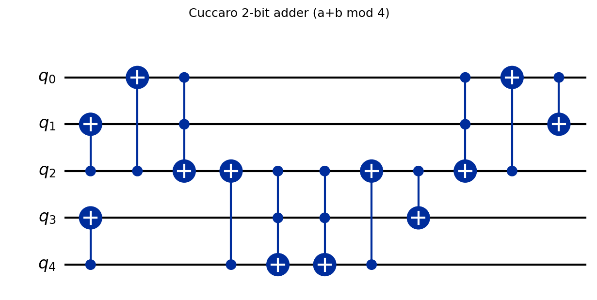

# Cuccaro ripple-carry adder

The **Cuccaro–Draper–Kutin–Moulton** in-place ripple-carry adder
(arXiv:quant-ph/0410184), encoded as concrete `Gate`-IR data.

> **TL;DR** — `cuccaro_n_bit_adder_full n q_start` is THE n-bit adder. It
> runs `n` MAJ gadgets forward, then `n` UMA gadgets in **reverse** order,
> on `2n+1` qubits, computing `target ← (a + b) mod 2ⁿ` in place.

## Where everything lives (the spine)

| Concern | File | Headline |
|---|---|---|
| **Definition** | [`CuccaroAdderDef.lean`](CuccaroAdderDef.lean) | `cuccaro_n_bit_adder_full` |
| **Correctness** | [`CuccaroAdderCorrectness.lean`](CuccaroAdderCorrectness.lean) | `cuccaro_adder_correct` (+ `…_full` bundle) |
| **Resource** | [`CuccaroAdderResource.lean`](CuccaroAdderResource.lean) | `cuccaro_adder_tcount` (= 14·n), `cuccaro_adder_verified` |
| **Example + QASM** | [`CuccaroAdderExample.lean`](CuccaroAdderExample.lean) | `emitCuccaroAdderQASM n` |

Supporting lemmas (frame/induction/decode bridges) live in
`CuccaroFull.lean`, `CuccaroCorrectness.lean`, `CuccaroDecoded.lean` and are
imported only by the spine. Auditors should read the three spine files; the
proofs are intentionally pushed out of the way.

## Qubit layout (`2n + 1` qubits from `q_start`)

```
q_start + 0       : carry-in           (restored to 0)
q_start + 2i + 1  : bit i of b  →  bit i of (a+b) mod 2ⁿ   (target register)
q_start + 2i + 2  : bit i of a         (read register, preserved)
```

## Correctness (the one theorem to audit)

`cuccaro_adder_correct (bits q_start a b) (ha : a < 2^bits) (hb : b < 2^bits)`:

```
cuccaro_target_val bits q_start
    (Gate.applyNat (cuccaro_n_bit_adder_full bits q_start)
      (cuccaro_input_F q_start false a b))
  = (a + b) % 2 ^ bits
```

`cuccaro_adder_correct_full` additionally gives: read register restored to
`a`, carry-in restored to 0, and `WellTyped` on the `2·bits + 1` budget.

## Resource (after correctness)

- `cuccaro_adder_tcount` : T-count = **14·n** (n MAJ + n UMA, 7 T each).
- `cuccaro_adder_verified` : the *same* circuit is correct **and** WellTyped
  on `2n+1` qubits **and** 14·n T-gates — resource stated about the verified
  object.

## Concrete example

2-bit adder computing `1 + 2 = 3` (see `CuccaroAdderExample.lean`):

```
cuccaro_adder_2bit = cuccaro_n_bit_adder_full 2 0    -- 5 qubits, 28 T-gates
cuccaro_target_val 2 0 (applyNat … (cuccaro_input_F 0 false 1 2)) = 3
```

## Circuit diagram (2-bit adder)

Rendered by standard Qiskit (`.draw('mpl')`) from the verified native-basis
QASM (`CuccaroAdder.toQASMNative 2`):



Reproduce: `lake env lean …/CuccaroAdderExample.lean` (writes
`diagrams/cuccaro_adder_2bit.qasm`), then
`python scripts/draw_qasm.py diagrams/cuccaro_adder_2bit.qasm diagrams/cuccaro_adder_2bit.png`.

## Emit OpenQASM for any N (uniform framework)

The adder exposes a `Gadget` descriptor (`CuccaroAdder`) and emits through the
**project-wide** `emitQASM` framework in
[`Codegen/QASMEmit.lean`](../../Codegen/QASMEmit.lean) — the same `emitQASM`
works for every gadget:

```lean
#eval IO.println (emitQASM CuccaroAdder 3)   -- 3-bit adder as OpenQASM 2.0
```

`CuccaroAdder : Gadget := { name := "cuccaro_adder",
circuit := fun n => cuccaro_n_bit_adder_full n 0 }`, and
`emitQASM g n := FormalRV.Codegen.toQasm (g.circuit n)` works for arbitrary
`n` (faithful emitter; `emitOps_applyNat` is the soundness link). Every other
arithmetic gadget (and QFT/QPE, once exposed as `Gate`) defines its own
`Gadget` and emits identically.

## Derived variants

Built on top of the base adder (separate files, same Def/Correctness/Resource
spirit): add-constant (`CuccaroAddConst`), sub-constant (`CuccaroSubConst`),
comparator (`CuccaroCompare`), modular reduction (`CuccaroModReduce`), the
SQIR-style families (`CuccaroSQIR*`), and the dirty-flag modular adder
(`CuccaroSQIRDirtyFlag/`).
