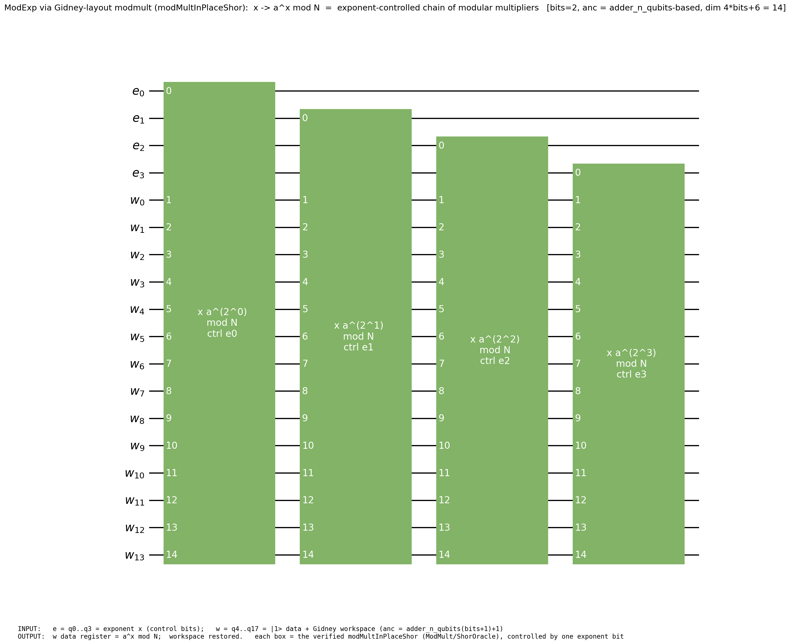
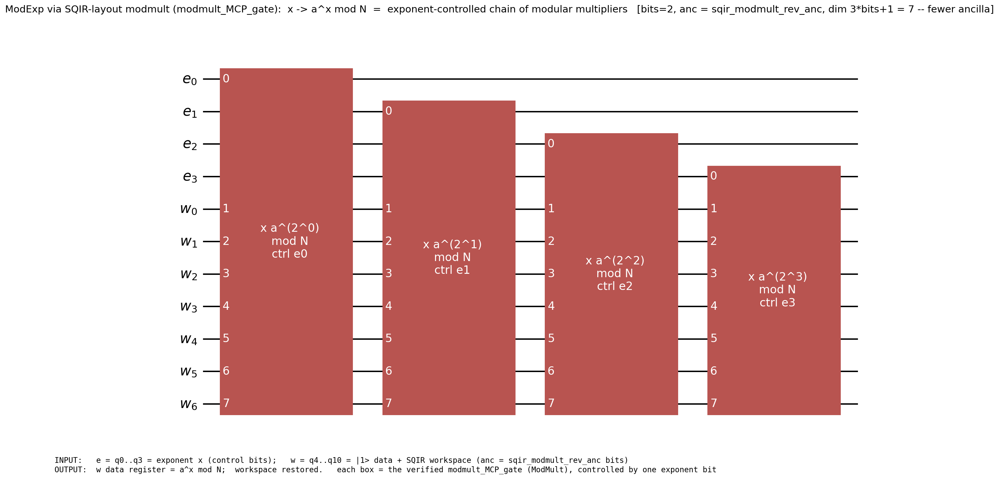

# Modular exponentiation (ModExp)

Modular exponentiation `x ↦ aˣ mod N` — Shor's order-finding oracle — built **on
top of the sealed `ModMult` module**. It is a controlled chain of modular
multipliers: iterate `i` multiplies by `a^(2ⁱ) mod N`, so the controlled-powers
composition over the exponent register computes `aˣ mod N`.

> **TL;DR** — `our_modmult_family bits N a ainv multBits` is the verified modexp
> oracle family: each iterate is `modMultInPlaceShor` (the Shor-layout modmult,
> now a ModMult variant in [`ModMult/ShorOracle`](../ModMult/ShorOracle)). It is
> a `ModMulImpl` (the semantic core), which yields the end-to-end Shor
> success-probability bound `Shor_correct_with_verified_modexp`.

## Where everything lives (the spine)

| Concern | File | Headline |
|---|---|---|
| **Definition** | [`ModExpDef.lean`](ModExpDef.lean) | `our_modmult_family` (chain of `modMultInPlaceShor`) |
| **Correctness** | [`ModExpCorrectness.lean`](ModExpCorrectness.lean) | `our_modmult_family_ModMulImpl` (iterate `i` multiplies by `a^(2ⁱ) mod N`) + `Shor_correct_with_verified_modexp` |
| **Resource** | [`ModExpResource.lean`](ModExpResource.lean) | `tcount_shorModExpVerified` = **224·bits³** |
| **Example** | [`ModExpExample.lean`](ModExpExample.lean) | worked `our_modmult_family` instances |

## Built on ModMult (the modularized design)

ModExp imports only the **sealed** public interface `import FormalRV.Arithmetic.ModMult`
— never reaching into `ModMult/Internal/`. It reuses **two** ModMult gadgets, each
already constructed and proven in the ModMult module:

- **semantic side** — `modMultInPlaceShor` (in [`ModMult/ShorOracle`](../ModMult/ShorOracle)),
  the Shor-layout modmult (Gidney adder, dim `4·bits+6`), carrying
  `modMultInPlaceShor_MultiplyCircuitProperty`. ModExp does **not** redefine it.
- **resource side** — `modmult_MCP_gate` (the SQIR-layout modmult, dim `3·bits+1`),
  carrying `modmult_tcount = 112·bits²`, chained for `tcount_shorModExpVerified`.

(There are two modmult variants because Shor's order-finding consumes the family at
the Gidney-adder dimension `4·bits+6`, while the resource count is taken on the
SQIR-faithful `modmult_MCP_gate` — both now live side-by-side under `ModMult/`.)

### Generic over the modmult (ancilla count doesn't matter)

ModExp's oracle is **parametric over the modmult**: `modexpOracleFamily dim N a ainv gate`
builds the squared-power family from *any* per-constant modmult `gate` at *any*
dimension, and `modexpOracleFamily_ModMulImpl` proves it's a valid Shor oracle as
long as each iterate satisfies `MultiplyCircuitProperty` — at **any** ancilla count
(`ModMulImpl`/`Shor_correct_var` are `anc`-parametric). Two instances:

- `our_modmult_family` = the `modMultInPlaceShor` instance (anc `adder_n_qubits(bits+1)+1`).
- `modexpFamilyMCP` = the `modmult_MCP_gate` instance (anc `sqir_modmult_rev_anc bits`),
  with `modexpFamilyMCP_ModMulImpl` and `Shor_correct_with_mcp_family` — i.e. ModExp
  drives Shor with the SQIR-layout modmult too. Only the ancilla count differs.

So differing ancilla counts are **not** an incompatibility: ModExp reuses whichever
verified modmult you give it.

So the layering is: **Cuccaro adder → ModularAdder → ModMult → ModExp → Shor**,
each level reusing the sealed gadget of the one below.

## Worked examples — the SAME modexp on BOTH modmults

Modular exponentiation is an **exponent-controlled chain of modular multipliers**:
for each exponent bit `eᵢ`, controlled-multiply the work register by `a^(2ⁱ) mod N`.
The construction is identical for both modmults; only the work-register / ancilla
size differs (see the two diagrams).

**Example 1 — Gidney-layout modmult (`modMultInPlaceShor`), ancilla `4·bits+6`:**



**Example 2 — SQIR-layout modmult (`modmult_MCP_gate`), ancilla `3·bits+1` (fewer):**



Same staircase of controlled modular multipliers — only the work register (ancilla)
shrinks. Both are *verified*: `ModExpExample.lean` proves each is a valid Shor oracle
at `N=3, a=2` (`2·2 ≡ 1 mod 3`):

```lean
-- Gidney-layout modmult → valid modexp oracle (anc adder_n_qubits 4 + 1)
example : ModMulImpl 2 3 3 (adder_n_qubits (3+1) + 1) (our_modmult_family 3 3 2 2 3) := …
-- SQIR-layout modmult → valid modexp oracle (anc sqir_modmult_rev_anc 3)
example : ModMulImpl 2 3 3 (sqir_modmult_rev_anc 3)  (modexpFamilyMCP 3 3 2 2)   := …
```

and the full Shor success-probability bound is checked end-to-end at `N=15, a=7`
and `N=21, a=2` (`Shor_correct_with_our_family_at_canonical_dim`), with
`Shor_correct_with_mcp_family` giving the SQIR-layout counterpart.

## Two terms (honest status)

- **Semantic** (`ModExpDef`/`ModExpCorrectness`): `our_modmult_family` + its
  `ModMulImpl` proof — this is what *computes `aˣ mod N`* and drives Shor.
- **Resource** (`ModExpResource`): the `Gate`-IR chain `shorModExpVerified`
  carries the **exact** T-count `224·bits³`. It is a *separate term* from the
  BaseUCom family above; bridging the two (a single object that is both
  semantically `aˣ mod N` and carries the Gate count) is a known open gap.
