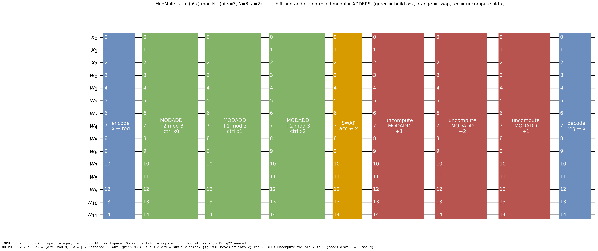
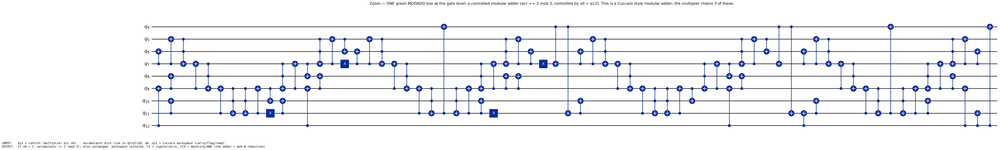

# SQIR-faithful modular multiplier

The in-place **modular multiplier** `x ↦ (a·x) mod N`, encoded as concrete
`Gate`-IR data, faithful to the SQIR/Coq `ModMult.v` construction. This is the
arithmetic core of Shor's order-finding.

> **TL;DR** — `modmult_MCP_gate bits N a ainv` is THE multiplier. On the
> SQIR-faithful encoding it maps the data register `x ↦ (a·x) mod N` in place,
> using exactly `112·bits²` T-gates.

## Where everything lives (the spine)

| Concern | File | Headline |
|---|---|---|
| **Definition** | [`ModMultDef.lean`](ModMultDef.lean) | `modmult_MCP_gate` |
| **Correctness** | [`ModMultCorrectness.lean`](ModMultCorrectness.lean) | `modmult_correct` (`MultiplyCircuitProperty a N`) |
| **Resource** | [`ModMultResource.lean`](ModMultResource.lean) | `modmult_tcount` (**= 112·bits²**), `modmult_verified` |
| **Example + QASM** | [`ModMultExample.lean`](ModMultExample.lean) | `ModMult N a ainv` (Gadget) |

Correctness is stated through the shared **`Gate.applyNat`** semantic core (the
proof routes via `modmult_MCP_gate_apply_encode`). Supporting lemmas live
in `ModMultBitPositioning/PrefixInvariant/AccumulatorRange.lean`.

## The size parameter `bits` (= bit-width of the encoded integers)

`bits` (the **first** argument of `modmult_MCP_gate bits N a ainv`, and
the size argument of `(ModMult N a ainv).circuit bits` / `emitQASM …`) is
**the number of bits of the data register holding `x`** — the bit-width of the
integers being multiplied modulo `N`. It must satisfy `2·N ≤ 2^bits`. The full
qubit budget is `total_dim bits` (e.g. `= 23` at `bits=3`). **To change
the size**, pass a different `bits` — e.g. `emitQASM (ModMult N a ainv) 8`,
or `modmult_tcount 8 N a ainv …` for its T-count (`= 112·8²`). `N` is the
modulus, `a` the multiplier, `ainv` its inverse mod `N`.

## Encoding & correctness (the one theorem to audit)

`modmult_correct (bits N a ainv) (1≤bits) (0<N) (N≤2^bits) (2N≤2^bits) (ainv≤N) (a·ainv≡1 mod N)`:
the gate satisfies `MultiplyCircuitProperty a N bits (sqir_modmult_rev_anc bits) …`
— it multiplies the encoded data register by `a` modulo `N`.

## Resource (exact, after correctness)

- `modmult_tcount` : T-count **= `112 · bits²`** (an exact equality, not a bound).
- `modmult_verified` : the *same* gate is `MultiplyCircuitProperty`-correct
  **and** has T-count `112·bits²`.

## How it's built (and why it's correct) — the modular diagram

The fully-decomposed circuit is too large to draw flat (567 native ops at
`bits=3`). Instead, a **structure-revealing schematic**: each box is a *real*
sub-gadget (Qiskit `to_gate`, decomposable), and the sequence exposes the
**shift-and-add of modular adders** that makes the multiplier work — without
the gate-level noise. (Sound because `Gate.shift` distributes over `seq`, so
these boxes composed in order *are* `modmult_MCP_gate`.)



Colour-coded by role: **blue** = data movement (encode/decode), **green** =
*compute* `a·x`, **orange** = swap, **red** = *uncompute*. Left to right
(`x` = `q0–2` = input; `w` = `q3–14` = workspace `|0>`):

1. **encode** (blue) — move the input `x` into the internal (shifted) register.
2. **three green MODADDs** — step `j` adds `a·2ʲ mod N` to the accumulator,
   *controlled by bit `xⱼ`* (q12, q13, q14). Together they compute
   `Σⱼ xⱼ·(a·2ʲ) = a·x (mod N)`. **Each MODADD box is a Cuccaro modular adder.**
3. **SWAP** (orange) — exchange the accumulator (now `a·x`) with the `x` register.
4. **three red MODADDs** (uncompute) — a second shift-and-add (by `N − a⁻¹`)
   drives the old `x` back to `0`, freeing the workspace. This is the step that
   needs `a·a⁻¹ ≡ 1 (mod N)` — the correctness hypothesis.
5. **decode** (blue) — move the result back to `q0–2`.

Net effect: `x ↦ (a·x) mod N` in place, workspace restored. (Full SQIR budget
`modmult_total_dim 3 = 23`; `q15–22` are unused.)

### Zoom: one MODADD box at the gate level

Each green/red box decomposes to a real **controlled modular adder** (Cuccaro
add + mod-`N` reduction). Here is one of them fully expanded — `acc += 2 mod 3`,
controlled by `x0 = q12`:



`CX` = ripple/carry, `CCX` = majority/AND; the cascade then its reverse is the
Cuccaro adder, with the extra compare-and-conditional-subtract doing the mod-`N`
reduction. See [`Arithmetic/Cuccaro`](../Cuccaro/README.md) for the plain adder.

Reproduce: run `ModMultExample.lean` (emits `diagrams/blk_*.qasm`), then
`python scripts/draw_modular.py diagrams/modmult_modular.json diagrams/modmult_modular.png`
and `python scripts/draw_qasm.py diagrams/blk_step0.qasm diagrams/modmult_step_zoom.png diagrams/modmult_step_zoom.io.json`.

## Emit OpenQASM for any N (uniform framework)

```lean
#eval IO.println (emitQASM (ModMult 3 2 2) 3)   -- ×2 mod 3 at bits=3
```
`ModMult N a ainv : Gadget` plugs into the project-wide `emitQASM`
framework ([`Codegen/QASMEmit.lean`](../../Codegen/QASMEmit.lean)); works for
any `bits`.

## Onward to PPM

The multiplier's `circuit bits` (a `Gate`) is exactly what the PPM compiler
consumes (`compileArithmeticGateToPPM`); its PPM resource (CCZ-magic / measure
counts) is in [`PPM/ModMultPPMResource.lean`](../../PPM/ModMultPPMResource.lean),
and the end-to-end weld is `Arithmetic/ModMult/ModExpWelded.lean`.
