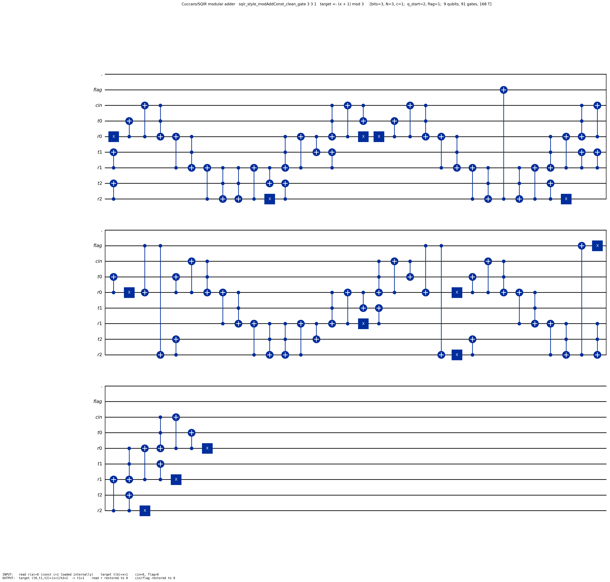

# Cuccaro / SQIR modular adder — `(x + c) mod N`

The **Cuccaro-based** modular add-constant — the **LIVE** one the verified
modular multiplier and Shor actually use. "SQIR-style" means it matches SQIR
`ModMult.v`'s qubit layout (`q_start = 2`, `flagPos = 1`), not that it uses a
SQIR base adder: the "add" slot is the project's Cuccaro MAJ/UMA adder
(`cuccaro_n_bit_adder_full`).

> The definitions and proofs physically live under
> `Arithmetic/Cuccaro/CuccaroSQIRDirtyFlag/` (they belong with the Cuccaro adder
> and are imported by `ModMult/`). This folder is a **spine view** that
> re-exports them — it adds no definitions or proofs.

## Spine

| Concern | File | Headline |
|---|---|---|
| **Definition** | [`Def.lean`](Def.lean) | `sqir_style_modAddConst_clean_gate`, `sqir_style_controlledModAddConst_gate` |
| **Correctness** | [`Correctness.lean`](Correctness.lean) | `cuccaroModAddConst_correct`, `cuccaroControlledModAddConst_correct` |
| **Resource** | [`Resource.lean`](Resource.lean) | qubit budget (`sqir_modmult_rev_anc bits`) |

Live path: `ModMult.modmult_step_gate → sqir_style_controlledModAddConst_gate →
modmult_MCP_gate` (the verified multiplier) `→ VerifiedShor`.

## How it's built (the "dirty-flag" pipeline)

Same textbook idea as the Gidney adder, but it does **not** widen by a bit;
instead it requires `2N ≤ 2^bits` and uses a dedicated flag qubit:

```
addConstGate c       := load c into read reg ; Cuccaro adder ; unload            →  target += c
compareConst N       := forward-MAJ-only comparator copies decide(N ≤ x+c) → flag
conditionalSub N     := flag-masked Cuccaro adder of (2^bits − N)                →  subtract N iff flag
cleanup              := compareConst c ; X(flag)   uncomputes the flag back to 0
```

so the target ends at `(x+c) mod N` and the flag is restored.

## Qubit layout (`sqir_modmult_rev_anc bits` qubits; `q_start = 2`, `flag = 1`)

For `i = 0 … bits−1` (interleaved target/read above a shared carry-in):

```
q[0]               : below q_start (unused here)
q[1]               : flag           (comparison / borrow flag)
q[2]               : c_in           (carry-in)
target[i] = 2 + 2·i + 1  : holds x  →  bit i of (x + c) mod N    (the "b" register)
read[i]   = 2 + 2·i + 2  : holds the constant c (internal; input 0)  (the "a" register)
```

## Worked example: `(x + 1) mod 3` with `x = 1`  (`sqir_style_modAddConst_clean_gate 3 3 1`)

Because the Cuccaro adder needs `2N ≤ 2^bits`, `(x+1) mod 3` is run at `bits = 3`
(`2·3 = 6 ≤ 8`). The diagram is the **exact compiled circuit** (native
`x`/`cx`/`ccx`, folded into 3 rows) → **9 qubits, 91 gates, 168 T**. The verified
instance is `cuccaroModAddConst_correct 3 3 1 1` (`1 ≤ 3`, `0 < 3 ≤ 2³`,
`2·3 ≤ 2³`, `1 < 3`, `1 < 3` all hold).



### 1. Input encoding (`x = 1`, constant `c = 1` loaded internally)

Input is `update (cuccaro_input_F 2 false 0 1) 1 false` (read/`a` register 0,
target/`b` register `x = 1`, carry-in 0, flag 0):

| qubit | wire | port (role) | value |
|---|---|---|---|
| `q[0]` | `.` | below `q_start` (unused) | `0` |
| `q[1]` | `flag` | comparison / borrow flag | `0` |
| `q[2]` | `cin` | carry-in | `0` |
| `q[3]` | `t0` | `target[0]` = bit 0 of `x` | `1` |
| `q[4]` | `r0` | `read[0]` (constant, internal) | `0` |
| `q[5]` | `t1` | `target[1]` | `0` |
| `q[6]` | `r1` | `read[1]` | `0` |
| `q[7]` | `t2` | `target[2]` | `0` |
| `q[8]` | `r2` | `read[2]` | `0` |

### 2. How the circuit is compiled

The `X` gates load the constants into the `a`/read register; each MAJ→UMA ripple
is one Cuccaro adder. In order: **add `c`** → **compareConst `N`** (the
forward-MAJ chain whose top carry is `cx`'d into `flag`) → **conditional subtract
`N`** (the flag-masked adder) → **cleanup** (`compareConst c` ; `X(flag)`) that
returns the flag to 0.

### 3. Output ports

| qubit | wire | port (role) | value |
|---|---|---|---|
| `q[3]` | `t0` | `target[0]` of `(x+c) mod N` | `0` |
| `q[5]` | `t1` | `target[1]` | `1` |
| `q[7]` | `t2` | `target[2]` | `0` |
| reads `r*` | — | restored to `0` | `0` |
| `cin`, `flag` | — | restored to `0` | `0` |

Decoded: `target = (1 + 1) mod 3 = 2 = (0,1,0)` LSB-first; read register, carry-in
and flag are clean. ∎

Reproduce: `lake env lean …/Cuccaro/Example.lean` writes
`diagrams/cuccaro_modadd_3_3_1.qasm`, then
`python scripts/draw_qasm.py diagrams/cuccaro_modadd_3_3_1.qasm diagrams/cuccaro_modadd_3_3_1.png diagrams/cuccaro_modadd_3_3_1.io.json`.
