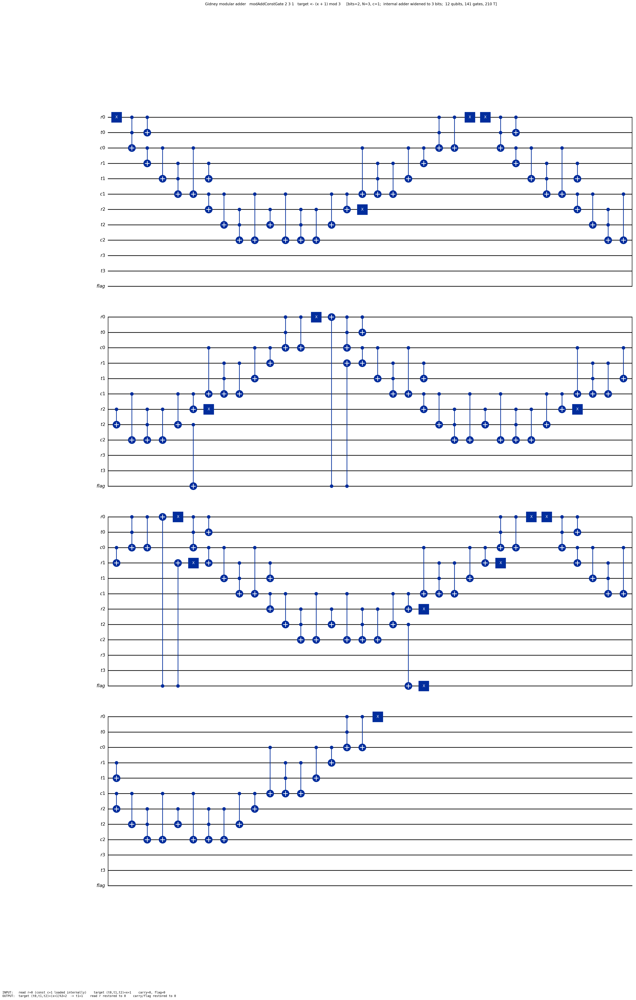

# Gidney modular adder — `(x + c) mod N`

The **Gidney-based** modular add-constant, built on the patched Gidney
ripple-carry adder (`gidney_adder_full_faithful_no_measurement_patched`, from
`Arithmetic/RippleCarryAdder`). Fully verified, but **standalone** — the verified
Shor multiplier instead uses the [Cuccaro adder](../Cuccaro/README.md).

## Spine

| Concern | File | Headline |
|---|---|---|
| **Definition** | [`Def.lean`](Def.lean) | `modAddConstGate`, `controlledModAddConstGate` (+ a standalone `modMultConstGate`/`modMultInPlace` tower) |
| **Correctness** | [`Correctness.lean`](Correctness.lean) | `modAddConst_correct`, `controlledModAddConst_correct` |
| **Resource** | [`Resource.lean`](Resource.lean) | qubit budget (`controlledModAddConst_wellTyped`, `modMultConst_wellTyped_at_shor_dim`) |

Supporting proofs (read only if auditing): `PowerOfTwoCase.lean`,
`ForwardFaithfulness.lean`, `ControlledPipeline.lean`, `SwapSemantics.lean`.

## How it's built

The textbook modular-reduction pipeline, with every "add" filled by the patched
Gidney adder. To avoid losing the carry-out, the whole pipeline runs **one bit
wider** than the data (`bits` data bits → an internal `bits+1`-bit adder):

```
addConstGate c        := load c into read reg (X cascade) ; patched adder ; unload   →  target += c
subConstGate N        := addConstGate (2^(bits+1) − N)                                →  target −= N  (two's-complement)
conditionalAddConstGate N := same, read reg masked by a flag qubit (CX cascade)       →  no CCCX needed
modAddConstGate N c   := add c ; sub N ; copy high bit → flag ;
                         conditional add-back N ; uncompute flag (sub c ; … ; add c)  →  target = (x+c) mod N
```

So `modAddConstGate` costs exactly **5** patched-adder invocations (add `c`,
sub `N`, conditional add-back `N`, then sub `c` + add `c` to uncompute the flag);
the X/CX prepare cascades are T-free.

## Qubit layout (`adder_n_qubits (bits+1) + 1` qubits, interleaved LSB-first)

The internal adder is `bits+1` bits wide; for `i = 0 … bits`:

```
read[i]   = 3·i      : holds the constant c (loaded then unloaded internally; input 0)
target[i] = 3·i + 1  : holds x  →  bit i of (x + c) mod N
carry[i]  = 3·i + 2  : carry chain
flag      = adder_n_qubits (bits+1)      : comparison / borrow flag (out of band)
```

## Worked example: `(x + 1) mod 3` with `x = 1`  (`modAddConstGate 2 3 1`)

The diagram below is the **exact compiled circuit** of `modAddConstGate 2 3 1`
(native `x`/`cx`/`ccx`, folded into 4 rows): `bits = 2`, `N = 3`, `c = 1`, run on
the widened 3-bit adder → **12 qubits, 141 gates, 210 T**. The verified instance
is `modAddConst_correct 2 3 1 1` (all preconditions `1 ≤ 2`, `0 < 3 ≤ 2²`,
`1 < 3`, `0 < 1 < 3` hold).



### 1. Input encoding (`x = 1`, the constant `c = 1` is loaded internally)

Input is `adder_input_F 3 0 1` (read register 0, target register `x = 1`, carries
0) with the flag at 0:

| qubit | wire | port (role) | value |
|---|---|---|---|
| `q[0]` | `r0` | `read[0]` (constant, loaded internally) | `0` |
| `q[1]` | `t0` | `target[0]` = bit 0 of `x` | `1` |
| `q[2]` | `c0` | `carry[0]` | `0` |
| `q[3]` | `r1` | `read[1]` | `0` |
| `q[4]` | `t1` | `target[1]` = bit 1 of `x` | `0` |
| `q[5]` | `c1` | `carry[1]` | `0` |
| `q[6]` | `r2` | `read[2]` (widening bit) | `0` |
| `q[7]` | `t2` | `target[2]` (widening bit) | `0` |
| `q[8]` | `c2` | `carry[2]` | `0` |
| `q[9]`,`q[10]` | `r3`,`t3` | high read/target (overflow) | `0` |
| `q[11]` | `flag` | comparison / borrow flag | `0` |

### 2. How the circuit is compiled

Read left-to-right: the five ripple "humps" in the picture are the five patched
Gidney adders, separated by the single-qubit `X` cascades that load/unload the
constants (`c`, `N`, `2³−N`, …) and the lone `cx … flag` that copies the borrow
bit out. In order: **add `c`** (humps 1) → **subtract `N`** (hump 2) →
`cx → flag` → **conditional add-back `N`** (hump 3) → **uncompute the flag**
(subtract `c`, `cx`/`x` on the flag, add `c` — humps 4–5).

### 3. Output ports

| qubit | wire | port (role) | value |
|---|---|---|---|
| `q[1]` | `t0` | `target[0]` of `(x+c) mod N` | `0` |
| `q[4]` | `t1` | `target[1]` | `1` |
| `q[7]` | `t2` | `target[2]` | `0` |
| reads `r*` | — | restored to `0` | `0` |
| carries `c*`, `flag` | — | restored to `0` | `0` |

Decoded: `target = (1 + 1) mod 3 = 2 = (0,1,0)` LSB-first; read register and the
flag are clean. ∎

Reproduce: `lake env lean …/Gidney/Example.lean` writes
`diagrams/gidney_modadd_2_3_1.qasm`, then
`python scripts/draw_qasm.py diagrams/gidney_modadd_2_3_1.qasm diagrams/gidney_modadd_2_3_1.png diagrams/gidney_modadd_2_3_1.io.json`.
