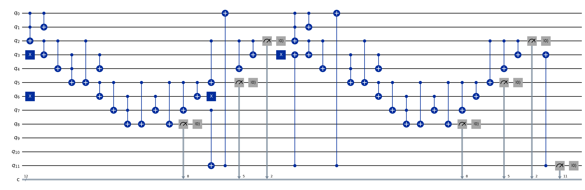

# Gidney 2025 Subtract-Fixup Modular Adder (the faithful `2.5n`-Toffoli construction)

`gidneyModAddFixup bits p c : EGate` is the verified, fully-constructed modular adder of **Gidney 2025 (arXiv:2505.15917, main.tex L972–975)** — the **subtract-with-underflow + lookup-fixup** construction the paper actually uses for `X += c (mod p)`. It computes `(x + c) mod p` for `x < p`, `c < p`, on a `bits`-bit register `X` plus one extra top qubit `Q`. Import `FormalRV.Arithmetic.ModularAdder.GidneySubtractFixup` to get the whole verified adder for auditing any paper that uses Gidney's modular adder.

## The paper's construction (verbatim, main.tex L972–975)

To do `X += c (mod p)` with `x < p`, `c < p` (X held in `len(p)` value bits + one extra top qubit `Q`):

1. Flip the addition into a **SUBTRACTION** of `T2 = p − c`: compute `X -= T2`. The extra qubit `Q` catches the underflow — `Q = 1` iff `x − T2 < 0`, i.e. iff `x + c < p`.
2. Complete the modular addition with `X += [0, p][Q]` — a **conditional add** of the constant `p` controlled by `Q` (add `p` iff `Q = 1`).
3. **Uncompute `Q`** by measurement-based uncomputation (Toffoli-free).

Correctness: `X -= (p−c)` gives `x + c − p` (2's complement). If `x+c ≥ p`: no underflow (`Q=0`), result `= x+c−p = (x+c) mod p`. If `x+c < p`: underflow (`Q=1`), then `+= p` gives `x+c−p+p = x+c = (x+c) mod p`. Either way the low `bits` register holds `(x+c) mod p`, and the conditional `+p` simultaneously clears `Q` back to `0` (both `x+c−p` and `x+c` are `< 2^bits`).

## The spine — where everything lives
| Aspect | File | Headline theorem |
|---|---|---|
| Circuit | `Def.lean` | `gidneyModAddFixup` (subtract → copy-Q → conditional `+p` → `mz` flag) |
| Value | `Correctness.lean` | `gidneyModAddFixup_correct` — low `bits` register `= (x+c) % p`; `Q` and flag released to `0` |
| Count | `Resource.lean` | `toffoli_gidneyModAddFixup = 2·(bits+1)`; `gidneyModAddFixup_meets_g2025_modadd` (vs paper `2.5n`) |
| Example | `Example.lean` | `#check` of the verified instance + `#eval` count + OpenQASM emission |

## What the circuit is
- Width `W = bits + 1`: the `bits` value bits of `X` (target register `target_idx 0 … target_idx (bits-1)`) plus the extra top qubit `Q = target_idx bits`. The interleaved Gidney layout `read/target/carry = 3i/3i+1/3i+2` is used. One out-of-band fixup-flag ancilla lives at `flagIdx = adder_n_qubits W = 3W+2`.
- The two additions are the verified **MEASURED Gidney ripple-carry adder** `FormalRV.Arithmetic.MeasuredAdder.gidneyAdderMeasured` (`n` Toffoli per add; the carry ancillas released by Gidney's measurement-based AND-uncompute). The subtraction is `addConstMeasured W (2^W − (p−c))` (two's complement); the conditional `+p` is `conditionalAddP W flagIdx p`.
- The conditional `+p` uses **NO controlled-CCX**: a CX cascade copies `flag ∧ p.testBit i` into the read register (`prepareMaskedP`), the ordinary measured adder runs, then the cascade is un-applied (CX involutive). The control `Q` is first copied to the out-of-band `flag` (which the adder leaves untouched) so the un-prepare cancels cleanly; the in-band `Q` is cleared by the `+p` itself, and the `flag` ancilla is released by `EGate.mz` (the paper's step 3).

## Circuit diagram

Rendered straight from the emitted OpenQASM for `gidneyModAddFixup 2 3 1` (the verified `(x+1) mod 3` instance at `bits = 2`, `x = 1`; 12 qubits):



The tell is the **two measured-adder blocks** (each a `ccx`-led carry sweep followed by `measure`+`reset` of the carry ancillas — the Toffoli-free measurement-uncompute), framed by the `x`-gate constant load (stage 1) and `cx`-gate masked load (stage 3), with the `Q`→flag `cx` in between. Conceptually:

```
   stage 1: SUBTRACT p−c            stage 2     stage 3: CONDITIONAL +p          stage 4
 ┌─────────────────────────┐         copy     ┌─────────────────────────┐       release
 │ load (p−c)'s 2's-compl  │       Q ─CX─►flag│ mask read = flag ∧ p    │
 │  into read   (X gates)  │                  │  (CX from flag, no CCCX) │
 │ measured Gidney add ────┼──► target = x+c−p│ measured Gidney add ─────┼──► target = (x+c)%p
 │  (n Toffoli, mz carries)│   Q = (x+c<p)?1:0│  (n Toffoli, mz carries) │   Q → 0  (auto)
 │ unload (X gates)        │                  │ un-mask read (CX)        │      mz(flag)
 └─────────────────────────┘                  └─────────────────────────┘
        n Toffoli                                     n Toffoli
```

Reproduce: `lake env lean FormalRV/Arithmetic/ModularAdder/GidneySubtractFixup/Example.lean` (emits the `.qasm`), then `python scripts/draw_qasm.py FormalRV/Arithmetic/ModularAdder/GidneySubtractFixup/diagrams/gidney_subtractfixup_modadd_2_3_1.qasm FormalRV/Arithmetic/ModularAdder/GidneySubtractFixup/diagrams/gidney_subtractfixup_modadd_2_3_1.png`.

## Correctness (the theorem to audit)
`gidneyModAddFixup_correct (bits p c x) (1 ≤ bits) (0 < p) (p ≤ 2^bits) (x < p) (c < p)` concludes, on the clean input `adder_input_F (bits+1) 0 x`:
1. `gidney_target_val bits (...) = (x + c) % p` — the low `bits` target register decodes **literally** to the modular sum;
2. `... (target_idx bits) = false` — the extra top qubit `Q` released to `0`;
3. `... (adder_n_qubits (bits+1)) = false` — the fixup flag ancilla released to `0`.

The two measured adds are **reused verbatim** (`gidneyAdderMeasured_target_val`, `gidneyAdderMeasured_correct`/`_read`); the only NEW arithmetic is the two's-complement underflow case-split (`subtract_underflow`, `fixup_value`).

## Resource (the count) — and the head-to-head with the paper
`toffoli_gidneyModAddFixup : EGate.toffoli (gidneyModAddFixup (n+1) p c) = 2·(n+2)` — i.e. **`2·(bits+1)` Toffoli**, two `n`-Toffoli measured adds. The constant/masked-load cascades (X/CX), the `Q`→flag CX, and the `mz` flag release are all **Toffoli-free**.

| metric | value | note |
|---|---|---|
| Toffoli | **`2·(bits+1)`** ≈ `2·bits` | two measured `n`-Toffoli adds (subtract + conditional `+p`) |
| paper's headline | `2.5n` (`g2025_modadd_toffoli_halves n = 5n` half-units) | INCLUDES deferred phase-correction overhead |
| paper's deferred variant | `2n` ("if the phase correction is deferred", main.tex L977) | exactly what this measurement-based construction realises |

So the **exact verified count is `2·(bits+1)`, essentially `2n`** — this MEETS the paper's deferred-phase-correction `2n` variant and BEATS the `2.5n` headline. `gidneyModAddFixup_meets_g2025_modadd (n) (3 ≤ n)`: in the paper's half-Toffoli currency, `2 · toffoli ≤ g2025_modadd_toffoli_halves (n+1)` (i.e. `4(bits) + 4 ≤ 5·bits`) for `bits = n+1 ≥ 4`.

## Honest scope
- The `2·(bits+1)` count is the **Boolean / measurement-uncompute** Toffoli count. The paper's `2.5n` adds a phase-correction Toffoli charge that this Boolean model does not carry (the measured-AND-uncompute is Toffoli-free); the paper itself quotes `2n` for the deferred-phase-correction variant, which is what we realise. We do NOT claim to reproduce the phase-correction overhead.
- The two extra free slots above the `(bits+1)`-bit register (`read_idx (bits+1)`, `target_idx (bits+1)`) and the carry register are part of the interleaved Gidney layout; they are left clean (proven via the tight boundedness `gidneyAdderMeasured_boundedBy_tight`).
- The controlled additions of dlogs that feed this modular adder in Gidney 2025 are bridged to the verified controlled-multiply residue by `FormalRV.CFS.dlog_reduction_eq_residueAccumulate` (the cheap addition-based arithmetic computes EXACTLY the verified residue).
- This is a STANDALONE faithful model of the paper's adder; the verified Shor multiplier uses the Cuccaro/SQIR family (`ModularAdder.Cuccaro`).

## For auditors
`import FormalRV.Arithmetic.ModularAdder.GidneySubtractFixup` — the umbrella pulls the whole verified adder. Cite `gidneyModAddFixup_correct` (value `= (x+c)%p`) and `toffoli_gidneyModAddFixup` / `gidneyModAddFixup_meets_g2025_modadd` (count vs the paper's `2.5n`). Axiom audit: the headline theorems depend only on `propext`, `Classical.choice`, `Quot.sound` — no `sorry`, no `native_decide`, no custom axioms.
