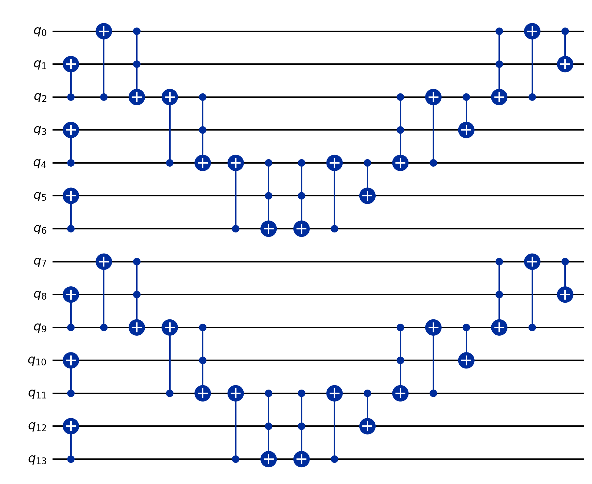

# Oblivious Carry Runway Adder

`runwayAddK gSep k : Gate` is a verified, fully-constructed segmented quantum adder. It adds two `k`-segment numbers (each segment `gSep` data bits, `n = k·gSep`) with carries DEFERRED into per-segment runway bits rather than propagated across the whole register — the core primitive of Gidney's oblivious-carry-runway scheme. Import `FormalRV.Arithmetic.ObliviousRunwayAdder` to get the whole verified adder for auditing any paper that uses oblivious carry runways.

## The spine — where everything lives
| Aspect | File | Headline theorem |
|---|---|---|
| Circuit + single add | `RunwayAdderFunctional` | `runwayAddK`, `runwayAddK_exact` (spread sum), `runwayAddK_wellTyped` |
| Per-add advance | `RunwayAdderAdvance` | `runwayAddK_occupancy_eq_carries` (occupancy = the real deferred carries), `runwayAddK_advance_genuine` (≤ k) |
| Contiguous value | `RunwayAdderContiguous` | `runwayAddK_contiguous` (contiguous reading = `a + b` exactly) |
| Multi-add | `RunwayAdderMultiAdd` | `runwayAddK_iter_contiguous(_clean)` (iterate `t`× = `a + t·b`, exact under per-segment no-overflow) |
| Deviation | `RunwayDeviationFaithful` | `perAddWrapFracD` (circuit-tied) + `totalWrapFracD_eq_totalDeviation` (= cost model `totalDeviation`) |
| Example | `Example.lean` | `#eval` gate counts + OpenQASM emission |

## What the circuit is
- Layout: `k` DISJOINT width-`(gSep+1)` Cuccaro blocks; segment `m` lives at `[segBase m, segBase m + 2gSep+3)`. Each block adds a `gSep`-bit data chunk; the top `(gSep+1)`-th augend bit is the RUNWAY holding that segment's deferred carry. NO carry propagates between segments (that is the "oblivious" depth win).
- `runwayAddK gSep k` = the sequential composition of the `k` segment adds (`cuccaroAdder.circuit (gSep+1) (segBase m)`).
- Two readings: SPREAD place value `2^(m·(gSep+1))` keeps each carry parked (deferred); CONTIGUOUS place value `2^(m·gSep)` folds each runway carry into the next segment by place value alone → the true `a + b`.

## Circuit diagram

Rendered straight from the emitted OpenQASM for `runwayAddK 2 2` (gSep = 2, k = 2; an `n = 4`-bit add over 14 qubits):



The tell is the **two disjoint width-`(gSep+1)` Cuccaro blocks** (`q0–q6` and `q7–q13`): **no gate crosses between them**, so each segment's carry-out stays **parked in its runway bit** instead of rippling into the next segment — that is the oblivious-carry depth win. Conceptually, for general `k`:

```
   segment 0                     segment 1                          segment k-1
 ┌───────────────────┐         ┌───────────────────┐             ┌───────────────────┐
 │ data a0 b0 a1 b1… │         │ data a_g b_g …    │     · · ·    │ data …            │
 │ runway bit  c0    │         │ runway bit  c1    │             │ runway bit  c_{k-1}│
 └───────────────────┘         └───────────────────┘             └───────────────────┘
   c0 deferred  ──╳──►            c1 deferred  ──╳──►               (no carry crosses
   (kept in runway,                                                  a segment boundary)
    not propagated)
```

Each block is `cuccaroAdder.circuit (gSep+1) (segBase m)`: it adds the `gSep`-bit data chunk and deposits the carry-out into the `(gSep+1)`-th augend bit (the runway). Read at **contiguous** place value `2^(m·gSep)`, each runway carry `c_m` lands exactly on segment `m+1`'s low place, folding the carries for free → the exact `a + b` (`runwayAddK_contiguous`).

Reproduce: `lake env lean FormalRV/Arithmetic/ObliviousRunwayAdder/Example.lean` (emits the `.qasm`), then `python scripts/draw_qasm.py FormalRV/Arithmetic/ObliviousRunwayAdder/diagrams/oblivious_runway_adder_g2_k2.qasm FormalRV/Arithmetic/ObliviousRunwayAdder/diagrams/oblivious_runway_adder_g2_k2.png`.

## Correctness (the theorems to audit)
- Single add: `runwayAddK_exact` (spread), `runwayAddK_contiguous` (= `a + b`).
- Multi-add: `runwayAddK_iter_contiguous` (= `a + t·b`) under per-segment no-overflow `segReg_m + t·b_m < 2^(gSep+1)`.
- Advance: `runwayAddK_occupancy_eq_carries` — the runway occupancy IS the real carry count, `≤ k = n/g_sep`.
- Deviation: the per-runway wrap fraction at the paper's offset space `D = n²·n_e·1024 = 2^g_pad` sums to the cost model's `totalDeviation` (`totalWrapFracD_eq_totalDeviation`), circuit-tied through the occupancy.

## Resource (concrete, from the construction)
`tcount`/`toffoliCount`/`width` are read straight off the `Gate`. `#eval` examples (see `Example.lean`): `gSep=4, k=2` → Toffoli 20, width 22; `gSep=4, k=4` → Toffoli 40, width 44. Emit OpenQASM with `FormalRV.Codegen.toQasm (runwayAddK gSep k) false (width …)`; render with `python scripts/draw_qasm.py …`.

## Honest scope
- This is the single-addition segmented adder + its `t`-fold (same-addend) accumulation. With a 1-bit runway per segment, ~one deferred add fits before overflow; the per-segment no-overflow hypothesis is exactly the deterministic condition the deviation bounds probabilistically.
- Distinct-addend sequences (the windowed-lookup loop) compose identically but need the lookup modeled separately (`Arithmetic/Windowed`).
- The deviation's per-runway `1/D` is the counting fraction taken as the uniform probability of an all-ones offset (no Mathlib measure space constructed). A physical circuit pads by an integer `g_pad ≥ 44`, so its real deviation is `≤` the paper's number.
- This folder is the **single source of truth** for the adder. An earlier `Windowed/ObliviousRunwayAdder.lean` skeleton (a non-functional structure with a vacuous fold obligation and a state-agnostic "advance" bound) has been **removed** — import this folder instead of duplicating the construction.

## For auditors
`import FormalRV.Arithmetic.ObliviousRunwayAdder` — the umbrella pulls the whole verified adder. Cite the spine theorems for any paper using oblivious carry runways; counts/QASM come straight off `runwayAddK gSep k`.
