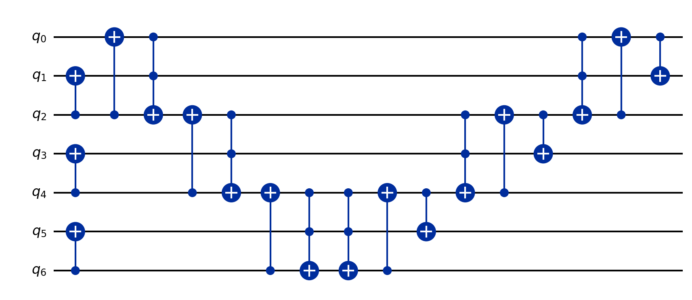
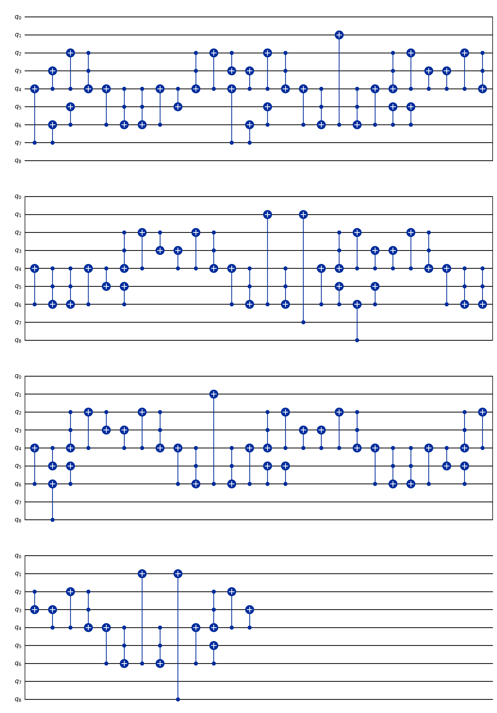

# FormalRV.Arithmetic

Layer-2 (logical arithmetic) of the FormalRV stack. Each ripple-carry / modular
gadget is encoded as concrete `Gate` IR over the Framework core, given a
classical Boolean specification, and (where claimed Verified) carries a
semantic-correctness theorem proven by induction — gate counts alone never
suffice (CLAUDE.md hard rule). The terminal bridges hand a Boolean-correct
multiplier up to `Shor` as a `MultiplyCircuitProperty`.

## Layout
- `Cuccaro/` — Cuccaro–DKM ripple-carry adder family (MAJ/UMA, compare, add/sub-const, mod-reduce, full adder, SQIR-style cond/mod-add, dirty-flag variant).
- `RippleCarryAdder/` — patched Gidney ripple-carry adder (`RippleCarryAdderDefinitions` + `RippleCarryAdderQubitCounts`/`RippleCarryAdderRSA2048Resource`/`RippleCarryAdderDecideWitnesses`/`RippleCarryAdderPropagationReverse`/`RippleCarryAdderUncomputeCascade`); forward/reverse cascades and carry-chain induction.
- `ModularAdder/` — `(x+c) mod N` and its controlled form, built on the patched adder (`ModularAdderDefinitions` + `ModularAdderPowerOfTwoCase`/`ModularAdderForwardFaithfulness`/`ModularAdderControlledPipeline`/`ModularAdderSwapSemantics`).
- `ModMult/` — constant modular multiplier via shift-and-accumulate over Cuccaro mod-add (`ModMultDefinitions` + `ModMultBitPositioning`/`ModMultPrefixInvariant`/`ModMultAccumulatorRange`/`ModMultBasicSettingProofs`).
- `UnaryLookup/` — unary address-decode lookup; indexing landed, gate sequence still a stub.
- `Correctness.lean` — reusable Gate-IR-to-basis-state action lemmas (CCX/CX/X/seq).
- `GateToUCom.lean` — faithful translation `Gate -> BaseUCom` for semantic reasoning.
- `MCPBridge.lean` — promotes a Boolean-correct Gate IR into `MultiplyCircuitProperty` for `Shor`.
- `RCIR.lean` — backward-compat shim: `RCIRGate := Framework.Gate`.

## Key definitions
- `cuccaro_MAJ` / `cuccaro_UMA` (`Cuccaro/Cuccaro.lean`) — the two ripple-carry primitives.
- `gidney_adder_full_faithful_no_measurement_patched` (`RippleCarryAdder/RippleCarryAdderDefinitions.lean`) — explicit (no-measurement) Gidney adder.
- `controlledModAddConstGate` (`ModularAdder/ModularAdderDefinitions.lean`) — 8-step controlled `(x+c) mod N` pipeline.
- `modmult_inplace_shifted` (`ModMult/ModMultDefinitions.lean`) — in-place constant modular multiplier.
- `Gate.toUCom` (`GateToUCom.lean`) — Gate IR to `BaseUCom`.

## Key theorems
- `cuccaro_n_bit_adder_full_correct` (`Cuccaro/CuccaroFull.lean`) — full n-bit Cuccaro adder hits its three positional sum/carry/restore invariants — **Verified**.
- `gidney_adder_full_faithful_no_measurement_patched_correct` (`RippleCarryAdder/RippleCarryAdderUncomputeCascade.lean`) — target register holds the sum bits, reads preserved, carries cleared — **Verified**.
- `controlledModAddConstGate_correct` (`ModularAdder/ModularAdderControlledPipeline.lean`) — target becomes `(x+c) mod N` iff control set, workspace restored — **Verified**.
- `modmult_inplace_shifted_correct` (`ModMult/ModMultAccumulatorRange.lean`) — output register holds `(a·x) mod N` (given `a·ainv ≡ 1`) — **Verified**.
- `toUCom_satisfies_MultiplyCircuitProperty_of_applyNat` (`MCPBridge.lean`) — a Boolean-correct Gate IR compiles to a `MultiplyCircuitProperty` multiplier — **Verified** (conditional on its two encoding hypotheses).
- `*_meets_paper_claim` T-counts in `Cuccaro/Cuccaro.lean` — gate/T-count equalities by `decide` — **Arithmetic-only**.
- unary-lookup gate sequence (`UnaryLookup/UnaryLookupDefinitions.lean`) — indexing only; circuit body unwritten — **Scaffolded**.

## Status
Cuccaro adder, patched Gidney adder, controlled modular adder, and the in-place
modular multiplier are **Verified** (semantic correctness proven by induction);
their T-counts are **Arithmetic-only** side products. Unary lookup is
**Scaffolded** (indexing only). The `GateToUCom`/`MCPBridge` path is **Verified**
as a reduction but is exercised end-to-end only via the multiplier above.

## Worked example — the adder and the multiplier, drawn

`cuccaro_n_bit_adder_full 3 0` is a complete 3-bit ripple-carry adder on 7 qubits
(a forward `MAJ` chain, then a *reverse* `UMA` chain), emitted to OpenQASM 2 by
`scripts/EmitQASM.lean` and drawn above by Qiskit. On the encoded input
(`cuccaro_input_F`: carry-in at `q0`, then interleaved `bᵢ,aᵢ` pairs),
`cuccaro_n_bit_adder_full_correct` (`Cuccaro/CuccaroFull.lean:847`, **Verified**,
axiom-clean) proves the three positional invariants — the sum bit at `q_{2i+1}`
becomes `cᵢ ⊕ bᵢ ⊕ aᵢ`, the `a`-register is restored, and the carry-in is restored.

Stacking controlled modular adds gives `modmult_const_gate 2 15 7` — the
108-gate `x ↦ 7·x mod 15` multiplier above. The accumulator obeys the
shift-and-accumulate recurrence `modmult_acc_spec` (`ModMult/ModMultDefinitions.lean`);
for `m=2` it steps `0 → 0 → (0 + 7·2 mod 15) = 14`. `modmult_const_gate_target_decode`
(`ModMult/ModMultPrefixInvariant.lean`, **Verified**) proves the target decodes to
`(a·m) mod N`, and `MCPBridge.lean` promotes this Boolean-correct circuit to the
`MultiplyCircuitProperty` that `Shor` consumes as its oracle.

### More small examples

3. **Controlled modular adder** `controlledModAddConstGate` (`ModularAdder/ModularAdderDefinitions.lean`)
   — an 8-step `(x+c) mod N` pipeline (compare, conditional subtract, restore).
   `controlledModAddConstGate_correct` (`ModularAdder/ModularAdderControlledPipeline.lean`, **Verified**)
   proves the target becomes `(x+c) mod N` exactly when the control bit is set, with
   the workspace restored — the conditional building block the multiplier stacks
   `bits` times.
4. **A numeric trace** of `cuccaro_n_bit_adder_full 3 0` on `a=2, b=3`: the MAJ chain
   computes the carries, the reverse UMA writes the sum register `2+3 = 5 = 101₂`
   (no overflow, top carry 0) and restores `a=2` — exactly the three
   `cuccaro_n_bit_adder_full_correct` invariants on concrete inputs.

## Essential proof techniques

- **Boolean basis-state action, not matrices.** Every gate is given a `Nat → Bool`
  action `Gate.applyNat`, with per-gate lemmas (`gate_{x,cx,ccx}_acts_on_basis`)
  glued by `gate_seq_acts_on_basis` (`Correctness.lean`);
  `uc_eval_toUCom_acts_on_basis` proves this Boolean semantics agrees with the
  matrix `uc_eval` on basis vectors. So arithmetic correctness reduces to symbolic
  Boolean identities — and a gate/T-count alone is *rejected* (CLAUDE.md): two
  circuits of equal T-count can compute different functions; only the action proves
  *what* is computed.
- **Induction on the carry chain.** The proof of the adder carries a three-band
  invariant (carry positions hold `carryᵢ ⊕ aᵢ`, sum positions `bᵢ ⊕ aᵢ`, plus the
  top carry) by induction on `n`, with *frame lemmas* isolating the support so
  outside positions are provably untouched and a *shift lemma*
  (`cuccaro_carry_after_MAJ0_shift`) advancing the carry as `q_start → q_start+2`;
  the reverse `UMA` chain then algebraically inverts each `MAJ` to deposit the sum.
- **A solvable recurrence for multiplication.** Because each step adds the
  *constant* `(a·2^k) mod N` (no cross-bit dependency), the accumulator recurrence
  closes by induction on the bit index (`modmult_acc_spec_eq_mul_mod`),
  evaluating to `(a·m) mod N` after all `bits` steps.
