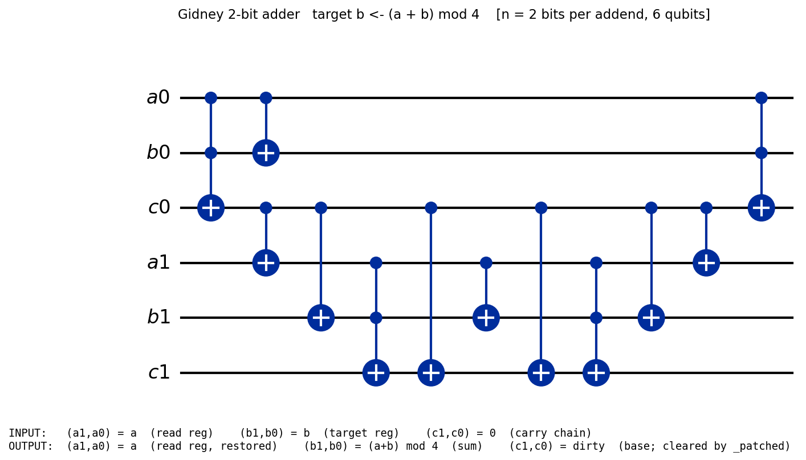

# Gidney ripple-carry adder

The **Gidney** in-place ripple-carry adder (arXiv:1709.06648; Qrisp
`qq_gidney_adder.py`), encoded as concrete `Gate`-IR data.

> **TL;DR** — `gidney_adder n` is THE n-bit adder. It runs a faithful forward
> cascade, a final-CX cascade (stamps the sum), then a reverse cascade, on
> `3n+2` qubits, leaving the **target register holding `(a + b) mod 2ⁿ`** and
> the read register restored to `a`. The base adder leaves the carry register
> **dirty**; the carry-clearing **patched** variant
> (`gidney_adder_full_faithful_no_measurement_patched`) returns it to 0 and is
> the one the modular-adder layer builds on.

## Where everything lives (the spine)

| Concern | File | Headline |
|---|---|---|
| **Definition** | [`RippleCarryAdderDef.lean`](RippleCarryAdderDef.lean) | `gidney_adder` (+ `…_patched`) |
| **Correctness** | [`RippleCarryAdderCorrectness.lean`](RippleCarryAdderCorrectness.lean) | `gidney_adder_correct`, `gidney_adder_correct_full` |
| **Resource** | [`RippleCarryAdderResource.lean`](RippleCarryAdderResource.lean) | `gidney_adder_tcount` (= 14·n), `gidney_adder_verified` |
| **Example + QASM** | [`RippleCarryAdderExample.lean`](RippleCarryAdderExample.lean) | `GidneyAdder : Gadget`, `emitQASM GidneyAdder n` |

Definition support (one file per job, no proofs): `RippleCarryAdderSpec.lean`
(classical `carry`/`sumfb`, `adder_sum_bit_classical`, `adder_input_F`,
decoders, test fixtures), `RippleCarryAdderPostStates.lean` (basis-state
post-state functions + invariant predicates), and
`RippleCarryAdderCostSkeleton.lean` (the deliberately-wrong cost-only skeleton).

Heavy supporting proofs (read only if auditing the proofs) live in
`RippleCarryAdderForwardAndCost.lean` (forward correctness, per-step/cascade
reversibility, T-counts), `RippleCarryAdderClassicalBridge.lean` (the classical
`carry`/`sumfb` → `testBit` bridge + cascade invariants),
`RippleCarryAdderDecideWitnesses.lean` (reverse-cascade lemmas + smoke
witnesses), `RippleCarryAdderPropagationReverse.lean` (assembled headline +
`applyNat` bridge + patched carry-clearing), and
`RippleCarryAdderUncomputeCascade.lean` (packaged primitive + WellTyped).
Auditors should read the spine files; the proofs are pushed out of the way.

## Qubit layout (`3n + 2` qubits, interleaved LSB-first)

```
read[i]   = 3·i      : bit i of a        (read register, preserved)
target[i] = 3·i + 1  : bit i of b  →  bit i of (a+b) mod 2ⁿ   (target register)
carry[i]  = 3·i + 2  : carry chain  (dirty in the base adder; cleared by …_patched)
```

## The size parameter `n` (= bits per addend)

`n` is the number of bits of each addend `a` and `b`. The adder acts on
`adder_n_qubits n = 3·n + 2` qubits and computes `(a+b) mod 2ⁿ`. To change the
size, pass a different `n` everywhere — e.g. `emitQASM GidneyAdder 8`, or
`gidney_adder_tcount 6` for the 8-bit adder's T-count.

## Correctness (the theorems to audit)

`gidney_adder_correct (n a b) (hn : 1 < n) (ha : a < 2^n) (hb : b < 2^n)`:

```
∀ i, i < n →
  Gate.applyNat (gidney_adder n) (adder_input_F n a b) (target_idx i)
    = adder_sum_bit_classical a b i            -- = (a + b).testBit i
```

`gidney_adder_read_preserved` additionally gives `read_idx i = a.testBit i`.

`gidney_adder_correct_full` is the **carry-clean patched bundle** (the reusable
primitive `gidney_adder_patched_primitive`): for `bits ≥ 2`, the patched adder
is `WellTyped` on `3·bits + 2` qubits, decodes the target to `(a+b) mod 2^bits`,
preserves the read register, **and clears the carry register**.

## Resource (after correctness)

- `gidney_adder_tcount` : T-count = **14·n** (n forward + n reverse Toffolis,
  7 T each; the final-CX cascade is T-free).
- `gidney_adder_tcount_vs_measurement` : that `14·n` is exactly **twice** the
  `7·n` figure achievable with Gidney's measurement-based uncomputation (qianxu
  Eq. E3). This factor-of-2 is the honestly-surfaced no-measurement vs.
  measurement gap (the optimization is costed but not gate-level formalized).
- `gidney_adder_RSA2048_tcount` : at `q_A = 33` (RSA-2048), T-count = **462**,
  matching the `gidney_adder_RSA2048_T_count_verified` paper-claim anchor.
- `gidney_adder_patched_wellTyped` : the patched adder is WellTyped on `3n+2`
  qubits.
- `gidney_adder_verified` : resource **after** correctness — the one circuit is
  simultaneously sum-correct, read-preserving, and `14·n` T-gates.

## Emit OpenQASM for any N (uniform framework)

The adder exposes a `Gadget` descriptor (`GidneyAdder`) and emits through the
project-wide `emitQASM` framework in
[`Codegen/QASMEmit.lean`](../../Codegen/QASMEmit.lean):

```lean
#eval IO.println (emitQASM GidneyAdder 3)   -- 3-bit adder as OpenQASM 2.0
```

`GidneyAdder : Gadget := { name := "gidney_adder", circuit := fun n => gidney_adder n }`,
and `GidneyAdder.tcount n` is *exactly* the proven closed form `14·n`. Every
other arithmetic gadget defines its own `Gadget` and emits identically.

## Worked example: the 2-bit adder computing `1 + 1 = 2`

The picture below is the **exact compiled circuit** of `gidney_adder 2`
(`GidneyAdder.toQASMNative 2` → 6 qubits, 12 gates), with each wire named by the
register port it encodes. The verified instance is `gidney_adder_correct 2 1 1`
(and `gidney_adder_correct_full` for the carry-clean patched variant).



### 1. Input encoding (`a = 1`, `b = 1`)

`a` is loaded into the **read** register, `b` into the **target** register, both
LSB-first; the carry chain starts at 0. This is exactly `adder_input_F 2 1 1` —
the `Gate.applyNat` input the theorems run on:

| qubit | wire | port (role) | value for `a=1, b=1` |
|---|---|---|---|
| `q[0]` | `a0` | `read[0]`   = bit 0 of `a` | `1` |
| `q[1]` | `b0` | `target[0]` = bit 0 of `b` | `1` |
| `q[2]` | `c0` | `carry[0]` (ancilla) | `0` |
| `q[3]` | `a1` | `read[1]`   = bit 1 of `a` | `0` |
| `q[4]` | `b1` | `target[1]` = bit 1 of `b` | `0` |
| `q[5]` | `c1` | `carry[1]` (ancilla) | `0` |

### 2. How the circuit is compiled (12 gates in 3 phases)

`gidney_adder 2 = forward ; final-CX ; reverse`. Each `CCX` is 1 Toffoli = 7 T;
the `CX`s are T-free, so T-count = `14·2 = 28` (4 Toffolis).

```text
── forward faithful cascade ──────────────────────────────────
ccx q[0],q[1],q[2]   // bit0: carry[0] ^= a0 ∧ b0            (generate carry)
cx  q[2],q[3]        // bit0: read[1]   ^= carry[0]          (propagate into a1)
cx  q[2],q[4]        // bit0: target[1] ^= carry[0]          (propagate into b1)
ccx q[3],q[4],q[5]   // bit1: carry[1] ^= read[1] ∧ target[1]
cx  q[2],q[5]        // bit1: carry[1] ^= carry[0]           (chain)
── final-CX cascade (stamp read onto target) ─────────────────
cx  q[0],q[1]        // target[0] ^= read[0]
cx  q[3],q[4]        // target[1] ^= read[1]
── reverse faithful cascade (uncompute; this is what completes the sum) ─
cx  q[2],q[5]        // undo bit1 chain
ccx q[3],q[4],q[5]   // undo bit1 carry
cx  q[2],q[4]        // undo bit0 propagation into target[1]
cx  q[2],q[3]        // undo bit0 propagation into read[1]
ccx q[0],q[1],q[2]   // undo bit0 carry
```

### 3. Output ports

The **target** register now holds `(a+b) mod 2ⁿ`, **read** is restored to `a`,
and the carry chain is left **dirty** (the patched adder
`gidney_adder_full_faithful_no_measurement_patched` clears it to 0):

| qubit | wire | port (role) | value for `a=1, b=1` |
|---|---|---|---|
| `q[0]` | `a0` | `read[0]`   = `a₀`        (restored) | `1` |
| `q[1]` | `b0` | `target[0]` = bit 0 of `a+b` | `0` |
| `q[2]` | `c0` | `carry[0]`  (dirty; cleared by `…_patched`) | — |
| `q[3]` | `a1` | `read[1]`   = `a₁`        (restored) | `0` |
| `q[4]` | `b1` | `target[1]` = bit 1 of `a+b` | `1` |
| `q[5]` | `c1` | `carry[1]`  (dirty; cleared by `…_patched`) | — |

Decoded: `read = a = 1` (restored), `target = (1 + 1) mod 4 = 2` = `(0,1)`
LSB-first. ∎

Reproduce the diagram: `lake env lean …/RippleCarryAdderExample.lean` writes
`diagrams/gidney_adder_2bit.qasm`, then
`python scripts/draw_qasm.py diagrams/gidney_adder_2bit.qasm diagrams/gidney_adder_2bit.png diagrams/gidney_adder_2bit.io.json`
(the `.io.json` supplies the wire names + INPUT/OUTPUT legend).

## ⚠️ Cost-only skeleton (`RippleCarryAdderCostSkeleton.lean`)

A deliberately-WRONG `gidney_adder_bit_step` / `gidney_adder_forward` /
`gidney_adder_uncompute` / `gidney_adder_full` family lives in its own file,
`RippleCarryAdderCostSkeleton.lean`. It has the right Toffoli count but the
wrong logical action (it omits the carry-propagation CXs) and is kept ONLY for
T-count accounting (it underlies the measurement-gap theorems). It is **not**
the correct adder — do not build on it.
