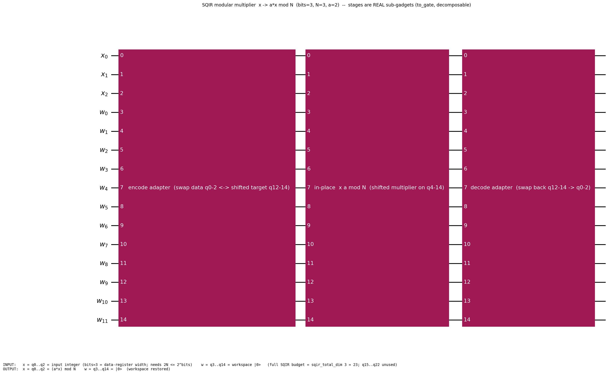

# SQIR-faithful modular multiplier

The in-place **modular multiplier** `x ↦ (a·x) mod N`, encoded as concrete
`Gate`-IR data, faithful to the SQIR/Coq `ModMult.v` construction. This is the
arithmetic core of Shor's order-finding.

> **TL;DR** — `sqir_modmult_MCP_gate bits N a ainv` is THE multiplier. On the
> SQIR-faithful encoding it maps the data register `x ↦ (a·x) mod N` in place,
> using exactly `112·bits²` T-gates.

## Where everything lives (the spine)

| Concern | File | Headline |
|---|---|---|
| **Definition** | [`SQIRModMultDef.lean`](SQIRModMultDef.lean) | `sqir_modmult_MCP_gate` |
| **Correctness** | [`SQIRModMultCorrectness.lean`](SQIRModMultCorrectness.lean) | `sqir_modmult_correct` (`MultiplyCircuitProperty a N`) |
| **Resource** | [`SQIRModMultResource.lean`](SQIRModMultResource.lean) | `sqir_modmult_tcount` (**= 112·bits²**), `sqir_modmult_verified` |
| **Example + QASM** | [`SQIRModMultExample.lean`](SQIRModMultExample.lean) | `SQIRModMult N a ainv` (Gadget) |

Correctness is stated through the shared **`Gate.applyNat`** semantic core (the
proof routes via `sqir_modmult_MCP_gate_apply_encode`). Supporting lemmas live
in `SQIRModMultBitPositioning/PrefixInvariant/AccumulatorRange.lean`.

## The size parameter `bits` (= bit-width of the encoded integers)

`bits` (the **first** argument of `sqir_modmult_MCP_gate bits N a ainv`, and
the size argument of `(SQIRModMult N a ainv).circuit bits` / `emitQASM …`) is
**the number of bits of the data register holding `x`** — the bit-width of the
integers being multiplied modulo `N`. It must satisfy `2·N ≤ 2^bits`. The full
qubit budget is `sqir_total_dim bits` (e.g. `= 23` at `bits=3`). **To change
the size**, pass a different `bits` — e.g. `emitQASM (SQIRModMult N a ainv) 8`,
or `sqir_modmult_tcount 8 N a ainv …` for its T-count (`= 112·8²`). `N` is the
modulus, `a` the multiplier, `ainv` its inverse mod `N`.

## Encoding & correctness (the one theorem to audit)

`sqir_modmult_correct (bits N a ainv) (1≤bits) (0<N) (N≤2^bits) (2N≤2^bits) (ainv≤N) (a·ainv≡1 mod N)`:
the gate satisfies `MultiplyCircuitProperty a N bits (sqir_modmult_rev_anc bits) …`
— it multiplies the encoded data register by `a` modulo `N`.

## Resource (exact, after correctness)

- `sqir_modmult_tcount` : T-count **= `112 · bits²`** (an exact equality, not a bound).
- `sqir_modmult_verified` : the *same* gate is `MultiplyCircuitProperty`-correct
  **and** has T-count `112·bits²`.

## Modular circuit diagram

The fully-decomposed circuit is far too large to draw flat (567 native ops at
`bits=3` → a useless 43k-px strip). Instead, a **faithful modular schematic**:
the three real top-level stages as Qiskit `to_gate` boxes (decomposable), with
the input/output encoding labelled.



Stages (each emitted from Lean at natural size, so the boxes reflect the real
sub-gadgets): **encode adapter** (swaps data `q0–2` ↔ shifted target `q12–14`)
→ **in-place ×a mod N** (shifted multiplier on `q4–14`) → **decode adapter**.
INPUT: `x` (`q0–2`) = input integer; OUTPUT: `x` = `(a·x) mod N`; workspace
restored. (Full budget `sqir_total_dim 3 = 23`; `q15–22` unused.) Render:
`python scripts/draw_modular.py diagrams/sqir_modmult_modular.json diagrams/sqir_modmult_modular.png`.

## Emit OpenQASM for any N (uniform framework)

```lean
#eval IO.println (emitQASM (SQIRModMult 3 2 2) 3)   -- ×2 mod 3 at bits=3
```
`SQIRModMult N a ainv : Gadget` plugs into the project-wide `emitQASM`
framework ([`Codegen/QASMEmit.lean`](../../Codegen/QASMEmit.lean)); works for
any `bits`.

## Onward to PPM

The multiplier's `circuit bits` (a `Gate`) is exactly what the PPM compiler
consumes (`compileArithmeticGateToPPM`); its PPM resource (CCZ-magic / measure
counts) is in [`PPM/ModMultPPMResource.lean`](../../PPM/ModMultPPMResource.lean),
and the end-to-end weld is `Arithmetic/SQIRModMult/ModExpWelded.lean`.
