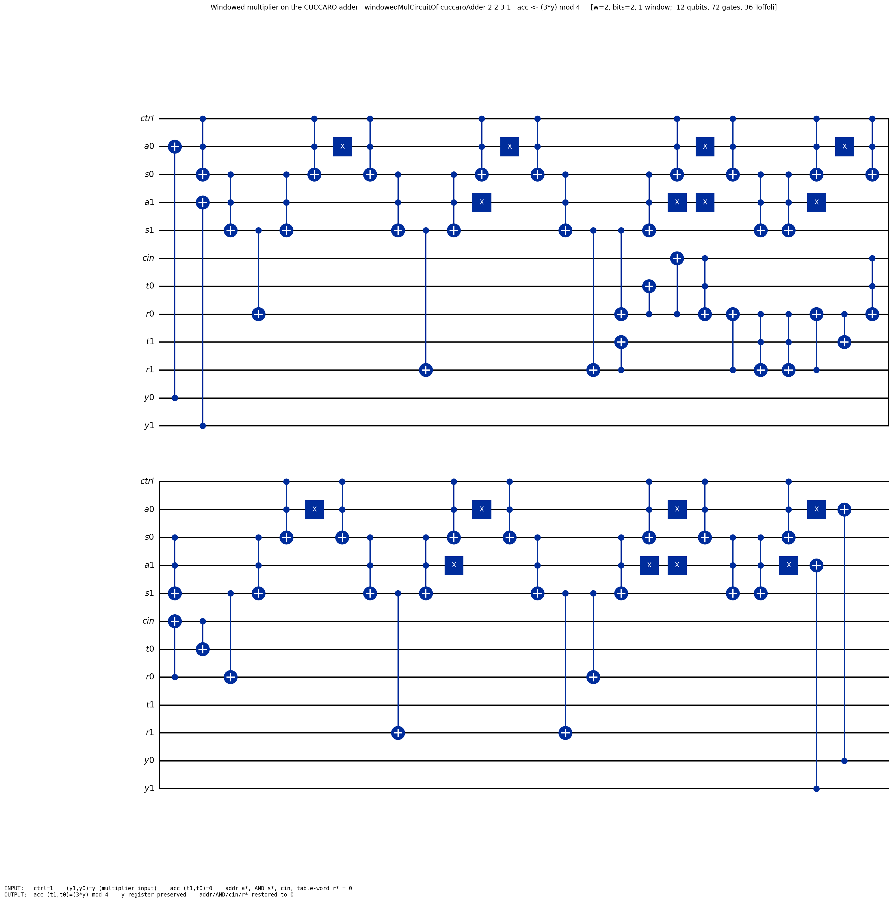
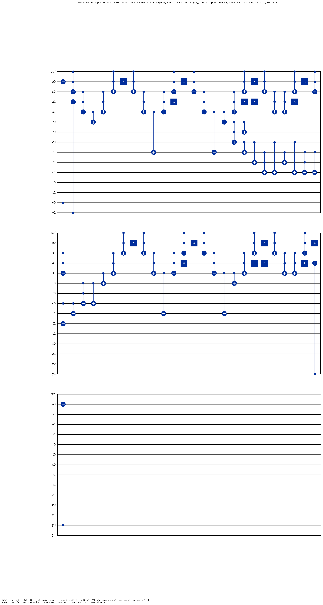

# Windowed arithmetic — adder-generic lookup-based multiplication & exponentiation

Gidney–Ekerå-style windowed arithmetic (arXiv:1905.07682, 1905.09749): instead of
one controlled operation per bit, group bits into **windows** and do one QROM
table-lookup + one addition per window. This folder realizes it **generically
over the adder and the window size**, with kernel-level value theorems.

## The interface story (what plugs into what)

```
ANY  Adder            ──┐
  (Arithmetic/Adder)    ├──>  windowedMulCircuitOf A w …      verified product-multiplier
ANY  window size w    ──┘       (windowedMulCircuitOf_correct: decodeAcc = (a·y) mod 2^bits)

ANY  modular multiplier (EncodeRoundTripModMul)
                        ──>  .toVerifiedModMulFamily → QPE → Shor success bound
                              (Shor/MultiplierInstances: cuccaroMultiplier, gidneyMultiplier)

windowed EXPONENT      ──>  expWindowPassOf A wE wM …          two-level concatenated lookup
  (this folder)               (expWindowPassOf_correct: acc·= g_k^{e-window} · y mod 2^bits)
```

- **`Adder`** (`Arithmetic/Adder.lean`): a layout-parametric reversible adder —
  index functions (`augendIdx`/`addendIdx`), an `ancClean` precondition, and a
  decode-level correctness contract. **Encoding is unified by the index
  functions**: windowed code writes the looked-up table row at `A.addendIdx` and
  reads the running sum at `A.augendIdx`, never knowing the adder's internals.
  Two proven instances: `cuccaroAdder` (block span `2n+1`) and `gidneyAdder`
  (span `3n+2`; the base-0 Gidney gate is rebased by a generic `Gate.shiftBy`).
- **Window size `w`** is a plain `Nat` parameter everywhere. `w = 1` is the
  bit-serial degenerate case.
- **`EncodeRoundTripModMul`** (`Shor/WindowedShorConnection.lean`) is THE
  modular-multiplier interface (`gate c` : multiply-by-`c` with
  `|x⟩|0⟩ ↦ |(c·x) mod N⟩|0⟩`); `Shor/MultiplierInstances.lean` instantiates it
  for both ripple lineages, and `toVerifiedModMulFamily` →
  `shor_correct_of_encodeRoundTrip` is the generic "multiplier → Shor" payoff.

## The headline theorems (all kernel-clean, no `sorry`/`native_decide`)

| Theorem | Statement (informal) | File |
|---|---|---|
| `windowedMulCircuitOf_correct` | for ANY `A : Adder`, `w > 0`: the windowed multiplier decodes the accumulator to `(a·y) mod 2^bits` | `WindowedCircuitCorrect.lean` |
| `windowedMulCircuit_correct_cuccaro` / `_gidney` | the same circuit, instantiated at each adder | `WindowedCircuitCorrect.lean` |
| `expWindowPassOf_correct` | one exponent-window pass multiply-accumulates by the **exponent-window-selected** constant: `acc = (g_k^{window wE e k} · y) mod 2^bits` | `WindowedExpStep.lean` |
| `tcount_windowedMulCircuitOf` | T-count `= numWin · (28·w·2^w + tcount(A.circuit))`, generic over `A` | `WindowedCircuit.lean` |
| `lookupReadAt_selects` | the QROM reads exactly the addressed table row | `WindowedLookupSelect.lean` |
| `grayLookupReadAt_selects_word` | the **Gray-code/sawtooth** QROM reads the same row at `2·(2^w−1)` Toffolis (vs `2·w·2^w`); exact gap `faithful = w·(gray+14)` | `UnaryLookup/UnaryLookupGrayCode.lean` |
| `grayWindowedMulCircuitOf_correct` | the windowed multiplier on the **Gray-code read** — same value theorem, Toffoli `numWin·(4·(2^w−1) + 2·bits)` (the `w` factor gone) | `WindowedGrayLookup.lean` |

Supporting: `WindowedCopySemantics.lean` (window-copy CX-cascade semantics),
`WindowedArith.lean` (the pure number theory), `WindowedCostModel.lean` (the
GE2021 paper-accounting formulas), `WindowedWidth.lean` (structural qubit counts).

### Why the windowed *exponent* is a concatenated address (design note)

A black-box "add a control to any multiplier" is **impossible** in the
`X/CX/CCX` Gate IR (there is no controlled-everything combinator — controlling
`CCX` needs `CCCX`). So windowed exponentiation is faithfully formalized the way
Gidney's paper actually does it: the exponent window and the multiplier window
are **concatenated into one QROM address** (`addr = v + 2^wM·e_k`,
`WindowedArith.address_concat`), and the table row already contains
`g_k^{e_k} · (2^wM)^j · v`. One pass = the quantum-selected constant multiply.

## Concrete head-to-head: same circuit, two adders (`bits = 4`, `a = 3`)

Computed by `#eval` from the actual `Gate` terms (`Example.lean`):

| `w` | windows | **Cuccaro**: Toffoli / gates / qubits | **Gidney**: Toffoli / gates / qubits |
|---|---|---|---|
| 1 | 4 | 64 / 166 / **16** | 64 / 206 / **21** |
| 2 | 2 | 80 / 172 / **18** | 80 / 192 / **23** |
| 3 | 2 | 208 / 386 / **22** | 208 / 406 / **27** |
| 4 | 1 | 264 / 480 / **22** | 264 / 490 / **27** |

Both adders cost **identical Toffolis** (each is a 2-Toffoli-per-bit ripple);
they differ in T-free CX/X overhead and in **qubit width** (Cuccaro's `2n+1`
block vs Gidney's `3n+2`) — the trade is read off the verified structure, not
asserted. At this toy `bits = 4` the lookup term `4·w·2^w` dominates, so larger
windows *cost* more; windowing pays at production sizes, where the per-window
adder term `2·bits` dominates (at `bits = 2048`, `w = 11 ≈ lg n` minimizes
`numWin·(4·w·2^w + 2·bits)` — the paper's `O(n²/lg n)` per multiply).

## Worked example: `acc ← (3·y) mod 4` at `w = 2` (1 window)

The exact compiled circuit on **both** adders — same table, same lookup, same
y-copy; only the adder block differs. Verified instance:
`windowedMulCircuit_correct_cuccaro 2 2 3 1 y …` (and `_gidney`).

**Cuccaro** (12 qubits, 72 gates, 36 Toffoli):



**Gidney** (15 qubits, 74 gates, 36 Toffoli):



Reading the (Cuccaro) picture left-to-right: CX-copy of the `y`-window into the
address wires `a0,a1` → the four unary-iteration QROM rows (X-flips on the
address, `CCX` prefix-AND cascade through `s0,s1`, word-CNOTs into the table-word
wires `r0,r1` — only the row matching the address fires) → the Cuccaro ripple
(`cin,t*,r*`) adds the looked-up row `3·(2²)⁰·v = 3v` into the accumulator `t*`
→ the second QROM read clears `r*` → the uncopy clears the address. Output:
`acc (t1,t0) = (3·y) mod 4`, everything else restored.

| port | input | output |
|---|---|---|
| `ctrl` | 1 | 1 |
| `y1,y0` | `y` | `y` (preserved) |
| `t1,t0` (acc) | 0 | `(3·y) mod 4` |
| addr `a*`, AND `s*`, word `r*`, `cin` | 0 | 0 (restored) |

Reproduce: `lake env lean …/Windowed/Example.lean` writes the `.qasm` files,
then `python scripts/draw_qasm.py diagrams/windowed_mul_cuccaro_w2.qasm
diagrams/windowed_mul_cuccaro_w2.png diagrams/windowed_mul_cuccaro_w2.io.json`.

## Try it 1 — the window size is a free knob

Everything below is **real, executed code** (put it in any scratch `.lean` at the
repo root; prebuild once with
`lake build FormalRV.Arithmetic.Windowed.WindowedCircuitCorrect FormalRV.Codegen.QASMEmit`,
then `lake env lean <file>`):

```lean
import FormalRV.Arithmetic.Windowed.WindowedCircuitCorrect

open FormalRV.Framework FormalRV.Framework.Gate FormalRV.BQAlgo
open FormalRV.Shor.WindowedCircuit

/-- A 4-bit multiply-add `acc += 3·y` over the Cuccaro adder; the window size
    `w` is a free knob — `4/w` windows of `w` bits each cover the 4-bit `y`. -/
def myMul (w : Nat) : Gate :=
  windowedMulCircuitOf cuccaroAdder w 4 3 (4 / w)

#eval toffoliCount (myMul 1)   -- 64    (4 windows × (4·1·2¹ + 2·4))
#eval toffoliCount (myMul 2)   -- 80    (2 windows × (4·2·2² + 2·4))
#eval toffoliCount (myMul 4)   -- 264   (1 window  × (4·4·2⁴ + 2·4))

-- The closed-form count follows the knob: `numWin · (4·w·2^w + 2·bits)`.
example : toffoliCount (myMul 2) = 2 * (4 * 2 * 2 ^ 2 + 2 * 4) :=
  windowedMulCircuit_toffoli 2 4 3 2

-- The CORRECTNESS theorem follows the knob too — here at w = 3
-- (bits = 8, a = 5, numWin = 2, y = 45 < 2^(3·2)):
#check (windowedMulCircuit_correct_cuccaro 3 8 5 2 45 (by decide) (by decide) :
    decodeAccOf cuccaroAdder
        (Gate.applyNat (windowedMulCircuitOf cuccaroAdder 3 8 5 2)
          (mulInputOf cuccaroAdder 3 8 2 45)) (1 + 2 * 3) 8
      = (5 * 45) % 2 ^ 8)
```

Output (verbatim): `64`, `80`, `264`, and the `#check` displays the
fully-instantiated correctness proposition at `w = 3`. Swap `cuccaroAdder` for
`gidneyAdder` and everything still goes through (`windowedMulCircuit_correct_gidney`).

## Try it 2 — emit concrete OpenQASM via the uniform `emitQASM` framework

The windowed multiplier plugs into the project-wide `Gadget`/`emitQASM`
framework (`Codegen/QASMEmit.lean`) like every other arithmetic gadget — with
the **adder and the window size as parameters**:

```lean
import FormalRV.Arithmetic.Windowed.WindowedCircuitCorrect
import FormalRV.Codegen.QASMEmit

open FormalRV.Framework FormalRV.BQAlgo
open FormalRV.Shor.WindowedCircuit
open FormalRV.Codegen (Gadget emitQASM)

/-- The windowed multiplier (`acc += a·y`) over ANY `Adder`, as a uniform,
    emittable `Gadget`: `circuit bits` is the multiplier at accumulator
    width `bits`. -/
def WindowedMul (A : Adder) (tag : String) (w a numWin : Nat) : Gadget :=
  { name    := s!"windowed_mul_{tag}_w{w}"
    circuit := fun bits => windowedMulCircuitOf A w bits a numWin }

-- Emit OpenQASM 2.0 for `acc += 3·y` (w = 2, one window) over BOTH adders:
#eval IO.println (emitQASM (WindowedMul cuccaroAdder "cuccaro" 2 3 1) 2)
#eval IO.println (emitQASM (WindowedMul gidneyAdder  "gidney"  2 3 1) 2)

-- Exact structural resource readout (same counters as the resource theorems):
#eval IO.println ((WindowedMul cuccaroAdder "cuccaro" 2 3 1).resourceReport 2)
#eval IO.println ((WindowedMul gidneyAdder  "gidney"  2 3 1).resourceReport 2)
```

Verbatim output — the first lines of the Cuccaro emission (full program is 580
lines; the two leading `cx`s are the window copy `y → address`):

```qasm
OPENQASM 2.0;
include "qelib1.inc";
qreg q[12];
cx q[10],q[1];
cx q[11],q[3];
h q[2];
cx q[1],q[2];
tdg q[2];
cx q[0],q[2];
...
```

the Gidney emission differs only in layout (`qreg q[15];` — span `3n+2` — with
the y-copies `cx q[13],q[1]; cx q[14],q[3];`), and the resource reports read:

```
windowed_mul_cuccaro_w2 (n=2): gates=72, T=252
windowed_mul_gidney_w2  (n=2): gates=74, T=252
```

(`T = 252 = 7 × 36` Toffolis `= 7 · numWin·(4·w·2^w + 2·bits)` — identical
across adders, as the head-to-head table predicts.)

## Auditor's routing table — which file to import for which paper claim

When auditing a windowed-arithmetic resource claim, pick the variant **from the
file structure** and import it directly:

| Paper claim being audited | Import | Headline |
|---|---|---|
| **No-optimization baseline** (faithful unary-iteration QROM, `2·w·2^w` Toffolis/read; windowed multiply `numWin·(4·w·2^w + 2·bits)`) | `FormalRV.Arithmetic.Windowed.WindowedCircuitCorrect` | `windowedMulCircuitOf_correct`, `tcount_windowedMulCircuitOf` |
| **Gray-code-optimized lookup** (Babbush sawtooth, `2·(2^w−1)` Toffolis/read — the GE2021 `0.3n³` lookup term up to ×2) | `FormalRV.Arithmetic.UnaryLookup.UnaryLookupGrayCode` | `grayLookupReadAt_selects_word`, `tcount_grayLookupReadAt`, exact gap `tcount_lookupReadAt_eq_w_mul_gray` |
| **Gray-code windowed multiply** (`numWin·(4·(2^w−1) + 2·bits)` Toffolis, value-verified on both adders) | `FormalRV.Arithmetic.Windowed.WindowedGrayLookup` | `grayWindowedMulCircuitOf_correct`, `grayWindowedMulCircuit_toffoli_cuccaro` |
| **The residual ×2: measurement-based uncompute** (Gidney 1905.07682 App. C) — **now PROVEN at the logical density layer** (`Com.meas`/`c_eval`, no PPM) | `FormalRV.Shor.MeasuredANDUncompute` (AND case), `FormalRV.Shor.MeasuredLookupUncompute` (W-bit channel), `FormalRV.Shor.PhaseLookupFixup` (concrete fixup circuit, end-to-end) | `measANDUncompute_perfect`, `measWordUncompute_perfect`, `measWordUncompute_phaseLookup` |
| **Measured lookup-add value semantics** (EGate level; counts + `acc += T[addr]`) | `FormalRV.Shor.MeasUncomputeAt` (layout-correct, any `W`); defect proofs + W=1 discharge in `FormalRV.Shor.MeasUncomputeValue` (the original `babbushLookupAdd` is proven value-broken for `W ≥ 2`) | `babbushLookupAddAtValueSpecOn_holds`, `measUncomputeAt_saves_a_read` |
| **Windowed exponent** (two-level lookup, per-pass) | `FormalRV.Arithmetic.Windowed.WindowedExpStep` | `expWindowPassOf_correct` (+ both adder corollaries) |
| Paper's exact ℚ cost-accounting formulas (GE2021 §cost) | `FormalRV.Arithmetic.Windowed.WindowedCostModel` | `toffoliCount_rsa2048`, `toffoliCount_le_paper` |

The Gray-code and faithful reads are **contract-identical** (same selection +
frame lemmas, same qubit layout), so circuits and proofs swap between them
mechanically — the value theorems hold for both.

## Honest scope notes

- The windowed multiplier here is the **product-adder** `acc += a·y mod 2^bits`
  (Gidney's coset/deferred-modular-reduction design); it is NOT a per-window
  mod-`N` reducer. The exactly-modular in-place multiplier feeding the verified
  Shor pipeline is the separate `windowedInplaceModMulGate` /
  `modmult_MCP_gate` lineage (see `Shor/WindowedShorConnection.lean` and
  `Arithmetic/ModMult/`).
- The **Gray-code factor is closed at the gate level**
  (`UnaryLookupGrayCode` / `WindowedGrayLookup`) AND the **×2 measurement-based
  uncompute is now proven at the logical density layer** (no PPM): the
  X-measure + classically-controlled phase-fixup channel is the *perfect*
  uncompute on lookup-computed superpositions
  (`Shor/MeasuredANDUncompute` → `MeasuredLookupUncompute` →
  `PhaseLookupFixup`, end-to-end with a concrete fixup circuit), and the
  layout-correct measured lookup-add carries the value semantics + the exact
  ×2-saving ledger at any `W` (`Shor/MeasUncomputeAt`). Remaining refinement:
  the *split* `2^{w/2}` fixup circuit (design + exact count spec'd in
  `PhaseLookupFixup` §7; the unsplit fixup costs one Gray-code read).
- `expWindowPassOf_correct` is the per-pass theorem; composing passes over all
  exponent windows into the full windowed modexp (and into QPE) remains the
  known-open composition flagged at `WindowedExpCorrect`/`BabbushLookupAddValueSpec`.
