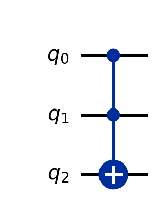

# FormalRV.Core

The foundational layer of FormalRV: the gate intermediate representation (IR), its
classical (bit-vector) and quantum (complex-matrix) semantics, the pad/Kronecker
embedding of small gates into a `dim`-qubit system, and the verified 7-T Toffoli
decomposition. Everything above this layer (arithmetic gadgets, PPM/QEC, the Shor
pipeline) is expressed in terms of these defs. Faithfully mirrors SQIR's
`SQIR.v` / `UnitarySem.v` / `UnitaryOps.v` / `GateDecompositions.v`, in Lean 4 over mathlib.

## Layout
- `Basic.lean` — shared scalars (e.g. surgery cycle cost `tau_s`); no mathlib.
- `Gate.lean` — the reversible/Clifford+Toffoli `Gate` IR (I/X/CX/CCX/seq) + `tcount`/`gcount`/`depth`.
- `Semantics.lean` — RCIR-level bit-vector semantics: `Gate.apply` on `State n`, `implements` predicate.
- `Boolean.lean` — boolean helpers (`majority`, Cuccaro-form identity) for arithmetic proofs.
- `QuantumGate.lean` — unitary IR: `BaseUnitary`/`UCom`/`Com`, gate shorthands (H,X,T,S,CNOT), `CCX`/`CCZ` decompositions, `WellTyped`.
- `UnitarySem.lean` — matrix semantics: `uc_eval`, `pad_u`/`pad_ctrl`, single-qubit matrices and their algebra (~2200 lines).
- `PadAction/` (`Defs` + `Proofs1..3`, re-exported by `PadAction.lean`) — action of padded gates on basis states; the CCX-on-`f_to_vec` proof lives here.
- `QuantumLib.lean` — state-vector helpers (`funbool_to_nat`, `basis_vector`, `f_to_vec`); holds 2 Shor-specific axioms.
- `UnitaryOps.lean` — circuit operations (`invert`, `niter`, control); some lemmas scaffolded.
- `GateDecompositions.lean` — `toffoliMatrix`, CCX correctness, T/S/H power identities.
- `NDSem.lean`, `DensitySem.lean` — measurement / density-matrix semantics (scaffolding).

## Key definitions
- `Gate` (`Gate.lean`) — reversible-circuit IR; only `CCX` carries T-cost.
- `Gate.apply` (`Semantics.lean`) — deterministic bit-vector action of a `Gate` on `State n = Fin n → Bool`.
- `BaseUCom` / `uc_eval` (`QuantumGate.lean`, `UnitarySem.lean`) — unitary AST and its `2^dim × 2^dim` matrix denotation.
- `pad_u` / `pad_ctrl` (`UnitarySem.lean`) — embed a 2×2 (controlled) gate at qubit `n` via Kronecker products + reindex (both implemented, not stubbed).
- `BaseUCom.CCX` (`QuantumGate.lean`) — the textbook 7-T Toffoli (H·CNOT·T†… chain).
- `f_to_vec` / `funbool_to_nat` (`QuantumLib.lean`) — computational-basis state from a boolean register.
- `toffoliMatrix` (`GateDecompositions.lean`) — the abstract 8×8 Toffoli permutation matrix.

## Key theorems
- `f_to_vec_CCX` (`GateDecompositions.lean`) — the 7-T `CCX` flips target `c` iff controls `a,b` are set — **Verified** (only mathlib axioms; proof in `PadAction/Proofs3`).
- `CCX_eq_toffoliMatrix` (`GateDecompositions.lean`) — `uc_eval (CCX 0 1 2) = toffoliMatrix` (all 8 basis cases) — **Verified**.
- `pad_u_mul_pad_u` (`UnitarySem.lean`) — composing two gates at the same qubit = padding their matrix product — **Verified**.
- `rotation_X/Y/Z/T/S/H` (`UnitarySem.lean`) — each `R(θ,ϕ,λ)` shorthand equals its standard 2×2 matrix — **Verified**.
- `niter_*_eq_*` (`GateDecompositions.lean`) — gate-power identities (T⁴=Z, S²=Z, H²=I, …) — **Verified**.
- `majority_eq_cuccaro_form` (`Boolean.lean`) — majority = `c ⊕ ((a⊕c)∧(b⊕c))`, justifying MAJ = 2·CX + CCX — **Verified**.
- `f_modmult_circuit`, `probability_of_success` (`QuantumLib.lean`) — Shor modmult circuit and success probability — **Axiom** (deferred to circuit-construction work).
- `nd_eval` / `c_eval` structural lemmas (`NDSem.lean`, `DensitySem.lean`) — measurement-semantics congruences — **Scaffolded** (deep proofs deferred).

## Status
The unitary core (gate IR, matrix semantics, pad embedding, CCX=7-T correctness, Pauli/phase-gate algebra) is sorry-free in its proof bodies; the only `axiom`s in this folder are the two Shor-specific deferrals in `QuantumLib.lean`. The measurement-based layers (`NDSem`, `DensitySem`) and parts of `UnitaryOps` are deliberately Scaffolded — types and statements are present, but partial-trace / matrix-norm proofs are deferred.

## Worked example — Toffoli = 7 T, emitted and round-tripped

The whole T-count ledger rests on one primitive. `toQASM (CCX 0 1 2)` emits
`toffoli.qasm` (drawn above); `tcount_eq_seven_numCCX` (`GateQASM.lean:33`,
**Verified**, axiom-clean) proves `tcount g = 7 · numCCX g` for *every* circuit `g`,
and `gcount_eq_sum` that `gcount = numX + numCX + numCCX`. So a Qiskit script can
load any emitted `.qasm`, count its `ccx`, and confirm it equals `tcount/7` —
turning the resource theorem into an externally checkable fact, not Lean bookkeeping.

At the *unitary* level the decomposition is also proved: `BaseUCom.CCX` is the
textbook 7-T chain (`H·CNOT·T†…`), and `f_to_vec_CCX` (`GateDecompositions.lean:81`,
**Verified** — `#print axioms` = `propext, Classical.choice, Quot.sound`) proves that
chain flips the target iff both controls are set, with `CCX_eq_toffoliMatrix` giving
the full 8×8 permutation identity.

### More small examples

3. **Composite gate-count.** For `seq (X 0) (CCX 0 1 2)` the IR computes
   `tcount = 0 + 7 = 7`, `gcount = 1 + 1 = 2`, `depth = 2` (the `example`s in
   `Gate.lean`), and `toQASM` emits `x q[0]; ccx q[0],q[1],q[2];`. The 3-bit Cuccaro
   adder (`Arithmetic/`) is the same machinery at scale — 18 gates, `tcount = 14·3 = 42`
   from its `6` Toffolis — and Qiskit re-counts it.
4. **The Clifford leaves.** `toQASM (CX 1 0)` and `toQASM (X 0)` emit the obvious
   one-line OpenQASM 2; both have `tcount = 0` (Cliffords are T-free), while `numCX` /
   `numX` track them for the `gcount_eq_sum` identity — these are the leaves the
   `seq`-induction composes.

## Essential proof techniques

- **Structural induction on the `Gate` IR.** The resource theorems induct over the
  five constructors `I / X / CX / CCX / seq`; the leaf cases are reflexive and the
  `seq` case rewrites with the two induction hypotheses and closes by `omega` — the
  Lean-native analogue of SQIR's `bccom` induction.
- **Two semantics, one IR.** Cost lives in the lightweight *reversible* IR (`Gate`,
  where `CCX` is a primitive costed at 7 by definition); *correctness* lives in the
  *unitary* IR (`BaseUCom`/`uc_eval`, `2^dim×2^dim` matrices) where the 7-T `CCX` is
  proven equal to the Toffoli. The pad/Kronecker embedding (`pad_u`, with
  `pad_u_mul_pad_u`) and the gate-power identities (`T⁴=Z`, `S²=Z`, `H²=I`) are the
  matrix-algebra workhorses; `f_to_vec_CCX` is proven on `f_to_vec` basis states.

Honest scope: the two `axiom`s here are the deprecated Shor placeholders in
`QuantumLib.lean` (`f_modmult_circuit`, `probability_of_success`), off the verified
chain (the live proof uses the SQIR-faithful multiplier in `Arithmetic/`);
measurement/density semantics (`NDSem`, `DensitySem`) are Scaffolded.
