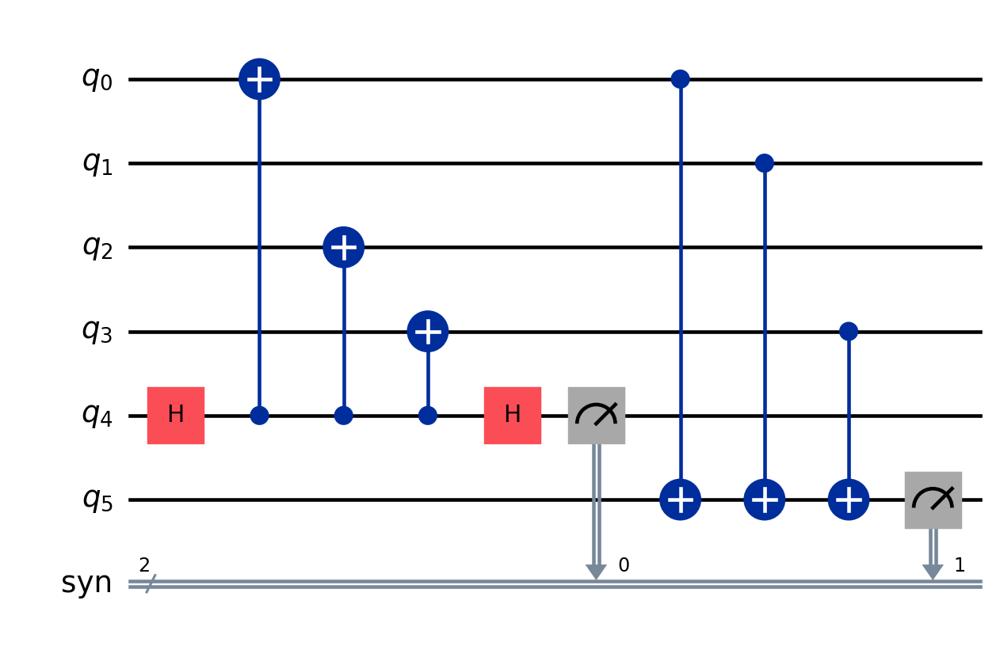
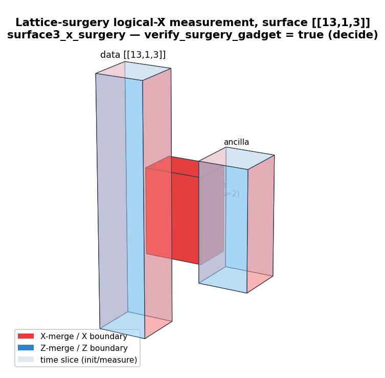
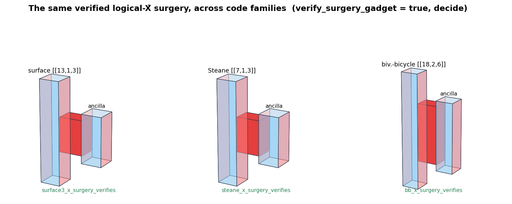
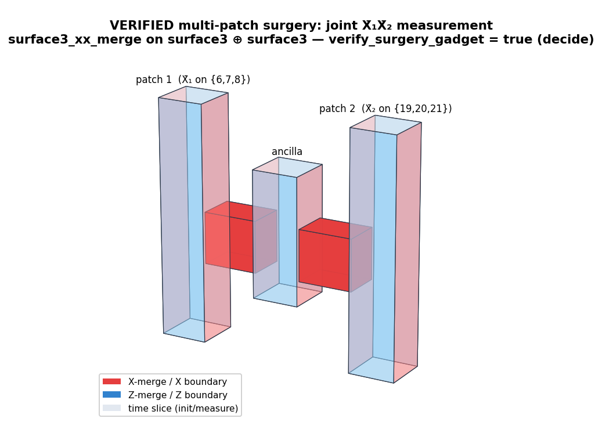
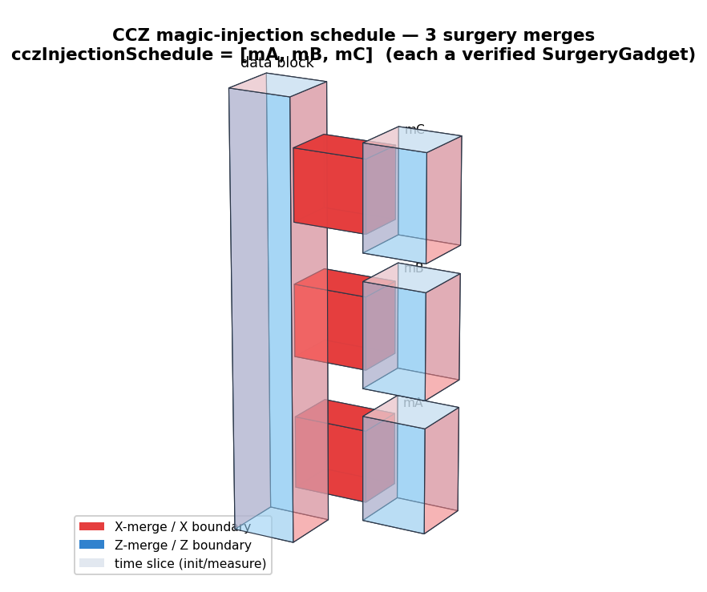
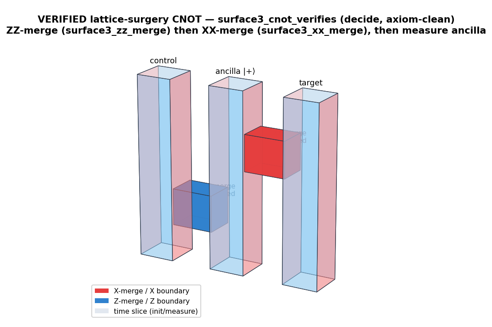
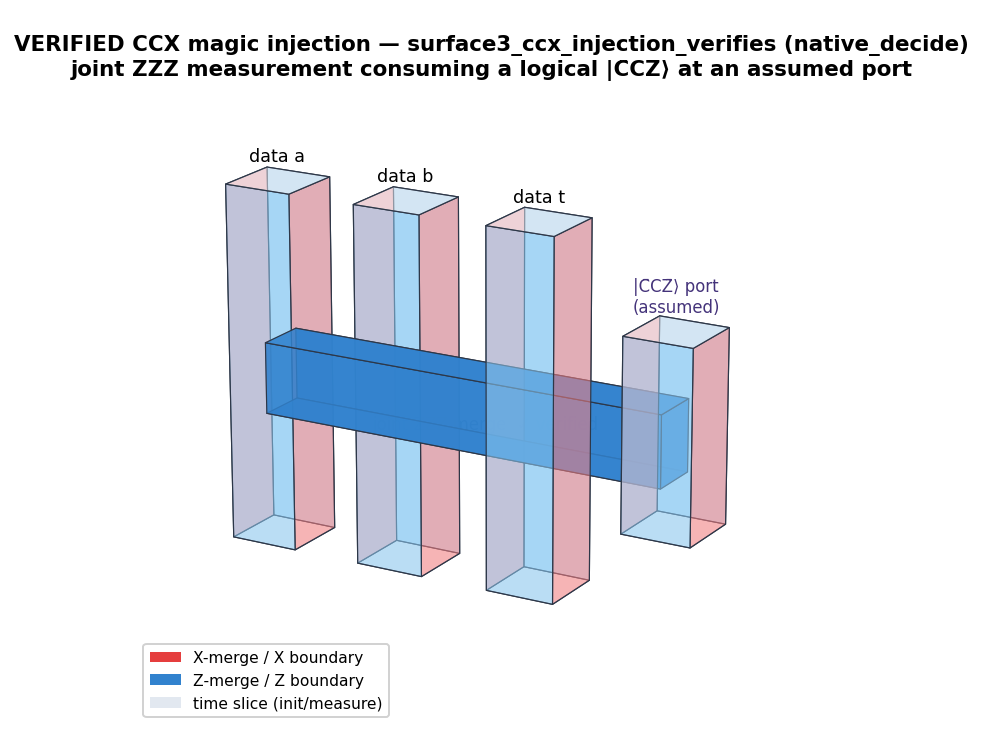

# FormalRV.LatticeSurgery

L3 of the FormalRV stack: lattice-surgery (merge/split) modelling for fault-tolerant Shor's algorithm and the PPM / system-call schedule contracts it must satisfy. A surgery gadget realises one logical Pauli-product measurement (PPM) on a qLDPC code by merging a data code with an ancilla system for `tau_s` cycles, then detaching. These files encode the merged-code parity matrices, a decidable structural verifier, a compiler from gadget descriptions to `SysCall` streams, and the reusable schedule certificate that propagates resource/invariant guarantees upward. Targets qianxu (Cain–Xu et al. 2026) App. C. No Mathlib; pure Bool/Nat/List, fully decidable.

## Layout
- `LDPCSurgery.lean` — the `SurgeryGadget` IR (single data + ancilla block), merged parity matrices, and the headline structural verifier.
- `LatticeSurgeryPPMContract.lean` — the reusable `PPMScheduleCert` contract, system invariants I1–I4, schedule combinators, and composition theorems (largest file, §1–§23).
- `SurgeryGadgetToSysCalls.lean` — compiler from surgery/topology gadgets to `SysCall` streams, plus the combined qLDPC + system-invariant contract theorems.

## Key definitions
- `SurgeryGadget` (`LDPCSurgery.lean`) — single-block surgery gadget: data code, ancilla checks, connection matrices `conn_x`/`conn_z`, `tau_s`, target Pauli, span witness.
- `merged_hx` / `merged_hz` (`LDPCSurgery.lean`) — the merged X/Z parity matrices `[[H_X 0],[f_X' H_X']]`, `[[H_Z f_Z],[0 H_Z']]`.
- `verify_surgery_gadget` (`LDPCSurgery.lean`) — decidable verifier: dimension consistency, qLDPC bound, `tau_s` sufficiency, row-span (kernel) identity.
- `PPMScheduleCert` / `…WithFactoryPorts` (`LatticeSurgeryPPMContract.lean`) — certificate bundling an architecture + `SysCall` stream + proofs of I1–I4 and decoder reaction.
- `seqSchedules` / `parSchedules` / `validateScheduleWithFactoryPorts` (`LatticeSurgeryPPMContract.lean`) — pure schedule combinators and the generic decidable bundle validator.
- `compileTopologySurgeryToSysCalls` (`SurgeryGadgetToSysCalls.lean`) — compiler emitting per-round edge gates / ancilla measures from a gadget's connection topology.
- `verify_surgery_gadget_with_schedule` (`SurgeryGadgetToSysCalls.lean`) — combined checker: structural qLDPC verifier AND strengthened system bundle.

## Key theorems
- `compile_basic_ppm_eq_existing_ppm_block` (`SurgeryGadgetToSysCalls.lean`) — the compiled stream is structurally equal to the hand-written GE2021 PPM block — **Verified** (structural equality, by decide).
- `verify_surgery_gadget_with_schedule_cert_exists` (`SurgeryGadgetToSysCalls.lean`) — a passing combined checker yields a strengthened cert with stream-derived wallclock — **Verified** (reuses the 7-fold invariant unpacking).
- `topology_pair_alias_rejected` (`SurgeryGadgetToSysCalls.lean`) — parallel gadgets sharing ancilla sites are rejected by the bundle — **Verified** (negative case, native_decide).
- `all_invariants_ok_of_cert` (`LatticeSurgeryPPMContract.lean`) — every cert satisfies the framework's bundled I1–I3 invariants — **Verified**.
- `seqSchedules_wallclock_is_derived` / `parSchedules_wallclock_is_derived` (`LatticeSurgeryPPMContract.lean`) — composed-schedule wallclock equals the foldl over its stream (anti-spreadsheet) — **Arithmetic-only** (Nat/rfl identity).
- §22 documented principle (`LatticeSurgeryPPMContract.lean`) — two valid certs do NOT auto-compose; merged streams must be re-validated, with `validate_parallel_alias_false` as the counterexample — **Verified**.

## Status
All proofs discharge by `decide`/`native_decide`/`rfl` with no `sorry` and no custom `axiom`; the system-invariant and structural-correctness claims (dimensions, qLDPC bound, `tau_s`, row-span identity, schedule resources) are genuinely **Verified** at that layer. However, these are structural/resource checks only: quantum-semantic correctness (that the surgery actually measures the claimed Pauli product), decoder correctness, per-SysCall duration physics, and RSA-2048-scale schedules are explicitly out of scope and remain unverified. Merged-code distance `d̃ = Θ(d_data)` is accepted as an implementer-supplied, paper-cited input (**Axiom**-equivalent, not proven here).

## Worked example — measuring logical X̄ on the [[13,1,3]] surface code



`surface3_x_surgery` merges one ancilla into the distance-3 surface code to measure
the logical `X̄ = X₆X₇X₈`. `StimEmit.surgeryToStim` emits the merged-code syndrome
circuit (above: each X-check is an ancilla in `|+⟩`, `CX anc→support`, `MX`; each
Z-check is `CX support→anc`, `M`). `surface3_x_surgery_measures_logicalX`
(`Corpus/SurgeryDemoSurface.lean:118`, **Verified**, axiom-clean) proves the
span-witness-selected ancilla X-checks multiply to exactly `signedXRow X̄`, and
`surface3_x_surgery_verifies` passes the structural verifier. Stim's `has_flow` then
re-derives the same fact externally — the LaSsynth gold standard.

### More small examples

2. **The row-span check, concretely.** For `surface3_x_surgery` the span witness
   `[F,F,F,F,F,F,T,T]` selects the two ancilla X-checks; `row_combination witness
   merged_hx = target_pauli` evaluates to the `X̄ = X₆X₇X₈` row
   (`targets_logical_correctly`, by `decide`) — the GF(2) fact that
   `selectedSignedProduct_eq` lifts to the signed Pauli product.
3. **Rejecting a bad gadget.** `topology_pair_alias_rejected`
   (`SurgeryGadgetToSysCalls.lean:834`, `native_decide`) proves the combined checker
   returns `false` for two parallel gadgets that *share* ancilla sites — a structural
   aliasing bug caught before any physics (the contract file's §22 shows two
   individually-valid certs that must NOT auto-compose).

## 3D spacetime (TQEC) diagrams — the surgery we verify

A lattice-surgery computation is naturally a **3D spacetime diagram** (the TQEC /
"Game of Surface Codes" idiom): time runs upward, each logical surface-code patch is a
box whose vertical faces carry the boundary type (X = red / rough, Z = blue / smooth),
and a surgery **merge** is a tube coloured by the measured Pauli type (X-merge red,
Z-merge blue). FormalRV verifies the abstract `SurgeryGadget` (merged parity rows +
Pauli frame, all by `decide`); these diagrams are its spacetime view. Regenerate with
`python PyCircuits/draw_tqec.py`.

**What the verifier checks.** `verify_surgery_gadget` (`LDPCSurgery.lean`) is the
conjunction of four decidable conditions — `dimensions_consistent`, `tau_s_sufficient`
(`3·τ_s ≥ 2d`), `merged_is_qldpc`, and `targets_logical_correctly` (the row-span kernel
condition) — and it applies to *any* surface-code surgery gadget. We instantiate and
prove it (`= true` by `decide`) across three code families:

| Gadget | Code | Measures | τ_s | merged Hx / Hz | Verified |
|---|---|---|:--:|:--:|---|
| `surface3_x_surgery` | surface `[[13,1,3]]` | X̄ = X₆X₇X₈ | 2 | 8 / 6 | `surface3_x_surgery_verifies` |
| `steane_x_surgery` | Steane `[[7,1,3]]` | X̄ = X₃X₅X₆ | 2 | 5 / 3 | `steane_x_surgery_verifies` |
| `bb_x_surgery` | biv.-bicycle `[[18,2,6]]` | logical X̄₀ | 4 | 20 / 18 | `bb_x_surgery_verifies` |
| `surface3_xx_merge` | surface ⊕ surface `[[26,2,3]]` | joint **X̄₁X̄₂** | 2 | 14 / 12 | `surface3_xx_merge_verifies` |
| `surface3_xxx_merge` | 3 × surface `[[39,3,3]]` | joint **X̄₁X̄₂X̄₃** | 2 | 20 / 18 | `surface3_xxx_merge_verifies` |
| `surface3_zz_merge` | surface ⊕ surface (CSS-dual) | joint **Z̄₁Z̄₂** | 2 | 14 / 12 | `surface3_zz_merge_verifies` |
| `surface3_zzz_merge` | 3 × surface (CSS-dual) | joint **Z̄₁Z̄₂Z̄₃** | 2 | 20 / 18 | `surface3_zzz_merge_verifies` |

<p align="center"></p>

It is the *same* construction — a data patch + an ancilla patch joined by an X-merge
tube of height ≈ τ_s — across all three code families:

<p align="center"></p>

**Multi-patch merges (same framework).** The verifier is not limited to one patch: a
**joint X̄₁X̄₂ measurement** — the `XX`-merge of a lattice-surgery CNOT — is the gadget
`surface3_xx_merge` on a block-diagonal `surface3 ⊕ surface3` `[[26,2,3]]` code, with one
ancilla coupled to *both* logical supports. It passes the **same** `verify_surgery_gadget`
(`= true` by `decide` at 27 merged qubits) and the **same** code-general
`surgery_implements_logical_measurement` (`surface3_xx_merge_implements_logical`, axiom-free).
`surface3_xxx_merge` does the joint **X̄₁X̄₂X̄₃** on three patches (`native_decide`, 40 qubits).

<p align="center"></p>

**Any code distance.** The per-merge gadget is generic in the distance:
`surface_d_x_surgery d` (`Corpus/ShorEmitDistance.lean`) builds the surgery gadget on
`surfaceHGP d` (the `[[d²+(d−1)², 1, d]]` surface code), with its logical X̄ computed by the
code-general `pairedLogicalX` and `τ_s = ⌈2d/3⌉`. It passes the **same**
`verify_surgery_gadget` at each chosen distance — `surface_d_x_surgery_verifies_d3`
(axiom-clean `decide`, just `propext`), `…_d5`, `…_d7` (`native_decide`). The whole
computation is then distance-parameterized:

```lean
def emitShorAtDistance (N a d : Nat) : String :=     -- full Shor(N,a) lattice surgery at distance d
  emitScheduleStim (List.replicate (shorMergeCount N) (surface_d_x_surgery d))
```

`lake env lean --run emit_shor_distance_demo.lean` emits the first 3 of Shor(15)'s 3072
merges at **distance 5** — a 708-line Stim circuit, three `[[41,1,5]]` merged-code syndrome
blocks (`RX` ancilla → `CX` to data → `MX`) → `PyCircuits/shor_distance5_demo.stim`.

**Schedules.** Gadgets compose into a `Schedule` (`SurgerySchedule.lean`), and
`schedule_runs_as_surgeries` (`SurgerySchedule.lean:76`) proves a schedule runs as the
sequence of its gadget measurements. Concrete schedules: `cczInjectionSchedule =
[mA, mB, mC]` (`MagicInjectionSurgery.lean`, the 3 merges of one magic-CCZ injection),
`demoSchedule = List.replicate 3 surface3_x_surgery` (`SurfaceShorFullStack.lean`), and
the parametric `shorSchedule` (RSA-2048 = 412,316,860,416 merges, `ShorEmit.lean`). The
CCZ-injection schedule as a spacetime diagram:

<p align="center"></p>

**The full lattice-surgery CNOT is VERIFIED.** It is the two-merge schedule
`surface3_cnot = [surface3_zz_merge, surface3_xx_merge]` (a `ZZ`-merge, then an `XX`-merge,
then measure the ancilla), and `surface3_cnot_verifies` proves **both** merges pass the
framework verifier — `decide`, axiom-clean (`propext`). The Z-merge is handled by **CSS
duality** (measuring X̄ of the dual code `{hx := hz, hz := hx}` *is* measuring Z̄), so it reuses
the **same** `verify_surgery_gadget` with no new machinery.

<p align="center"></p>

**CCX (Toffoli) magic injection — VERIFIED, assuming a logical magic state at a port.** The
injection is the verified joint **Z̄Z̄Z̄ measurement** (`surface3_zzz_merge`) coupling the data
to a port that holds a logical `|C̄CZ̄⟩` (the `measure ZZZ` step of the PPM-level CCX lowering
`[useMagicT, measure ZZZ, X-frame]`), plus the outcome-controlled Pauli correction.
`surface3_ccx_injection_verifies` (`native_decide`) checks the port-merge; the magic state at
the port is an *assumed* input, and the teleportation identity it realises is
`CCZGadgetTeleport.ccz_teleport_outcome_000`.

<p align="center"></p>

> **Honest scope.** Everything above passes the *same* `verify_surgery_gadget` /
> `verify_surgery_schedule`: single- and multi-patch X̄ merges, the **CSS-dual Z̄ merges**
> (`surface3_zz_merge`, `surface3_zzz_merge`), the **full CNOT** (`surface3_cnot_verifies`), and
> the **CCX magic injection** (`surface3_ccx_injection_verifies`). The `decide` proofs are
> kernel-clean (`propext`; the two-patch X-merge also carries the code-general
> `surgery_implements_logical_measurement` — `propext, Classical.choice, Quot.sound`); larger
> instances use `native_decide` (the standard `Lean.ofReduceBool` axiom). The verified object is
> the **logical / algebraic** merge (one ancilla, one coupling check realising the row-span),
> verified at each *chosen* distance — **not yet a single ∀d theorem**. Out of scope (cited /
> assumed): the **physical** distance-`d` syndrome circuit with local boundary stitching +
> decoder + fault tolerance (merged distance `d̃ = Θ(d)`); and **magic-state preparation** — the
> CCX injection *assumes* the logical magic state at the port (realising `CCZGadgetTeleport`), it
> does not distill it.

## Essential proof techniques

- **Logical measurement as a row-span identity.** Correctness is the statement that
  the target logical operator lies in the GF(2) row span of the merged X-checks. The
  proof links three layers in lockstep: a GF(2)→Pauli homomorphism
  (`xRow_vec_xor_ops`: vector XOR = Pauli product on X-supports, always trivial
  phase), `selectedSignedProduct_eq` (signed product of selected checks = the
  lowering of `row_combination`), and the decidable kernel check
  `row_combination span_witness merged_hx = target_pauli` (`targets_logical_correctly`).
- **Non-disturbance by Gottesman bookkeeping.** `surgery_preserves_commuting_logical`
  shows any logical commuting with all merged X-checks survives the merge, by
  threading the single-measurement step (`apply_PPM_pos_preserves_mem_of_commutes`)
  through the check list by induction.
- **Everything decidable.** Dimension consistency, the qLDPC weight bound,
  `3·τ_s ≥ 2d`, and the kernel condition are all `decide`/`native_decide` `Bool`
  checks — no `sorry`, no custom axiom.

Honest scope: these are structural / stabilizer-level guarantees; merged-code
distance `d̃ = Θ(d)`, decoder correctness, and per-SysCall physics are explicitly
out of scope (implementer-supplied, paper-cited).
