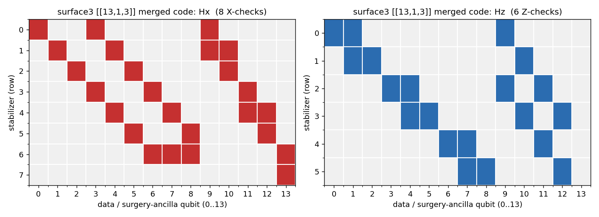

# FormalRV.QEC

The L4 (QEC-code) data layer of FormalRV. Provides binary-field (GF(2)) parity-check-matrix primitives used to express qLDPC lattice-surgery structural constraints, plus a catalogue of concrete code instances (Steane, surface-code distances, bivariate-bicycle / lifted-product qLDPC) carrying their `[[n, k, d]]` parameters. The `QECCode` structure itself is defined upstream in `Framework/L4_QECCode.lean`; this folder supplies the matrix toolkit and the instances built on it.

## Layout
- `LDPCMatrix.lean` — `List (List Bool)` GF(2) matrix/vector ops (XOR, row combination, block concat, shape/weight predicates) with no Mathlib dependency.
- `QECCodeInstances.lean` — concrete `QECCode` values (Steane, surface d=3..25, qLDPC `[[144,18,12]]`) plus the one fully-populated Steane parity matrix.
- `CSSCode.lean` — the `CSSCode` structure (populated `H_X`/`H_Z`, `css_condition`, `toStabilizers`) and the general semantic theorem `syndrome_circuit_implements_code`.
- `CodeDimension.lean` — `derivedK c = n − rank H_X − rank H_Z`, the GF(2) rank-derived logical-qubit count.
- `SmallCodeValidity.lean` — kernel-clean (`decide`, `#verify_clean`-gated) CSS-validity and derived-`k` for the Steane `[[7,1,3]]` and the `[[18,2,d]]` BB code.

## Key definitions
- `BoolVec` / `BoolMat` (`LDPCMatrix.lean`) — GF(2) row vector / matrix as `List Bool` / `List (List Bool)`.
- `vec_xor`, `row_combination` (`LDPCMatrix.lean`) — GF(2) vector sum and selection-weighted row combination (`selᵀ · mat`); the core of row-span membership checks for merged surgery codes.
- `hcat` / `vcat` (`LDPCMatrix.lean`) — horizontal/vertical block concatenation, building a merged code's `H̃_X` from data, ancilla, and connection blocks.
- `max_row_weight`, `max_column_weight`, `is_qldpc` (`LDPCMatrix.lean`) — row/column weights and the bounded-degree (qLDPC) predicate at parameter `Δ`.
- `steane_713`, `surface_d3`..`surface_d25`, `lp_144_18_12` (`QECCodeInstances.lean`) — parameter-only `QECCode` instances carrying `(n, k, d)`; parity matrices left empty except Steane. (Note: `surface_d3` here is the non-rotated `[[9,1,3]]` scaffold — *distinct* from the fully-populated `[[13,1,3]]` HGP surface code `surfaceHGP 3` in the worked example below.)
- `steane_713_with_parity` (`QECCodeInstances.lean`) — Steane `[[7,1,3]]` with both `hx`, `hz` set to the `[7,4]` Hamming parity check.

## Key theorems
- `CSSCode.syndrome_circuit_implements_code` (`CSSCode.lean`) — general semantic theorem: for any well-shaped `CSSCode`, `StabilizerState.valid (toStabilizers c) c.n = true ↔ c.css_condition = true` — **Verified** (real `rw`/`simp` proof, not a smoke check).
- `steaneCSS_is_CSS` / `bbSmall_is_CSS` and `steaneCSS_k_derived` / `bbSmall_k_derived` (`SmallCodeValidity.lean`) — the Steane `[[7,1,3]]` and the `[[18,2,d]]` BB code are genuine CSS codes (`css_condition = true`) with rank-derived `k = 1` / `k = 2`, by **kernel `decide`** (not `native_decide`), each `#verify_clean`-gated — **Verified**.
- `vec_xor`/`row_combination` smoke checks (`LDPCMatrix.lean`) — concrete GF(2) sums and row spans evaluate as claimed — **Arithmetic-only** (`rfl`/`decide`-level `example`s).
- `is_qldpc ... = true/false` smoke checks (`LDPCMatrix.lean`) — bounded-degree predicate accepts/rejects sample matrices correctly — **Arithmetic-only**.
- `matrix_has_n_cols`, `max_*_weight` smoke checks (`LDPCMatrix.lean`) — shape and weight functions compute the expected values on examples — **Arithmetic-only**.

## Status
The GF(2) matrix toolkit is complete and exercised by `decide`/`rfl` smoke checks (**Arithmetic-only**). Beyond the toolkit, the folder now also carries genuine semantic content (added in the M2 commits):

- `CSSCode.syndrome_circuit_implements_code` (`CSSCode.lean`) is a real, *general* semantic theorem — for any well-shaped `CSSCode c`, the lowered syndrome-extraction operators `toStabilizers c` form a valid (pairwise-commuting, correctly-sized) stabilizer code **iff** the CSS commutation condition `H_X · H_Zᵀ = 0` holds — **Verified** (`#verify_clean`-gated where instantiated).
- `SmallCodeValidity.lean` pins this down on two concrete real codes, kernel-clean: `steaneCSS_is_CSS` and `bbSmall_is_CSS` prove `css_condition = true` by **kernel `decide` (not `native_decide`)**, and the rank-derived dimensions `derivedK steaneCSS = 1` / `derivedK bbSmall = 2` are likewise by `decide` and corroborated by an explicit valid logical basis — all six theorems are `#verify_clean`-gated (**Verified**).

The original catalogue (`QECCodeInstances.lean`) is still **Scaffolded**: those `QECCode` values record `[[n,k,d]]` parameters with empty parity placeholders except `steane_713_with_parity`. For the *large* lifted-product / bivariate-bicycle codes the `derivedK` count is checked with `native_decide` (in the `Audit/` paper folders), which is **arithmetic-tier — a machine-evaluated Boolean check, not `#verify_clean` / axiom-clean**. And in all cases **code distance `d` is out of scope — never proven** (no decoder, no distance bound); per the L4→L3 contract, cycle-level logical error rates remain framework *inputs*, not derived here.

## Worked example — the surface [[13,1,3]] parity-check matrices

A CSS code is two GF(2) parity-check matrices. The heatmap above is the merged
surgery code built from the fully-populated `[[13,1,3]]` HGP surface code
`surfaceHGP 3` (`FrontendAlgebraic.lean`, *not* the empty-parity `surface_d3 = [[9,1,3]]`
scaffold) from `LatticeSurgery/SurgeryDemoSurface.lean`, drawn
directly from the Lean-emitted `surface3_surgery.stim`: `Hx` has 8 X-checks, `Hz`
has 6 Z-checks, each a sparse weight-≤4 row over the 14 data/ancilla qubits —
exactly the bounded-degree structure the `is_qldpc` predicate checks. This folder
supplies the GF(2) toolkit those checks run on: `vec_xor`, `row_combination`
(`selᵀ·mat`, the core of the surgery row-span membership test), `hcat`/`vcat`
(assembling a merged `H̃_X` from data / ancilla / connection blocks), and
`max_row_weight` / `is_qldpc`.

### More small examples

2. **Steane `[[7,1,3]]`.** `steane_713_with_parity` (`QECCodeInstances.lean`) is the one
   fully populated catalogue code: `hx = hz` = the `[7,4]` Hamming parity check
   (3 rows × 7 columns). It is the data code of the verified `steane_x_surgery` gadget
   (`LatticeSurgery/SurgeryDemoSteane.lean`).
3. **The GF(2) toolkit in action.** `vec_xor [t,f,t] [t,t,f] = [f,t,t]`,
   `is_qldpc mat 14 4 = true` for the surface3 checks (all weights ≤ 4), and
   `row_combination sel H` is the selection-weighted row sum the surgery verifier
   decides against a target — all `rfl`/`decide` smoke checks in `LDPCMatrix.lean`.

## Essential proof techniques

- **GF(2) linear algebra as `List Bool` with decidable checks.** Matrices are
  `List (List Bool)`; `row_combination` is the selection-weighted row sum, and
  membership of a logical operator in the stabilizer row span is a `decide`-checkable
  equation (`row_combination sel H = target`) — the exact obligation the
  `LatticeSurgery` verifier discharges.
- **Catalogue `QECCode`s carry `[[n,k,d]]`; their parities are mostly inputs.** Honest scope: the
  parameter-only catalogue (`surface_d3..d25`, `lp_144_18_12`) records parameters with parity
  matrices left empty *except* `steane_713_with_parity` (the `[7,4]` Hamming check).
  Separately, the populated `CSSCode`s — the `[[13,1,3]]` surgery code shown above (from
  `surfaceHGP 3`), the Steane `steaneCSS`, and the `[[18,2,d]]` `bbSmall` — *do* carry full
  parity matrices and are CSS-verified via `syndrome_circuit_implements_code` / `decide`.
  In every case **no code's distance `d` or decoder is proven here** — per the L4→L3 contract,
  logical error rates are framework *inputs*.
