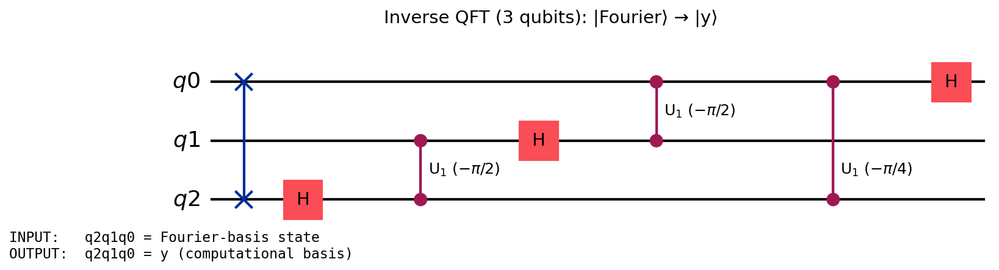

# Inverse Quantum Fourier Transform (IQFT)

The **inverse QFT** — the measurement-basis transform at the heart of phase
estimation (QPE) and Shor's algorithm — encoded as a concrete `BaseUCom`
unitary circuit and verified against the ideal Fourier matrix.

> **TL;DR** — `IQFT n` (= `real_QFTinv_layer n` = the framework's
> `BaseUCom.QFTinv n`) is THE n-qubit inverse QFT. It runs a **bit-reversal
> SWAP cascade**, then a **countdown of phase ladders** (for each target
> `t = n-1 … 0`: controlled phases `cu1(-π/2^(j-t))` from controls `j > t`,
> capped by `H t`), on `n` qubits — and `uc_eval (IQFT n) = IQFT_matrix n`
> **exactly**, for every `n ≥ 1` (`iqft_correct`).

This folder is about the **inverse** QFT: the forward `QFT` in the framework is
a placeholder (`npar_H`), but the inverse — the object QPE/Shor actually use —
is the real, fully-verified circuit here.

## Where everything lives (the spine)

| Concern | File | Headline |
|---|---|---|
| **Definition** | [`IQFTDef.lean`](IQFTDef.lean) | `IQFT` (= `real_QFTinv_layer` = `QFTinv`), `IQFT_matrix` |
| **Correctness** | [`IQFTCorrectness.lean`](IQFTCorrectness.lean) | `iqft_correct` (+ `…_verified`, `QFTinv_correct`) |
| **Resource** | [`IQFTResource.lean`](IQFTResource.lean) | `iqft_banded_isCliffordT`, `iqft_banded_error_budget` (= 2π/2ᶜ) |
| **Example + QASM** | [`IQFTExample.lean`](IQFTExample.lean) | `IQFTGadget`, `IQFTGadget.emitQASM n` |

Supporting proofs (read only when auditing the proofs) live in
[`IQFTRecursiveArbitrary.lean`](IQFTRecursiveArbitrary.lean) (the arbitrary-`n`
column induction — THE main theorem's proof), [`IQFTCircuitCorrectness.lean`](IQFTCircuitCorrectness.lean)
(the 1- and 2-qubit base cases + ladder/countdown/bit-reversal action lemmas),
[`AQFTCompile.lean`](AQFTCompile.lean) / [`AQFTCompileSemantics.lean`](AQFTCompileSemantics.lean)
(the approximate-QFT Clifford+T compiler), and [`IQFTDefinitions.lean`](IQFTDefinitions.lean)
(the helper defs the proofs run on). Auditors should read the four spine files;
the proofs are intentionally pushed out of the way.

## Qubit layout and the size parameter `n`

`IQFT n` acts on `n` qubits `q[0] … q[n-1]` (MSB-first: `q[i]` carries weight
`2^(n-1-i)`). `n` is **the register width**. To change the size, pass a
different `n` everywhere — e.g. `IQFTGadget.emitQASM 8` for an 8-qubit IQFT, or
`iqft_correct 8 (by decide)` for its correctness.

```
q[0]        : most significant qubit  (weight 2^(n-1))
q[i]        : weight 2^(n-1-i)
q[n-1]      : least significant qubit (weight 2^0)
```

The circuit structure (`real_QFTinv_layer n = bit_reversal_swaps n ; countdown n`):

```
bit-reversal:  swap q[i], q[n-1-i]        for i with 2i+1 < n
countdown:     for target t = n-1 … 0:
                 cu1(-π/2^(j-t)) q[j],q[t]   for controls j = t+1 … n-1
                 h q[t]
```

## Correctness (the one theorem to audit)

`iqft_correct (n) (hn : 0 < n)`:

```
uc_eval (IQFT n) = IQFT_matrix n
```

i.e. the bit-reversal-plus-phase-ladder circuit is, as a unitary, **exactly**
the ideal inverse-QFT matrix `IQFT_matrix n y x = (1/√2ⁿ)·exp(-2πi·x·y/2ⁿ)`.
Proved by induction on `n` (column by column) — **no approximation, no axiom**.

`iqft_correct_verified` additionally bundles `UCom.WellTyped n (IQFT n)`, and
`QFTinv_correct` lifts the result to the framework's `BaseUCom.QFTinv n` (the
object the QPE/Shor pipeline plugs into its measurement basis).

## Exact gate and qubit counts (the `Resource/` counters, anchored)

The independent counters in [`Resource/`](../Resource/README.md) (they import
only the IR — no builder, no proof can influence them) walk the **actual
circuit syntax tree** `IQFT n` to closed forms ([`IQFTCount.lean`](IQFTCount.lean)):

| Resource | Theorem | Closed form |
|---|---|---|
| CNOTs (time) | `cnotCountU_IQFT` | `3·⌊n/2⌋ + n·(n−1)` (3/SWAP + 2/controlled-phase) |
| 1-qubit gates (time) | `oneQCountU_IQFT` | `3·(n(n−1)/2) + n + 2` (3/phase + n H + 2 SKIPs) |
| Qubits (space) | `widthU_IQFT` | `n` — **no hidden ancilla** |

`iqft_verified_with_resources` bundles **semantics + time + space about the
same syntactic object**. Independent cross-check without reading any proof:
`#eval` the computable emitted QASM and count lines — `3·#swap + 2·#cu1`
matches the CNOT closed form for every n (verified n = 0..8).

## Resource (after correctness): compilation, not T-count

The IQFT's controlled phases are **continuous rotations**, so — unlike a
reversible arithmetic gadget — there is no exact T-count; the resource is
governed by **compilation to a finite gate set** (the approximate / "banded"
QFT, Coppersmith):

- `iqft_banded_isCliffordT` : for cutoff `c ≤ 2`, the compiled phase ladder is
  **exactly Clifford+T** (kept rotations are depth 0/1 = `S†` / controlled-`S†`;
  deeper ones are dropped).
- `iqft_banded_error_budget` : the **total** approximation error of the cutoff,
  summed over every dropped depth `c ≤ m < n`, is the closed-form geometric tail
  `≤ 2π/2ᶜ` — **derived from first principles** (chord ≤ arc per drop), no axiom.
- `iqft_banded_error_to_zero` : that budget is antitone in `c`, so a larger
  cutoff drives the error below any target.
- `iqft_banded_semantics` : the compiled ladder's action on basis states is the
  product of its kept controlled-phase scalars — its actual semantics, not just
  its gate set.

## Concrete example

The **2-qubit** IQFT (`IQFTGadget.emitQASM 2`, verified by `iqft_correct 2`):

```
swap q[0],q[1] ;  h q[1] ;  cu1(-pi/2) q[1],q[0] ;  h q[0]
```

(exactly `real_QFTinv2_candidate`: `SWAP 0 1 ; H 1 ; controlled_Rz 1 0 (-π/2) ; H 0`).

## Circuit diagram (3-qubit IQFT)

Rendered by standard Qiskit (`qasm2.loads` → `.draw('mpl')`) from the emitted
OpenQASM (`IQFTGadget.emitQASM 3`). Qiskit draws the qelib1 `cu1(λ)`
controlled-phase as `U₁(λ)`; each `cu1(-π/2^d)` **is** the verified
`controlled_Rz j t (-π/2^d)`.



The 7 gates are exactly `real_QFTinv_layer 3`: `swap q0,q2` (bit reversal), then
`h q2` · `cu1(-π/2) q2,q1` · `h q1` · `cu1(-π/2) q1,q0` · `cu1(-π/4) q2,q0` · `h q0`.

Reproduce: `lake build FormalRV.QFT.IQFTExample` (writes
`diagrams/iqft_3qubit.qasm` + `.io.json`), then
`python scripts/draw_qasm.py diagrams/iqft_3qubit.qasm diagrams/iqft_3qubit.png diagrams/iqft_3qubit.io.json`.

## Emit OpenQASM — the SAME, unified semantic framework

The arithmetic gadgets (Cuccaro, Gidney) emit via a `Gadget` over the reversible
`Gate` IR, certified by `progMat (emit g) = uc_eval g` (the Clifford+T emitter,
`Codegen/GateQasm.lean`). The `Gate` IR has **no rotations**, so the IQFT cannot
ride that exact descriptor — but it rides the **same faithfulness contract** on
the universal `BaseUCom` IR:

| | Arithmetic (Cuccaro/Gidney) | Quantum (IQFT) |
|---|---|---|
| IR | `Gate` (I/X/CX/CCX) | `BaseUCom` (H/Rz/CNOT/SWAP/…) |
| Emitter | `emitCliffTOps` | `emitUComOps` |
| Unitary of emitted ops | `progMat` | `uprogMat` |
| **Faithfulness** | `progMat (emit g) = uc_eval g` | **`uprogMat (emit c) = uc_eval c`** |
| Descriptor | `Gadget` / `emitQASM` | `UGadget` / `emitQASM` |

The unified emitter lives in [`Codegen/UComQasm.lean`](../Codegen/UComQasm.lean):

```lean
#eval IO.println (IQFTGadget.emitQASM 3)   -- 3-qubit IQFT as OpenQASM 2.0
```

- `Codegen.emitUComOps : BaseUCom dim → List UOp` faithfully emits **any**
  `BaseUCom` (the two `BaseUnitary` primitives `U(θ,φ,λ)` and `CX` cover it),
  and `Codegen.uprogMat_emitUComOps` proves `uprogMat (emitUComOps c) = uc_eval c`
  — the exact `progMat = uc_eval` contract the arithmetic emitter satisfies.
- Arithmetic gadgets **factor through it**: `uprogMat_emitUComOps_toUCom` shows a
  `Gate` circuit emits faithfully via `Gate.toUCom` into the same `uc_eval`. One
  framework, two op-sets.
- **Punchline** (`iqft_emitted_unitary_eq_IQFT_matrix`): chaining the emitter's
  faithfulness with `iqft_correct` gives `uprogMat n (emitUComOps (IQFT n)) =
  IQFT_matrix n` — **the OpenQASM we emit denotes, as a unitary, exactly the
  ideal inverse-QFT matrix.**

The emitted readable gates (`h`, `cu1(λ)`, `swap`) are exactly the verified
circuit's gates: `h = H = U(π/2,0,π)`, `cu1(λ) =` the 5-gate `controlled_Rz`
(the qelib1 `cu1` decomposition), `swap = SWAP`.
