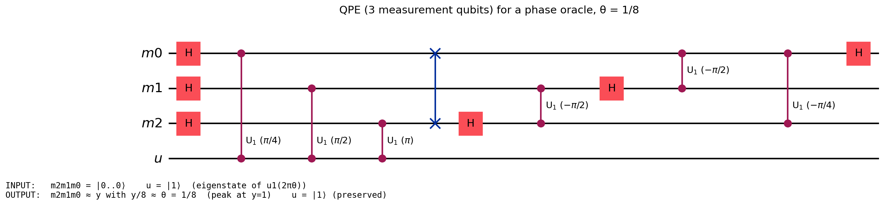

# Quantum Phase Estimation (QPE)

Quantum Phase Estimation — given a unitary `U` and an eigenstate `|ψ⟩` with
`U|ψ⟩ = e^{2πiθ}|ψ⟩`, recover an `m`-bit approximation of `θ` — encoded as a
concrete `BaseUCom` circuit over an **abstract (black-box) oracle**, and verified
against the ideal phase-register state.

> **TL;DR** — `QPE k n c` (= `npar_H k ; controlled_powers c k ; QFTinv k`) is THE
> phase-estimation circuit: Hadamards on the `k` measurement qubits, the
> controlled-powers ladder of the oracle, then the inverse QFT.  On an eigenstate
> `ψ` of the oracle with phase `θ`, it outputs `qpe_phase_state m θ ⊗ ψ`
> (`qpe_on_eigenstate_correct`), whose measurement peaks at the `m`-bit value of
> `θ` with probability `≥ 4/π²` (`qpe_prob_peak_bound`).

## The oracle is a BLACK BOX — modular exponentiation is not QPE's job

`c : Nat → BaseUCom (k+n)` is an **abstract** oracle family: `c i` is "apply `U`
to the power `2^i`, controlled on measurement qubit `i`".  QPE knows `U` ONLY
through this family and an eigenvalue hypothesis — **never how `U` is built**.
Modular exponentiation (`U = ×a mod N`) is *one instantiation*, and it lives in
Shor, not here:

- **QPE (this folder)** — the oracle-generic circuit + correctness, stated for
  any eigenstate-bearing `f`.
- **Shor** — instantiates the oracle with the modular multiplier and discharges
  the eigenvalue hypothesis: `QPE_var_lsb_on_modmult_eigenstate` (in
  [`Shor/PostQFT/QPEModmultEigenstate.lean`](../Shor/PostQFT/QPEModmultEigenstate.lean)),
  feeding the headline `QPE_MMI_correct`.

All QPE-generic semantic-correctness theorems were **relocated into this folder**
(2026-06-10) out of `QFT/IQFTRecursiveArbitrary.lean`, where they had been
developed alongside the inverse-QFT proof but did not belong.

## Where everything lives (the spine)

| Concern | File | Headline |
|---|---|---|
| **Definition** | [`QPEDef.lean`](QPEDef.lean) | `QPE k n c` (black-box oracle), `qpe_phase_state`, `qpeEigenvalue` |
| **Correctness** | [`QPECorrectness.lean`](QPECorrectness.lean) | `qpe_on_eigenstate_correct` (+ MSB/LSB variants), `qpe_prob_peak_bound` (in `QPEAmplitude`) |
| **Resource** | [`QPEResource.lean`](QPEResource.lean) | `qpe_measurement_basis_isCliffordT`, `qpe_measurement_basis_error_budget` (= 2π/2ᶜ) |
| **Example + QASM** | [`QPEExample.lean`](QPEExample.lean) | `QPEPhaseGadget`, `QPEPhaseGadget.emitQASM k` |

Heavy machinery (read only when auditing the proofs): [`ControlledGates.lean`](ControlledGates.lean)
(controlled-`R`/`CNOT` semantics, the `control` decomposition + projector form),
[`PhaseKickback.lean`](PhaseKickback.lean) (the phase-kickback cascade and the
pre-QFT eigenstate Fourier form `QPE_pre_QFT_on_eigenstate_fourier_form`),
[`QPEAmplitude.lean`](QPEAmplitude.lean) (the Dirichlet-kernel amplitude analysis
and the `≥ 4/π²` peak bound), [`QPE.lean`](QPE.lean) (the circuit definitions).

## Qubit layout (`k + n` qubits)

```
q[0..k-1]   : measurement register  (Hadamard-prepared; inverse-QFT-measured)
q[k..k+n-1] : data register         (holds the eigenstate |ψ⟩ of U)
```

`k` is the **measurement precision** (number of output bits); `n` is the data
register width.  To change the precision, pass a different `k` everywhere — e.g.
`QPEPhaseGadget.emitQASM 8` for an 8-bit estimate.

## Correctness (the one theorem to audit)

`qpe_on_eigenstate_correct (m anc f ψ θ …)` — given that `ψ` is a common
eigenstate of the abstract oracle family with LSB-first eigenvalues
`uc_eval (f i) * ψ = exp(2πi · 2^i · θ) • ψ`:

```
uc_eval (QPE_var_lsb m anc f) * (|0^m⟩ ⊗ ψ)  =  qpe_phase_state m θ ⊗ ψ
```

i.e. the QPE circuit maps `|0^m⟩ ⊗ ψ` exactly to the ideal phase-register state
`qpe_phase_state m θ` tensored with the (untouched) eigenstate — **no
approximation, no axiom**, for an arbitrary black-box oracle.  The MSB-first
form is `QPE_var_on_eigenstate_from_real_QFTinv`.  The measurement consequence
is `qpe_prob_peak_bound`: when the phase discrepancy `|2^m·θ − y| ≤ 1/2`, the
outcome `y` has probability `≥ 4/π²`.

## Exact gate counts with the oracle as a black box (anchored)

The independent [`Resource/`](../Resource/README.md) counters walk the **actual
`QPE k n c` syntax tree** to a closed form that is *parametric in the oracle's
own counts* ([`QPECount.lean`](QPECount.lean)) — QPE provably adds nothing
hidden on top of its oracle calls:

```
CNOTs(QPE k n c) = Σᵢ (2·1q(cᵢ) + 6·CNOT(cᵢ))  +  3·⌊k/2⌋ + k·(k−1)
                   └── controlled oracle calls ──┘  └── inverse-QFT basis ──┘
```

(`cnotCountU_QPE`, `oneQCountU_QPE`; a controlled 1-qubit gate = 2 CNOT + 4 1q,
a controlled CNOT = Toffoli = 6 CNOT + 9 1q.) The counts pass unchanged through
the Shor-facing wrapper (`cnotCountU_QPE_var_lsb` — the `map_qubits` lift and
LSB reversal are count-invariant), and `qpe_verified_with_resources` bundles
**black-box semantic correctness + the count about the same syntactic object**.

## Resource (after correctness): the only overhead is H + inverse QFT

On top of its `k` black-box controlled-oracle calls, QPE adds only `k` Hadamards
and one `k`-qubit **inverse QFT** (the measurement basis).  Since the inverse QFT
uses continuous controlled phases, its cost is governed by **Clifford+T
compilation** (the banded / approximate QFT), not an exact T-count:

- `qpe_measurement_basis_isCliffordT` — the banded measurement basis is exactly
  Clifford+T (cutoff `c ≤ 2`).
- `qpe_measurement_basis_error_budget` — the derived `≤ 2π/2ᶜ` error budget.
- `qpe_circuit_resource_decomp` — `uc_eval (QPE k n c) = QFTinv k · controlled_powers c k · npar_H k`.

The oracle cost itself is the **instantiation's** (for Shor, the modular
exponentiation ladder, which dominates the whole algorithm).

## Concrete example: phase-oracle QPE (θ = 1/8)

To emit a runnable circuit we make the black box concrete: `U = u1(2πθ)` on one
ancilla, eigenstate `|1⟩`, eigenvalue `e^{2πiθ}`.  Then `c i = cu1(2π·2^i·θ)`.
The `k = 3`, `θ = 1/8` instance (`QPEPhaseGadget.emitQASM 3`, 4 qubits) peaks at
`y = 1` (since `y/8 = 1/8 = θ`):

```
h q[0..2] ;  cu1(pi/4) q[0],q[3] ; cu1(pi/2) q[1],q[3] ; cu1(pi) q[2],q[3] ;  IQFT q[0..2]
```

### Circuit diagram

Rendered by standard Qiskit from the emitted OpenQASM (Qiskit draws `cu1(λ)` as
`U₁(λ)`).  The `U₁(π/4)`, `U₁(π/2)`, `U₁(π)` gates are the controlled powers
`cu1(2π·2^i·θ)` of the phase oracle; the right block is the inverse QFT.



Reproduce: `lake build FormalRV.QPE.QPEExample` (writes `diagrams/qpe_phase_3qubit.qasm`
+ `.io.json`), then `python scripts/draw_qasm.py diagrams/qpe_phase_3qubit.qasm diagrams/qpe_phase_3qubit.png diagrams/qpe_phase_3qubit.io.json`.

## Emit OpenQASM — the SAME unified framework as QFT and the arithmetic gadgets

QPE is genuinely quantum (rotations), so it rides the unified `BaseUCom`
emitter [`Codegen/UComQasm.lean`](../Codegen/UComQasm.lean) — the same
`uprogMat (emitUComOps c) = uc_eval c` faithfulness contract the QFT gadget and
(via `Gate.toUCom`) the arithmetic gadgets satisfy:

```lean
#eval IO.println (QPEPhaseGadget.emitQASM 3)   -- phase-oracle QPE as OpenQASM 2.0
```

`QPEPhaseGadget : UGadget` renders the concrete phase-oracle QPE; the abstract
oracle's correctness is the general `qpe_on_eigenstate_correct`.  The emitted
readable gates (`h`, `cu1(λ)`, `swap`) are exactly the verified circuit's gates.
