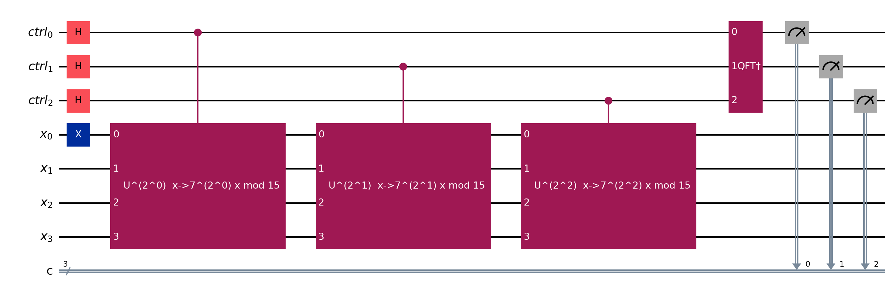

# FormalRV.Shor

This is the headline layer of FormalRV: a machine-checkable proof that Shor's
order-finding subroutine succeeds with an explicitly bounded probability. It
assembles the quantum-phase-estimation (QPE) circuit, phase-kickback cascade,
real inverse-QFT, modular-multiplier eigenstate / orbit decomposition, and the
Euler-totient lower bound into the final `Shor_correct_var` theorem.
`Main.lean` re-exports the headline results; check any of them with
`#print axioms`.

## Layout
- `Main.lean` — single entry point; `export`s the three headline theorems.
- `QPE.lean` — QPE circuit (`QPE`, `QFTinv`, `controlled_powers`); contains the superseded `QPE_semantics_full` axiom.
- `QPEAmplitude.lean` — standalone Dirichlet-kernel amplitude math (`qpe_amp`, `qpe_prob`); no circuit semantics.
- `PhaseKickback.lean` — block-disjoint commutation + the shifted controlled-powers eigenstate cascade.
- `ControlledGates.lean` — concrete controlled gates (`controlled_X`, `controlled_Rz`) toward a real `control`.
- `Eigenstate.lean` — Fourier orthogonality, modular-multiplier eigenstates `ψ_k`, orbit decomposition of `|1⟩`.
- `TotientLowerBound.lean` — elementary `φ(r)/r ≥ e⁻²/(log₂N)⁴` (no Mertens).
- `PostQFT/` (`Defs`, `Proofs1..3`) — ideal IQFT matrix + the final `QPE_MMI_correct` / `Shor_correct_var`.
- `Shor/` (`Part1..4`) — defs (`ModMulImpl`, `Shor_final_state`, `probability_of_success`) and the conditional chain.
- `VerifiedShor/` (`Part1..29`) — the public end-to-end pipeline wrapper.

## Key definitions
- `QPE` (`QPE.lean`) — the k+n-qubit QPE circuit (H layer; controlled powers; `QFTinv`).
- `ModMulImpl` (`Shor/Part1.lean`) — oracle contract: `f i` multiplies by `a^(2^i)` mod N.
- `Shor_final_state` (`Shor/Part1.lean`) — post-QPE state, `uc_eval (QPE_var …)` on `|0⟩|1⟩|0⟩`.
- `modmult_eigenstate` (`Eigenstate.lean`) — Shor eigenstate `ψ_k` over the modular orbit.
- `IQFT_matrix` (`PostQFT/Defs.lean`) — ideal inverse-QFT matrix, the target for `QFTinv`.
- `probability_of_success` (`Shor/Part1.lean`) — success measure the headline theorem bounds.

## Key theorems
- `Shor_correct_var` (`PostQFT/Proofs3.lean`) — for any `ModMulImpl` oracle, success `≥ κ/(log₂N)⁴`, `κ=4e⁻²/π²` — **Verified** (only `propext`/`Classical.choice`/`Quot.sound`; checked).
- `QPE_MMI_correct` (`PostQFT/Proofs3.lean`) — QPE peak probability `≥ 4/(π²·r)` at the closest outcome — **Verified** (axiom-free; checked).
- `phi_n_over_n_lowerbound` (`Shor/Part3.lean`) — totient ratio bound `≥ e⁻²/(log₂N)⁴` — **Verified**.
- `modmult_eigenstate_orthonormal` (`Eigenstate.lean`) — the `ψ_k` family is orthonormal under `Order a r N` — **Verified**.
- `orbit_decomposition_pointwise` (`Eigenstate.lean`) — `(1/√r)·∑ ψ_k = |1⟩` (Fourier inversion) — **Verified**.
- `pad_u_shifted_kron_basis_factors` (`PhaseKickback.lean`) — shifted `pad_u` factors through `kron_vec` — **Verified**.
- `QPE_semantics_full` (`QPE.lean`) — textbook QPE Born-rule bound — **Axiom** (superseded; off the headline proof path).

## Status
The two headline theorems (`Shor_correct_var`, `QPE_MMI_correct`) are Verified —
axiom-free with full semantic proofs, not gate counts. Four `axiom`s remain in
the folder (`QPE_semantics_full` in `QPE.lean`; the deprecated
`f_modmult_circuit*` placeholders in `Shor/Part4.lean`), but none lie on the
proof path of the re-exported results, which instead route through the LSB
pipeline and (for the fully axiom-free oracle) the SQIR-faithful multiplier in
`Arithmetic/`.

## Worked example — phase estimation of `7ˣ mod 15` (order r = 4)

The diagram is QPE's frame (Hadamards, controlled powers, inverse QFT); each
controlled-`U` block **is** the emitted verified modular multiplier (`Arithmetic/`).
For `a=7, N=15` the order is `r=4`, and `|1⟩` decomposes over the modular orbit as
`(1/√r)·∑ₖ ψₖ` (`orbit_decomposition_pointwise`, `Eigenstate.lean`) with the `ψₖ`
orthonormal (`modmult_eigenstate_orthonormal`). QPE concentrates each `ψₖ`'s phase
`k/r` onto the control register: `QPE_MMI_correct` (`PostQFT/Proofs3.lean:205`,
**Verified**, axiom-free) proves the peak outcome `s_closest` carries probability
`≥ 4/(π²·r)`. Summing over the `φ(r)` coprime residues and applying the totient
bound `φ(r)/r ≥ e⁻²/(log₂N)⁴` yields the headline `Shor_correct_var`
(`Proofs3.lean:220`): success `≥ κ/(log₂N)⁴`, `κ = 4e⁻²/π²`.

## Essential proof techniques

- **Amplitude analysis, not a Gate-IR circuit.** QPE correctness is a statement
  about complex amplitudes: after the inverse QFT, the amplitude at `s_closest` is a
  Dirichlet kernel bounded below by `4/(π²r)` via a geometric-series closed form
  (`qpe_amp`, `QPEAmplitude.lean`). FormalRV proves this at the state-vector level;
  it is *not* an emittable `{I,X,CX,CCX}` circuit (the reversible IR has no `H`/QFT).
- **Phase kickback by block-disjoint commutation.** The controlled-powers cascade is
  justified by showing the shift-lifted data circuit is fresh on the control wires
  and commutes block-disjointly with the control gates
  (`uc_eval_map_qubits_shift_commutes_pad_u`, `PhaseKickback.lean`), so each `ψₖ`
  simply accrues its phase.
- **An elementary totient bound.** `phi_n_over_n_lowerbound` (`Shor/Part3.lean`)
  avoids Mertens: `φ(r)/r = ∏_{p|r}(1−1/p) ≥ (1/2)^{#primes}`, and
  `#distinct primes ≤ log₂ r` because `2^{#primes} ≤ r` — an explicit, if
  conservative, constant.
- **CFS classical core.** The residue-arithmetic engine (Gidney 2025) is verified
  separately and axiom-clean: CRT injectivity (`rns_faithful`), the masked-state
  amplitude identity `⟨u_A|u_B⟩ = |A∩B|/W` (`unifSuper_inner`), and the `Δ_N`
  truncation bound.

Honest scope: the standalone control-gate implementation remains a `SKIP` stub; the
re-exported headline theorems route around it via the LSB pipeline and the
SQIR-faithful multiplier (so they are axiom-free), while `QPE_semantics_full`
(`QPE.lean`) is a superseded axiom off the proof path.
