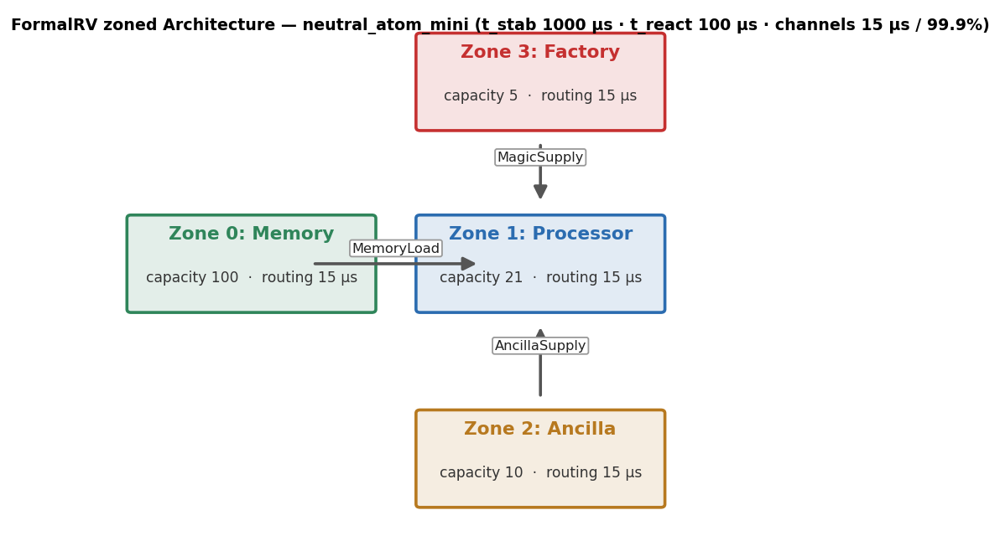
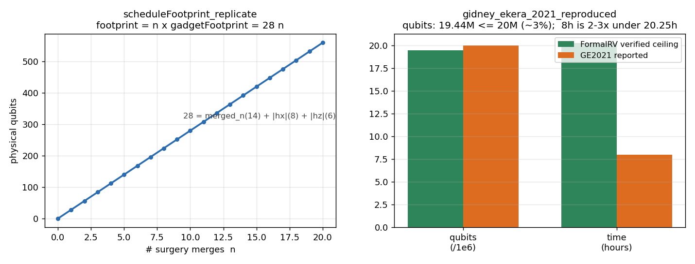
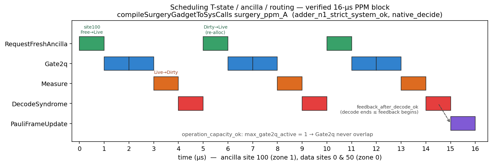

# FormalRV.System

System-level (L4) layer of FormalRV: a platform-neutral `Architecture` /
`SysCall` schedule model plus decidable invariant checkers that verify a
compiled fault-tolerant schedule is well-formed (capacity, exclusivity,
latency, decoder-feedback ordering, factory throughput). It also provides
code-aware logical layouts and **parametric soundness lemmas** that lift a
single-body check to an `n`-fold compressed repeat without expanding it.

## Layout
- `Architecture.lean` — `Zone`/`Channel`/`SysCall` IR, `Prop`-level verification predicates, occupancy/discard state machines, magic-state cost specs, logical↔physical layout bridge; neutral-atom / ion / superconducting instantiations (cited values).
- `ScheduleInvariantsExplicit.lean` — decidable `Bool` checkers for the four qianxu invariants (I1 capacity, I2 exclusivity, I3 latency/speed, I4 throughput) over a `ZonedArch`.
- `SystemInvariantStrengthening.lean` — strengthened checkers fixing two checker gaps: `operation_capacity_ok` (per-kind concurrency caps) and `feedback_after_decode_ok` (decoder→Pauli ordering); bundles `all_invariants_strict_ok` and its slot-capacity/freshness extensions.
- `SystemChecker.lean` — honest audit of the older bundle: tiny `native_decide` counterexamples documenting five categories the checker is silent on, plus positive controls it correctly rejects.
- `CodedLayout.lean` — `CodedLogicalLayout` binding logical qubits to `[[n,k,d]]` QEC code blocks with a consistency predicate.
- `CompressedRepeatSoundness.lean` — shift/append/sequence/repeat invariance lemmas pushing toward parametric symbolic-repeat soundness.
- `AdderSystem.lean` — concrete 48-SysCall adder-skeleton instance certified by the strict bundle (gap-reporting demo, not arithmetic correctness).
- `LayeredArtifactInterface.lean` — multi-layer artifact/certificate interface so Lean- or Python-generated schedules target the same checkers.
- `HardwareErrorParams.lean` — implementer-supplied per-SysCall error-rate inputs (ppm) consumed by inter-layer error budgeting.

## Key definitions
- `Architecture` / `SysCall` (`Architecture.lean`) — cross-platform zones+channels and the explicit schedulable-operation IR (gates, transit, measure, decode, Pauli-frame update).
- `all_invariants_ok` (`ScheduleInvariantsExplicit.lean`) — conjunction of the four decidable system invariants.
- `all_invariants_strict_ok` / `..._with_slot_capacity_and_freshness_ok` (`SystemInvariantStrengthening.lean`) — strictly stronger bundles adding operation-capacity, feedback-after-decode, slot-capacity, and ancilla-freshness checks.
- `CodedLogicalLayout.consistent` (`CodedLayout.lean`) — checks block sizes, local-index bounds, and that every gate target is bound.
- `symbolic_rep_strict_ok` (`LayeredArtifactInterface.lean`) — O(|body|) check of an n-fold repeat without materializing the n copies.

## Key theorems
- `intervals_overlap_*`, `connEdges_*` (`SystemChecker.lean`) — boundary/orientation tests pinning the half-open overlap and edge conventions — **Arithmetic-only** (`decide`).
- `*_violator_accepted` / `*_rejected` (`SystemChecker.lean`) — the older bundle accepts five classes of physically-invalid schedules and correctly rejects the four it tracks — **Arithmetic-only** (`native_decide`), documenting real audit gaps.
- `feedback_after_decode_ok_seqSchedules` / `..._repeated_atom_expand` (`CompressedRepeatSoundness.lean`) — decoder-feedback ordering is preserved under sequential composition and n-fold repeat — **Verified** (parametric, by induction).
- `symbolic_rep_implies_expanded_feedback_after_decode_ok` (`CompressedRepeatSoundness.lean`) — symbolic-repeat acceptance implies the expanded schedule passes the feedback check — **Verified** (parametric).
- `adder_n1_repeated_1000000_symbolic_ok` (`CompressedRepeatSoundness.lean`) — the strict bundle accepts a 10⁶-fold repeat via the symbolic checker — **Arithmetic-only** (`native_decide`, no expansion).
- `adder_seq{2,3}_obligation_A_ok` (`CompressedRepeatSoundness.lean`) — exclusivity + factory-exclusivity + operation/slot capacity hold on concatenated adder blocks — **Arithmetic-only** (concrete `native_decide`; full parametric proof still pending).

## Device-program emission (physical operations + system calls)

`SysCall` is a single IR that unifies **physical operations** (`Gate1q`, `Gate2q`, `Measure`,
`TransitQubit`) and **system calls** (`RequestFreshAncilla`, `RequestMagicState`, `DecodeSyndrome`,
`PauliFrameUpdate`), so one `Schedule = List SysCall` already interleaves both.
`FormalRV/Codegen/SysCallEmit.lean` renders a schedule to a timestamped, category-tagged
`DEVICE-PROGRAM` text stream (`emitSchedule`), so a backend reads off the quantum gates AND the
classical/factory/decoder system calls together.

Example — one magic-state Toffoli (π/8 rotation) as physical ops + system calls:
distill (SYS) → route the magic state (PHYS transit) → lattice-surgery joint measurement / teleport
(PHYS gate2q + measure) → decode (SYS) → feed-forward Pauli correction (SYS):

```
DEVICE-PROGRAM 1.0;
// Toffoli-via-magic-state-teleportation  (PHYS = physical op, SYS = system call)
[0,12)us  SYS   request_magic      factory=3
[12,13)us  PHYS  transit            q[100] via channel=1
[13,14)us  PHYS  gate2q             q[0],q[100] gate=0
[14,15)us  PHYS  measure            q[100] basis=0
[15,16)us  SYS   decode_syndrome    round=7
[16,17)us  SYS   pauli_frame_update corr=7

-- 3 physical ops, 3 system calls
```

Example — two magic states distilled in **parallel** factories (overlapping `request_magic` system
calls), routed and teleported concurrently on disjoint channels:

```
DEVICE-PROGRAM 1.0;
// two-parallel-factories  (PHYS = physical op, SYS = system call)
[0,12)us  SYS   request_magic      factory=3
[0,12)us  SYS   request_magic      factory=4
[12,13)us  PHYS  transit            q[100] via channel=1
[12,13)us  PHYS  transit            q[102] via channel=2
[13,14)us  PHYS  gate2q             q[0],q[100] gate=0
[13,14)us  PHYS  gate2q             q[2],q[102] gate=0
[14,15)us  PHYS  measure            q[100] basis=0
[14,15)us  PHYS  measure            q[102] basis=0
[15,16)us  SYS   decode_syndrome    round=8
-- 6 physical ops, 3 system calls
```

Run both with `lake env lean FormalRV/Codegen/SysCallEmit.lean`.  `physCount` / `sysCount` count the
two categories.  Rendering is a syntactic serialization; the schedule's *meaning* (timing, the
produce-before-consume wait, the I1–I4 invariants, space-time conflict-freedom) is what
`DeviceSchedule.lean` / `ScheduleInvariantsExplicit.lean` verify.

## Checking system invariants — four worked examples

A device program is *well-formed* only if it satisfies the four system-level invariants
(`ScheduleInvariantsExplicit.lean`):

| | invariant | checker | what it rules out |
|---|---|---|---|
| **I1** | capacity | `capacity_in_arch_ok`, `capacity_per_cycle_ok` | claiming atoms outside the architecture / over-filling a zone |
| **I2** | exclusivity | `exclusivity_ok` | two time-overlapping ops touching the **same** physical atom |
| **I3** | latency / speed / **decoder reaction** | `latency_speed_ok` + `decoder_react_ok arch.t_react_us` (both folded into `all_invariants_ok`) | Pauli-frame update slower than a cycle, transit faster than light, **decode slower than the reaction budget** |
| **I4** | factory throughput | `window_throughput_ok` | requesting magic states faster than the factory can distill them |

`all_invariants_ok arch sched window max dist` bundles **all of** I1–I4 into one `Bool` — including
the decoder-reaction budget, which lives in `ZonedArch.t_react_us`. **The whole workflow is:** build a
`Schedule` (physical ops + system calls) → check `all_invariants_ok` → emit with `emitSchedule`. The
five examples below live in `SystemInvariantExamples.lean`; every PASS/FAIL verdict is a
`native_decide` theorem there (checked by `lake build`), and every program is the actual
`emitSchedule` output.

```lean
-- the check (returns true / false) …
#eval all_invariants_ok demoArch passSequential 12000 1 noDist          -- true
#eval all_invariants_ok demoArch failAlias       12000 1 noDist          -- false
-- … and the proof that the verdict is what we claim:
theorem passSequential_ok : all_invariants_ok demoArch passSequential 12000 1 noDist = true := by
  native_decide
```

The architecture is a Data zone `[0,100)`, an Ancilla zone `[100,200)`, a Factory zone `[200,300)`,
1 µs cycle; the factory window is `12000 µs`, `max 1` magic state per window.

### ✅ PASS ① — sequential PPM pair
Two parity measurements (PPM = request ancilla → joint gate → measure → decode) that **reuse one
ancilla (100) but never overlap in time** (`[0,4)` then `[10,14)`).

```
DEVICE-PROGRAM 1.0;
// PASS-1 sequential PPM pair  (PHYS = physical op, SYS = system call)
[0,1)us    SYS   request_ancilla    zone=1
[1,2)us    PHYS  gate2q             q[0],q[100] gate=0
[2,3)us    PHYS  measure            q[100] basis=0
[3,4)us    SYS   decode_syndrome    round=0
[10,11)us  SYS   request_ancilla    zone=1
[11,12)us  PHYS  gate2q             q[50],q[100] gate=0
[12,13)us  PHYS  measure            q[100] basis=0
[13,14)us  SYS   decode_syndrome    round=1
```
**Why it passes** (`passSequential_ok`): every atom (0, 50, 100) is inside a zone (I1); the two
blocks are time-disjoint so sharing ancilla 100 is fine (I2); the decode/Pauli ops are within budget
(I3); there are no magic requests (I4 vacuous).

### ✅ PASS ② — parallel PPM pair on distinct ancillas
Both PPMs run **concurrently in `[0,4)`** but on **different** ancillas (100 vs 101) and data (0 vs 1).

```
DEVICE-PROGRAM 1.0;
// PASS-2 parallel distinct ancillas  (PHYS = physical op, SYS = system call)
[0,1)us  SYS   request_ancilla    zone=1
[1,2)us  PHYS  gate2q             q[0],q[100] gate=0
[2,3)us  PHYS  measure            q[100] basis=0
[3,4)us  SYS   decode_syndrome    round=0
[0,1)us  SYS   request_ancilla    zone=1
[1,2)us  PHYS  gate2q             q[1],q[101] gate=0
[2,3)us  PHYS  measure            q[101] basis=0
[3,4)us  SYS   decode_syndrome    round=1
```
**Why it passes** (`passParallelDistinct_ok`): the two joint gates overlap in time (real
parallelism — `passParallelDistinct_overlaps`), but I2 only forbids overlapping ops on the **same**
atom; here the atom sets `{0,100}` and `{1,101}` are disjoint, so exclusivity holds.

### ❌ FAIL ① — parallel PPM pair aliasing one ancilla (violates I2)
Same timing as PASS ②, but **both** PPMs use ancilla **100**.

```
DEVICE-PROGRAM 1.0;
// FAIL-1 parallel ancilla aliasing (I2)  (PHYS = physical op, SYS = system call)
[0,1)us  SYS   request_ancilla    zone=1
[1,2)us  PHYS  gate2q             q[0],q[100] gate=0     ← touches atom 100 in [1,2)
[2,3)us  PHYS  measure            q[100] basis=0
[3,4)us  SYS   decode_syndrome    round=0
[0,1)us  SYS   request_ancilla    zone=1
[1,2)us  PHYS  gate2q             q[1],q[100] gate=0     ← ALSO touches atom 100 in [1,2)
[2,3)us  PHYS  measure            q[100] basis=0
[3,4)us  SYS   decode_syndrome    round=1
```
**Why it fails** (`failAlias_fails`, `failAlias_exclusivity_false`): the two `gate2q`s both touch
atom 100 during `[1,2)` — a space-time collision — so **I2 (exclusivity) returns `false`**. Capacity
(I1) still holds (`failAlias_capacity_true`); the program is rejected purely for the aliasing. This
is the most common scheduling bug: forgetting that a shared ancilla serializes the operations.

### ❌ FAIL ② — two magic requests in one factory window (violates I4)
Two `request_magic` calls whose start times both fall in the same 12 000 µs distillation window.

```
DEVICE-PROGRAM 1.0;
// FAIL-2 two magic reqs in one window (I4)  (PHYS = physical op, SYS = system call)
[0,12000)us    SYS   request_magic      factory=200
[100,12100)us  SYS   request_magic      factory=200
```
**Why it fails** (`failThroughput_fails`, `failThroughput_window_false`): both requests begin inside
`[0, 12000)`, but the factory makes at most one magic state per window — so **I4 (throughput)
returns `false`**. Capacity (I1) and exclusivity (I2) still hold (`failThroughput_others_true`); the
program is rejected purely because it asks the factory for magic faster than it can supply it (the
latency the magic-state system call models — cf. `MagicStateReadiness.lean`).

### ❌ FAIL ③ — decode slower than the reaction budget (I3 decoder-reaction)
A gate → measure → **20 µs decode**, against the architecture's 10 µs reaction budget
(`demoArch.t_react_us = 10`).

```
DEVICE-PROGRAM 1.0;
// FAIL-3 decode slower than reaction budget (I3 decoder)  (PHYS = physical op, SYS = system call)
[0,1)us   PHYS  gate2q             q[0],q[100] gate=0
[1,2)us   PHYS  measure            q[100] basis=0
[2,22)us  SYS   decode_syndrome    round=0     (20 us > 10 us reaction budget)
```
**Why it fails** (`failDecodeSlow_fails`): `ZonedArch` carries a `t_react_us` field and
`all_invariants_ok` folds in `decoder_react_ok arch.t_react_us`, so the **headline bundle rejects the
20 µs decode directly** (`failDecodeSlow_decoder_react_false : decoder_react_ok 10 … = false`). I1, I2,
and I4 still hold (`failDecodeSlow_others_true`), isolating I3 decoder-reaction as the cause.

> Earlier the headline `all_invariants_ok` checked only feedback-latency + transit-speed for I3 and
> **missed** the decoder-reaction budget (a too-slow decode wrongly passed). Folding `t_react_us` into
> `ZonedArch` and `decoder_react_ok` into `all_invariants_ok` **closed that gap** — the decoder check
> is no longer a separate call.

The two PASS examples still pass under the (now stronger) headline — their 1 µs decodes are within the
10 µs budget.

Verdicts (in the umbrella `lake build` / CI) and emitted programs:
```
lake build                                              # checks all 12 native_decide verdicts
lake env lean FormalRV/Codegen/SysCallEmitDemo.lean     # prints the emitted DEVICE-PROGRAM text
```
> Note: the verdict theorems live in `SystemInvariantExamples.lean` (imported by `FormalRV/System.lean`,
> so checked by `lake build`); the emitter functions live in `Codegen/SysCallEmit.lean` (imported by
> `FormalRV/Codegen.lean`). Only the `#eval`-driven `SysCallEmitDemo.lean`, which *prints* the programs,
> is standalone (run with `lake env lean`).

## Schedule verification & resource bounds (new)

- `DeviceSchedule.lean` — `DeviceOp` schedule engine; `scheduleValid` bundles five concerns
  (space-time conflict, the produce-before-consume wait, capacity, decoder queue, reaction bound)
  plus `evolvePlacement` (placement state-evolution; surgery preserves it, transport relocates).
- `RoutingResourceModel.lean` — architecture-agnostic routing as resource reservation, proven
  consistent with surface-code lattice surgery (ancilla-path overlap) and neutral-atom transit;
  `RoutingKind` distinguishes physically-mobile (transport) from static (surgery) routing.
- `MagicStateReadiness.lean` / `MagicScheduleComplete.lean` — magic-state latency + footprint +
  routing + the whole-circuit wait law; factory-count / footprint accounting.
- `NaiveSchedule.lean` — the full ~10⁹-op RSA schedule defined recursively; `naiveSchedule_valid`
  proves it valid for **all** sizes (kernel-clean, no enumeration). This is the provably-correct
  **fully-serial** baseline — one op at a time, so every conflict/capacity/decoder/factory concern is
  trivially satisfied (nothing overlaps); parallel/space-packed/factory-pipelined scheduling is future
  work built on top of it.
- `ScheduleLowerBound.lean` — IMPOSSIBILITY: causal chain (`causal_chain4`) + spacetime packing
  (`magic_spacetime_floor`: `Q·T ≥ K·fq·prod`, a **Verified** theorem on an *abstract* schedule);
  the RSA floor ≈ 22.4M qubit-hours is that bound *instantiated* at recorded parameters
  (`rsa2048_floor_value`, **Arithmetic-only** `native_decide`).
- `HardwareSensitivity.lean` — the bound as a function of the full hardware-parameter set, with a
  proven monotonicity (sensitivity) theorem for each (decoding speed, architecture size, routing
  latency, measurement time, max parallelism, …); instantiated for both Gidney papers.

## Status
The decidable checkers and their cross-platform architecture model are complete; the strict bundle is proven strictly stronger than the older one, and several invariants (feedback-after-decode, capacity) have **Verified** parametric shift/sequence/repeat-invariance lemmas, while others (exclusivity, slot capacity) are confirmed only on concrete instances pending a long index-induction proof. `SystemChecker.lean` honestly records five abstraction gaps the SysCall-level checker does not yet enforce. These are well-formedness/resource checks, not semantic circuit-correctness proofs — the adder skeleton is a system-layer scaffold, not a verified adder.

## Worked examples

### 1. The zoned `Architecture` design (`neutral_atom_mini`)



An `Architecture` is `zones + channels + {t_stab_cycle, t_react, t_coherence}`.
Each `Zone` has a `role` (Memory / Processor / Ancilla / Factory / Routing), a
`capacity`, and an average routing time; each `Channel` carries a `kind`
(`AncillaSupply` / `MagicSupply` / `MemoryLoad` / `InterRouting`), a latency, a
bandwidth, and a per-transit fidelity. The diagram is the literal `neutral_atom_mini`
instance (`Architecture.lean:856`): a 21-qubit Processor fed by a 100-qubit Memory,
a 10-qubit Ancilla zone, and a 5-qubit Factory, each over a 15 µs / 99.9% channel.
Sibling instances `trapped_ion_mini` and `superconducting_mini` fill the *same shape*
with Quantinuum-H1 and Sycamore-class numbers.

### 2. Scheduling the system calls

Everything schedulable is an explicit `SysCall` with begin/end timestamps —
`Gate1q` / `Gate2q`, `Measure`, `TransitQubit`, `RequestFreshAncilla`,
`RequestMagicState`, `DecodeSyndrome`, `PauliFrameUpdate`. `AdderSystem.adder_n1_syscalls`
composes three PPM blocks into a concrete **48-SysCall, 48 µs** schedule, and every
resource number is *computed by `foldl`/`filter` over the list*, not typed in:
`adder_n1_*_value` (`native_decide`) prove **48 SysCalls, 18 `Gate2q`, 9 `Measure`,
9 `DecodeSyndrome`, 3 `PauliFrameUpdate`, 9 `RequestFreshAncilla`, wallclock 48 µs**.

### 3. Checking the invariants — accept

The strict bundle conjoins capacity, exclusivity, latency, throughput,
**operation-capacity** (per-kind concurrency caps), **feedback-after-decode**
ordering, slot-capacity, and ancilla-freshness. `adder_n1_strict_system_ok`
(`AdderSystem.lean:156`, **Verified** by `native_decide`) proves the schedule above
passes `all_invariants_strict_with_slot_capacity_and_freshness_ok` under a realistic
cap model (`max_gate2q_active = 1`, decoder bank 4).

### 4. Checking the invariants — reject (and a capacity lower bound)

Run the *same* checker on a schedule that fires two PPM blocks in parallel:
`bad_parallel_adder_schedule_rejected` (`AdderSystem.lean:354`, `native_decide`)
proves it returns **`false`** — two simultaneous `Gate2q`s exceed
`max_gate2q_active = 1`. The framework also pins a schedule-independent floor: any
schedule emitting 18 `Gate2q`s one-at-a-time needs `≥ ⌈18/1⌉·1 = 18 µs`, so an
"optimistic 1 µs" claim is provably impossible
(`optimistic_adder_claim_below_gate2q_capacity_lower_bound`). This is the
**gap-reporting** pattern — a paper claim that ignores serial dependencies is
formally contradicted by its own capacity assumptions.

### 5. The verified resource ceiling, and the GE2021 gap



*Left:* `scheduleFootprint_replicate` (`LatticeSurgery/ScheduleEmit.lean:66`,
**Verified**) — a schedule of `n` surgery merges occupies exactly `28·n` physical
qubits (`28 = merged_n + |hx| + |hz|`). *Right:* instantiating the verified
`surfaceModel` resource formula with Gidney–Ekerå 2021's own inputs (`2.7×10⁹`
Toffolis, 6200 logicals, `[[1568,1,27]]`, 1 µs) gives a derived ceiling of
**19.44M ≤ the reported 20M** qubits (~3%, the residual being the magic factory) and
a naive-sequential time ceiling of **20.25 h**, machine-checking that the reported
8 h sits **2–3×** below it — the gap is reaction-limited pipelining, pinned
explicitly by `gidney_ekera_2021_reproduced`.

### 6. T-state, ancilla, and qubit-routing scheduling — in detail

<p align="center"></p>

The Gantt above is the verified 16-µs PPM block
(`compileSurgeryGadgetToSysCalls surgery_ppm_A`): three syndrome rounds of
`RequestFreshAncilla → Gate2q → Gate2q → Measure → DecodeSyndrome`, then a
`PauliFrameUpdate`. Three resource types are scheduled *explicitly*:

- **Ancilla (lifecycle).** `RequestFreshAncilla 1` allocates the smallest non-`Live`
  site in zone 1's range `[100,200)` (the `AncillaModel` "next free site" rule,
  `demo_ancilla_model`); after `Measure` the site goes `Dirty`, and the next round's
  request re-allocates it `Live`. `ancilla_freshness_ok` rejects use-before-reset,
  reuse-without-reset, and dangling-`Live` schedules.
- **T-states.** `RequestMagicState factory_zone` draws a `|T⟩`/`|CCZ⟩` from a Factory
  zone; `MagicStateSpec` (`Architecture.lean:548`) carries the factory's qubit cost,
  production time, success rate, and output fidelity, and `capacity_ok` bounds the
  per-zone request count. (This block makes no magic requests — the Factory zone of the
  [zone design](#worked-examples) sits idle here.)
- **Routing.** `TransitQubit q channel_id` moves a qubit through a `Channel`;
  `latency_ok` forces each transit to last ≥ the channel latency (15 µs neutral-atom /
  500 µs ion / 1 µs SC) and `channel_bandwidth_ok` caps transits per ms.

Two invariants are visible above: **operation-capacity** (`max_gate2q_active = 1` → the
`Gate2q`s never overlap) and **feedback-after-decode** (each `PauliFrameUpdate` begins
only after its `DecodeSyndrome` ends). The whole block passes `adder_n1_strict_system_ok`
by `native_decide`. *Honest scope:* per-SysCall durations are representative hand-coded
values (cited from hardware papers), and factory distillation correctness is assumed.

## Essential proof techniques

- **A ∀-size feasibility ceiling by induction.** `naivePeak_le_footprint`
  (`NaiveUpperBound.lean:93`) proves the one-Toffoli-at-a-time schedule's peak qubit
  demand never exceeds the static footprint, by a one-line induction on the step
  count (`max footprint (≤footprint) = footprint`) — so the bound holds for *every*
  problem size, not just the concrete instance.
- **Closed-form footprint via `foldl` over `replicate`.** `scheduleFootprint_replicate`
  reduces the symbolic sum of `n` identical gadget footprints to `n · gadgetFootprint g`
  (helper `foldl_add_replicate`), so parametric schedules cost out without
  materialising the list.
- **One formula, pluggable cost model.** `estimateWith` is polymorphic over the
  `CostModel`; swapping `surfaceModel ↔ qldpcModel` is a parameter substitution proven
  once by `rfl`, and the concrete GE2021 numbers are then `decide`-level arithmetic
  over that verified formula.

Honest scope: the GE2021 reproduction is a verified-*formula* result over recorded
inputs (**Arithmetic-only** at the literal level), not a whole-circuit semantic
closure; the cost-model rules and the `demoCtx` feasibility witness are illustrative,
and several invariants are confirmed only on concrete instances pending full
index-induction.
