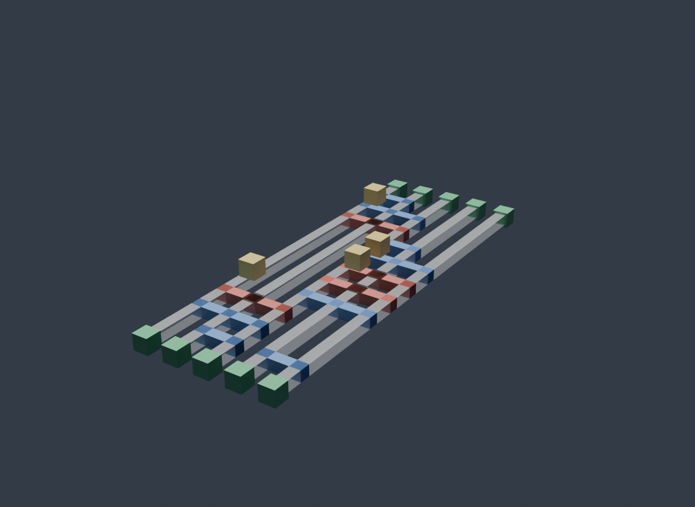

# FormalRV

**Formally-verified resource estimation for fault-tolerant Shor's algorithm — from the logical algorithm down to the physical surface-code device.**

[](https://github.com/leanprover/lean4/releases/tag/v4.29.1)
[](https://github.com/leanprover-community/mathlib4)
[](https://github.com/yezhuoyang/FormalRV/actions)
[](./LICENSE)

📖 **API docs:** <https://yezhuoyang.github.io/FormalRV/>

---

## Goal

Put Shor's algorithm, its arithmetic circuits, the logical (Pauli-product) layer, and the
quantum-error-correction stack into [Lean 4](https://leanprover.github.io/); **prove what can be
proven, emit the verified circuits as runnable code, and benchmark seven state-of-the-art resource
estimates against machine-checked bounds** — making the residue that *cannot* be proven explicit.

## Achievements

- **Axiom-free success bound.** `Shor_correct_var` / `Shor_correct_verified_no_modmult_axioms`
  (start at [`Shor/Main.lean`](FormalRV/Shor/Main.lean)): order-finding succeeds with probability
  `≥ κ/(log₂N)⁴`, `κ = 4·e⁻²/π²`. Its `#print axioms` is *only* Lean's three standard axioms — no
  project axioms, no `sorry` — instantiated with a **constructive** modular multiplier (no oracle).
- **Proof → runnable code.** The same circuits FormalRV *proves* correct are *emitted* as OpenQASM
  2/3 and Stim, and an **independent** tool (Qiskit, Stim) re-verifies the artifact without trusting
  Lean — emitted gate counts match the proved counts; Stim `has_flow` re-checks each surgery. The
  verified schedule also compiles to `tqec`-validated **3D surface-code lattice-surgery layouts**
  (`.glb` / ray-traced) via [`PyCircuits/ls_compile.py`](PyCircuits/ls_compile.py).
- **Device scheduling + hard resource bounds.** A unified FT-scheduling framework
  ([`System/FTFramework`](FormalRV/System/FTFramework.lean)): the full ~10⁹-op RSA-2048 schedule
  defined recursively and **proven valid for all sizes**; a kernel-clean lower bound
  `Q·T ≥ K·fq·prod` (≈ 22.4M qubit-hours for RSA-2048) that no schedule can beat; a hardware
  sensitivity analysis monotone in every device parameter; and a device-program emitter unifying
  physical operations + system calls, checked against four system invariants.
- **Seven-paper corpus.** Each estimate is bound to one typed tuple, with a machine-checked bound
  where the framework allows (table below).

## The four-layer stack

```
  L1  Algorithm        Shor + QPE + modular exponentiation + Ekerå–Håstad   ┐
  L2  Logical gadgets  adder · controlled adder · unary lookup · QFT        │ error
  L3  PPM / logical    Pauli-product measurement · magic-state cultivation  │ bounds
  L4  QEC code         parity-check matrices · stabilizer schedule · surgery ┘ propagate up
```

Each layer is a Lean structure with an explicit **inter-layer contract**; three error mechanisms
(logical/random, approximation, algorithmic-uncertainty) propagate bounds up to the success theorem.

## Worked example — the 2-bit adder, end to end

The smallest non-trivial slice of the whole stack: the verified **2-bit Cuccaro adder**
`cuccaro_n_bit_adder_full 2 0` (proven by `cuccaro_n_bit_adder_full_correct` — target register
`:= a + b`, read register restored), pushed through every layer. Reproduce:

```bash
lake env lean --run scripts/EmitAdder2Example.lean            # L2 circuit -> OpenQASM + PPM
python PyCircuits/ls_compile.py PyCircuits/qasm/adder2.qasm    # -> lattice surgery + certificate + Blender script
```

**L2 circuit → OpenQASM** (`Core/GateQASM.toQASM`): 5 qubits, `8·cx + 4·ccx`, `tcount 28`. Qiskit
reloads the file and confirms the gate counts equal Lean's:

```qasm
qreg q[5];
cx q[2],q[1]; cx q[2],q[0]; ccx q[0],q[1],q[2];      // MAJ bit 0
cx q[4],q[3]; cx q[4],q[2]; ccx q[2],q[3],q[4];      // MAJ bit 1
ccx q[2],q[3],q[4]; cx q[4],q[2]; cx q[2],q[3];      // UMA bit 1
ccx q[0],q[1],q[2]; cx q[2],q[0]; cx q[0],q[1];      // UMA bit 0
```

**L3 → PPM** (`compileArithmeticGateToPPM`): 28 commands. Each `cx` becomes a joint `ZZ`
measurement + Pauli-frame update; each `ccx` injects a magic state and measures `ZZZ`:

```
M Z 2,1   F 1                # cx 2->1   : joint ZZ measure + frame
T 2   M Z 0,1,2   F 2        # ccx 0,1->2: inject |C̄CZ̄⟩ + joint ZZZ measure + frame
```

**System — zoned hardware + verified schedule.** Those merges are scheduled onto a zoned
architecture and the schedule is *proven* to satisfy every system invariant
(`System/AdderSystem.adder_n1_strict_system_ok` — operation-capacity, feedback-after-decode,
slot-capacity, ancilla-freshness):

```
ZONE Data[0,100)  Ancilla[100,200)  Factory[200,300)  Routing[300,400)    # hardware zones
FRESHANC z1 · GATE2Q d0–a100 · GATE2Q d50–a100 · MEAS a100 · DECODE        # one merge round, t in µs
```

**L4 → lattice surgery** (`PyCircuits/ls_compile.py`): the circuit auto-compiles to a
conflict-free surface-code space-time layout with a **certificate** (the trusted artifact) — 5
qubits, depth 11, 8 merges, **4 CCZ magic injections**, `conflict_free = True`, space-time
volume 60 — plus a portable `.glb` and a ray-traced (Blender Cycles) render:

<p align="center"></p>

## Repository layout

Each concern is a folder **with its own `README.md`** (purpose, key definitions, key theorems,
honest status):

| Folder | What it holds |
|---|---|
| [`Core/`](FormalRV/Core) | Gate IR + classical/quantum (matrix) semantics; the 7-T Toffoli = CCX proof |
| [`Arithmetic/`](FormalRV/Arithmetic) | adders, modular multiplier, unary lookup — with correctness proofs |
| [`Shor/`](FormalRV/Shor) | ★ the main theorem ([`MainAlgorithm/`](FormalRV/Shor/MainAlgorithm)), QPE, phase kickback, IQFT |
| [`QEC/`](FormalRV/QEC) | qLDPC parity-check matrices and code instances |
| [`PPM/`](FormalRV/PPM) | Pauli-product measurement, Pauli algebra, magic factories |
| [`LatticeSurgery/`](FormalRV/LatticeSurgery) | surgery merge/split + system-call contracts |
| [`System/`](FormalRV/System) | scheduling / device / resource-bound framework (`FTFramework`) |
| [`Framework/`](FormalRV/Framework) | the four inter-layer contract interfaces (L1–L4) |
| [`Corpus/`](FormalRV/Corpus) | the seven corpus-paper bindings + paper-claim constants |
| [`Qualtran/`](FormalRV/Qualtran) | Qualtran `PhysicalParameters` data bridge |
| [`Codegen/`](FormalRV/Codegen) | the verified QASM / device-program emitters |

Files are named for their content and kept small (topical modules behind a `<Name>.lean` umbrella).

## Corpus: claim vs. verified

`Corpus/` records each paper's page-cited numbers as `paper_claim_*` constants (the qubit/time
numbers are *recorded* claims — per-paper parity matrices are stubbed) and machine-checks a narrower
bound where possible. The one cross-cutting **verified** result — order-finding success
`≥ κ/(log₂N)⁴`, axiom-free — holds for *every* instance (it is `N`-parametric).

| Paper | Headline claim | What FormalRV machine-checks |
|---|---|---|
| **cain-xu-2026** (focus) — [2603.28627](https://arxiv.org/abs/2603.28627) | RSA-2048 in ~10⁴ qubits, ~1 week | ➗ recovers Eqs. E3/E4/E9; ➗ `decide`-proved 95× qubit·hour win vs GE2021; ✅ verified adder/lookup T-counts |
| **gidney-ekera-2021** — [1905.09749](https://arxiv.org/abs/1905.09749) | 20M qubits, ~8 h | ✅ naive footprint is a feasible ceiling for any size; ➗ reproduces 19.44M ≤ 20M; the 8 h sits 2–3× under the verified time ceiling |
| **gidney-2025** — [2505.15917](https://arxiv.org/abs/2505.15917) | <1M qubits, <1 week | ✅ the CFS residue-arithmetic engine, axiom-clean (CRT, exact reconstruction, modexp, Ekerå–Håstad); Assumption 1 stated, never asserted |
| **webster-2026** — [2602.11457](https://arxiv.org/abs/2602.11457) | RSA-2048 in <100k qubits | ⬜ parameter-binding tuple (params type-check through the shared interface) |
| **babbush-2026** — [2603.28846](https://arxiv.org/abs/2603.28846) | ECC-256 in <500k qubits, 18–23 min | ⬜ parameter-binding tuple — the first non-RSA stress test of the L1 interface |
| **xu-2024** — [2308.08648](https://arxiv.org/abs/2308.08648) | constant-overhead FTQC, 24 ms cycle | ⬜ tuple; ➗ cross-checks the 24,000× cycle-time outlier |
| **peng-2022** (SQIR/Coq) — [2204.07112](https://arxiv.org/abs/2204.07112) | machine-checked gate-count bound | ✅ **the headline result lives here** — the axiom-free success bound, ported from SQIR's Coq proof |

Legend: ✅ *Verified* semantic theorem · ➗ *Arithmetic-only* (`decide`) · ⬜ *Recorded/Assumed*.

## What is proven vs. assumed

Strict honesty taxonomy — only semantic-correctness theorems count as **Verified** (a gate count on
an unverified circuit is just counting symbols):

**Machine-checked, no custom axioms:** the Shor success-probability chain, the Cuccaro/Gidney
adders, the constant modular multiplier, the 7-T Toffoli identity, the QPE peak bound, the
Pauli/stabilizer algebra, and the schedule resource lower bound. **Out of scope (assumed by
citation):** decoder correctness & runtime, hardware physics, magic-state distillation internals,
and merged-code distance. See each folder's `README.md` for per-area status.

## Build

```bash
git clone https://github.com/yezhuoyang/FormalRV && cd FormalRV
lake exe cache get      # prebuilt mathlib (≈ minutes)
lake build              # builds the whole library
```

Check a theorem's axioms with `#print axioms FormalRV.Shor_correct_var`
(expected: `propext, Classical.choice, Quot.sound`). Emit + independently re-verify the circuits:
`lake env lean --run scripts/EmitQASM.lean` (→ Qiskit re-counts gates) and
`lake env lean --run emit_shor_demo.lean` (→ Stim `has_flow`).

## License

[MIT](./LICENSE) © 2026 John ye. Built on [mathlib](https://github.com/leanprover-community/mathlib4);
the Shor layer ports [SQIR](https://github.com/inQWIRE/SQIR); `Qualtran/` bridges
[Qualtran](https://github.com/quantumlib/Qualtran).
