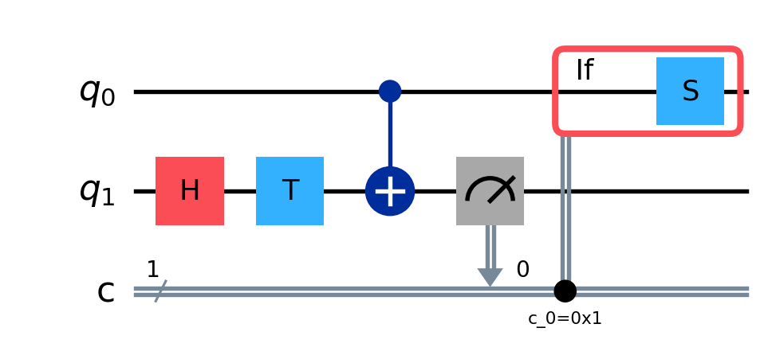

# FormalRV

**Formally-verified resource estimation for fault-tolerant Shor's algorithm.**

FormalRV is a [Lean 4](https://leanprover.github.io/) library that builds a
machine-checkable framework for *benchmarking the resources* of fault-tolerant
Shor's algorithm, and applies it to seven state-of-the-art cost estimates. It
puts the algorithm, the arithmetic circuits, the logical operations, and the
error-correction stack into Lean, proves the parts that *can* be proven, and
makes the residue that *cannot* be proven explicit and quantifiable.

Two things make FormalRV more than a resource calculator:

1. **A semantically-verified, end-to-end proof — with no project-specific
   axioms** (only Lean's three standard logical axioms) — that Shor's
   order-finding subroutine succeeds with an explicitly-bounded probability,
   instantiated with a *constructively-defined* modular multiplier, so there is
   no oracle placeholder (see [The headline result](#the-headline-result)).
2. **It generates the verified code.** The same circuits FormalRV *proves*
   correct are *emitted* as standard **OpenQASM** and **Stim**, and an
   independent third-party tool (Qiskit, Stim) re-verifies the emitted artifact
   — without trusting Lean (see [Generate the verified code](#from-proof-to-runnable-code--verified-qasm--stim-emission)).

[](https://github.com/leanprover/lean4/releases/tag/v4.29.1)
[](https://github.com/leanprover-community/mathlib4)
[](https://github.com/yezhuoyang/FormalRV/actions)
[](./LICENSE)

📖 **API documentation:** **<https://yezhuoyang.github.io/FormalRV/>** — a
FormalRV-only static site (definitions, theorems, and their docstrings, grouped
by concern) produced by [`scripts/gen_docs.py`](scripts/gen_docs.py), which parses
this project's `.lean` sources directly. It builds in **seconds** and documents
**only FormalRV** (mathlib is intentionally excluded), and is deployed to GitHub
Pages by the [`docs.yml`](.github/workflows/docs.yml) Actions workflow on every
push to `main`.

---

## The headline result

A machine-checked, **axiom-free** lower bound on Shor's order-finding success
probability — its full `#print axioms` dependency set is *only* Lean's three
standard logical axioms (`propext`, `Classical.choice`, `Quot.sound`), with no
project-specific axioms and no `sorry`:

- **`FormalRV.Shor_correct_var`** — for any modular-multiplier oracle satisfying
  the `ModMulImpl` interface, order-finding succeeds with probability
  `≥ κ / (log₂ N)⁴`, `κ = 4·e⁻²/π²`.
- **`FormalRV.Shor_correct_verified_no_modmult_axioms`** — the end-to-end
  statement, instantiated with a *constructively-defined*, SQIR-faithful modular
  multiplier (no oracle placeholder).

Both are re-exported from **[`FormalRV/Shor/Main.lean`](FormalRV/Shor/Main.lean)**
— start there. This is a from-scratch Lean port of the order-finding argument
from [SQIR](https://github.com/inQWIRE/SQIR) (Peng et al. 2022, Coq).

## From proof to runnable code — verified QASM & STIM emission

A second flagship value: FormalRV does not stop at *proving* the circuits
correct — it **emits the exact verified circuits as standard OpenQASM and Stim**,
and an *independent* third-party tool then confirms the emitted code matches what
Lean proved. The proof and the runnable artifact are the same object. **Generate
the verified code.**

Three emitters, each backed by a semantic-correctness proof — not just a
pretty-printer:

### 1. Gate IR → OpenQASM 2.0 (the verified arithmetic circuits)

[`FormalRV/Core/GateQASM.lean`](FormalRV/Core/GateQASM.lean) serialises the `Gate`
IR — the very circuits whose semantics are proven in [`Arithmetic/`](FormalRV/Arithmetic)
— to Qiskit-loadable OpenQASM 2.0, with the gate-count consistency *itself* proved:
`tcount g = 7 · numCCX g` (`tcount_eq_seven_numCCX`) and
`gcount g = numX g + numCX g + numCCX g` (`gcount_eq_sum`).

```bash
lake env lean --run scripts/EmitQASM.lean   # writes PyCircuits/qasm/*.qasm and prints Lean counts
```

For example, the verified out-of-place modular multiplier `sqir_modmult_const_gate 2 15 7`
(`x ↦ 7·x mod 15`):

```qasm
OPENQASM 2.0;
include "qelib1.inc";
qreg q[9];
cx q[7], q[4];
cx q[7], q[6];
cx q[4], q[3];
...
ccx q[2], q[3], q[4];     // 32 Toffolis total = 8·bits², so tcount = 56·bits² = 224 T
```

Then Qiskit **loads the emitted file, counts the gates, and confirms they equal
the Lean-proved numbers** — closing the loop that the count is not a Lean-only
bookkeeping trick:

```bash
python PyCircuits/verified_circuit_qasm_count.py
# [PASS] modmult_const_2_15_7: emitted QASM gate counts == Lean
#         Qiskit ccx=32 cx=76 x=0 total=108 | 7·ccx=224 vs tcount=224
# ...
# SUMMARY: 8/8 checks passed.
# THE EMITTED VERIFIED CIRCUITS' GATE COUNTS MATCH THE LEAN-PROVED NUMBERS.
```

The fully Clifford+T controlled multipliers (`ctrl_const_*`, `ctrl_MCP_*`) emit
**only** `x`/`cx`/`ccx` — Qiskit confirms the op-set carries no rotations, with
magic-count `numCX + 3·numCCX`.

### 2. PPM gadget IR → OpenQASM 3 (verified magic-state teleportation)

[`FormalRV/PPM/PPMToQASM.lean`](FormalRV/PPM/PPMToQASM.lean) emits the
*measurement-based* gadgets proven correct in `TGadgetTeleport` /
`CCZGadgetTeleport` — magic-state prep, the entangling CNOTs, the Z-measurement,
and the **classically-controlled feed-forward** corrections — as runnable
OpenQASM 3. The verified T-teleportation gadget (`tGadgetQASM`):

```qasm
OPENQASM 3.0;
include "stdgates.inc";
qubit[2] q;
bit[1] c;
h q[1];
t q[1];                   // prepare |T⟩ on the magic ancilla
cx q[0], q[1];            // entangle: data → ancilla
c[0] = measure q[1];      // Z-measure the ancilla
if (c[0] == true) s q[0]; // feed-forward S correction == t_gadget_with_feedback
```

[`PyCircuits/ppm_qasm_verification.py`](PyCircuits/ppm_qasm_verification.py) runs
an independent Qiskit simulation and cross-checks it against the Lean denotation
`·`.

### 3. Lattice-surgery schedule → Stim (the physical surface-code circuit)

[`StimEmit.lean`](FormalRV/LatticeSurgery/StimEmit.lean) +
[`ScheduleEmit.lean`](FormalRV/LatticeSurgery/ScheduleEmit.lean) emit the
**detailed physical syndrome-extraction circuit** of a verified surgery gadget —
per merged X-check an ancilla in `|+⟩`, `CX anc→s`, `MX`; per Z-check `R` /
`CX s→anc` / `M` — and [`Corpus/ShorEmit.lean`](FormalRV/Corpus/ShorEmit.lean)
glues `(N, a) → schedule → Stim` end-to-end:

```bash
lake env lean --run emit_shor_demo.lean   # writes PyCircuits/shor_demo_schedule.stim
```

```stim
RX 14
CX 14 0
CX 14 3
CX 14 9
MX 14
...
R 22
CX 0 22
CX 1 22
CX 9 22
M 22
```

A third party who *does not trust the Lean proof* can run Stim's stabilizer-flow
check (`has_flow`) on the emitted code and re-derive correctness independently —
the LaSsynth gold standard:

```bash
python PyCircuits/validate_surface3_stim.py   # has_flow: X-bar = X6 X7 X8 -> rec[-8] xor rec[-7]
python PyCircuits/validate_shor_demo.py       # every emitted surgery IS a correct projective X-bar measurement
```

The emitter is *parametric*, not materialised: `emitShor N a` is for small `N`,
while `emitShorPrefix N a k` emits the first `k` of any instance's surgeries
(RSA-2048 = 412,316,860,416 merges, proved in `shorMergeCount_rsa2048`) as a
Stim-validatable sample.

> **The point:** every number in the resource estimate, and every gate in the
> emitted QASM/Stim, traces back to a machine-checked theorem — and an
> independent tool can re-verify the emitted artifact without trusting Lean at all.

## The four-layer stack

```
  L1  Algorithm        Shor + QPE + modular exponentiation + Ekerå–Håstad   ┐
  L2  Logical gadgets  adder · controlled adder · unary lookup · QFT        │ error
  L3  PPM / logical    Pauli-product measurement · magic-state cultivation  │ bounds
  L4  QEC code         parity-check matrices · stabilizer schedule · surgery ┘ propagate up
```

Each layer is a Lean structure with an explicit **inter-layer contract**; three
error mechanisms (logical/random, approximation, algorithmic-uncertainty)
propagate bounds upward toward the success-probability theorem.

## Device programs: one syntax for physical operations **and** system calls

The L4 `SysCall` IR unifies **physical operations** (`gate1q`, `gate2q`, `measure`, `transit`) and
**system calls** (`request_ancilla`, `request_magic`, `decode_syndrome`, `pauli_frame_update`) in a
single `Schedule`. `Codegen/SysCallEmit.lean` emits it as a timestamped `DEVICE-PROGRAM` stream, and
the schedule is *checked* against four system invariants — **I1** capacity, **I2** exclusivity,
**I3** latency / speed / decoder-reaction, **I4** factory throughput
(`System/ScheduleInvariantsExplicit.lean`, `all_invariants_ok`; the decoder-reaction budget lives in
`ZonedArch.t_react_us`). The whole flow is **build → check → emit**, and every verdict is a
`native_decide` theorem (`System/SystemInvariantExamples.lean`, checked by `lake build`).

```
DEVICE-PROGRAM 1.0;                          // one magic-state Toffoli (π/8) — PHYS + SYS
[0,12)us  SYS   request_magic      factory=3        // distill the magic state
[12,13)us PHYS  transit            q[100] via channel=1
[13,14)us PHYS  gate2q             q[0],q[100] gate=0   // lattice-surgery teleport
[14,15)us PHYS  measure            q[100] basis=0
[15,16)us SYS   decode_syndrome    round=7
[16,17)us SYS   pauli_frame_update corr=7
```

Five worked examples (two that **pass** the invariants, three that **fail**, each with a proof of its
verdict and the reason) are in [`System/README.md`](FormalRV/System#checking-system-invariants--four-worked-examples)
— e.g. two parity measurements on **distinct** ancillas pass exclusivity, but the *same* schedule
**aliasing one ancilla** is rejected by I2, two magic requests inside one distillation window are
rejected by I4, and a decode slower than the reaction budget is rejected by I3. The verdicts are
checked by `lake build`; emit the programs with `lake env lean FormalRV/Codegen/SysCallEmitDemo.lean`.

The schedule layer also carries a verified **full-scale schedule** (`NaiveSchedule.lean`, valid for
all ~10⁹ ops), a resource **lower bound** (`ScheduleLowerBound.lean`: `Q·T ≥ K·fq·prod`, ≈ 22.4M
qubit-hours for RSA-2048), and a **hardware-sensitivity** analysis proving the bound responds to
every hardware parameter (decoding speed, architecture size, routing latency, measurement time, max
parallelism — `HardwareSensitivity.lean`), instantiated for both Gidney papers.

## Verified-gadget gallery — every diagram drawn from the emitted code

Each circuit below is **rendered by Qiskit / Stim from a file the Lean emitters
wrote** — none of it is hand-drawn ASCII. Regenerate the whole gallery with:

```bash
lake env lean --run scripts/EmitQASM.lean      # Gate-IR circuits  → PyCircuits/qasm/*.qasm
lake env lean --run scripts/EmitPPMQASM.lean   # PPM gadgets        → PyCircuits/qasm/*.qasm
lake env lean --run emit_shor_demo.lean        # surgery schedule   → PyCircuits/*.stim
python PyCircuits/draw_diagrams.py             # all diagrams below → docs/diagrams/*.png
```

We follow the Shor build-up: Toffoli → adder → modular multiplier → QPE, then the
fault-tolerant layer (magic-state teleportation → lattice surgery → scheduling).

### 1. Toffoli = 7 T — the atomic non-Clifford cost

<p align="center"></p>

`toffoli.qasm` is the bare `CCX`. The accounting theorem
[`tcount_eq_seven_numCCX`](FormalRV/Core/GateQASM.lean) (`Core/GateQASM.lean:33`,
axiom-free) proves **`tcount g = 7 · numCCX g`** for *every* circuit `g`, so each
downstream T-count is exactly 7× the Toffoli count — and Qiskit re-counts the
`ccx` of every emitted file to confirm it. **In Shor:** every nonlinear step
(carries, modular reduction) is Toffolis; this is the unit the resource estimates
are denominated in.

### 2. Cuccaro ripple-carry adder — `cuccaro_n_bit_adder_full 3 0`

<p align="center"></p>

A complete **3-bit adder on 7 qubits** (18 gates: a forward `MAJ` chain then a
reverse `UMA` chain; T-count `14·3 = 42`), emitted as OpenQASM 2 from the verified
`Gate` IR. [`cuccaro_n_bit_adder_full_correct`](FormalRV/Arithmetic/Cuccaro/CuccaroFull.lean)
(`CuccaroFull.lean:847`, axiom-free) proves the output register holds the
ripple-carry sum bits `cᵢ ⊕ bᵢ ⊕ aᵢ` and the `a`-register is preserved. **In
Shor:** adder → modular adder → modular multiplier → controlled modular
exponentiation — the adder is the bottom of that tower.

### 3. Modular multiplier — `sqir_modmult_const_gate 2 15 7`  (`x ↦ 7·x mod 15`)

<p align="center">7x mod 15"></p>

The full **108-gate, 9-qubit** out-of-place modular multiplier (32 Toffolis =
`8·bits²`, so T-count `56·bits² = 224`) — emitted and Qiskit-gate-count-verified
(8/8). [`sqir_modmult_const_gate_target_decode`](FormalRV/Arithmetic/SQIRModMult/Proofs2.lean)
(`SQIRModMult/Proofs2.lean:856`, axiom-free) proves that, applied to input `x`
with a zero target register, it decodes the target to `(a·x) mod N`. **In Shor:**
this *is* the controlled-`U` of phase estimation — controlled powers of it compute
`aˣ mod N`.

### 4. Quantum phase estimation — the frame around the oracle

<p align="center"></p>

*Schematic:* the `H` / inverse-QFT frame is QPE's standard structure, but each
controlled-`U` box **is** the emitted verified modular multiplier above. FormalRV
proves QPE at the **amplitude level**, not as a Gate-IR circuit:
[`QPE_MMI_correct`](FormalRV/Shor/PostQFT/Proofs3.lean) (`PostQFT/Proofs3.lean:205`,
axiom-free) gives the peak-probability bound **`≥ 4/(π²·r)`** at the order `r`, and
`Shor_correct_var` / `Shor_correct_verified_no_modmult_axioms` lift it to the
headline success bound **`≥ κ/(log₂N)⁴`** instantiated with the *emitted,
SQIR-faithful* multiplier (no oracle placeholder, no project-specific axioms).

### 5. Magic-state teleportation (T gadget) — `t_gadget.qasm`

<p align="center"></p>

The measurement-based `T` gadget, emitted as OpenQASM 3: prepare `|T⟩` on the
ancilla, entangle, `Z`-measure, and apply the **classically-controlled `S`
correction** iff the outcome is 1 (the red `if` box).
[`t_gadget_with_feedback`](FormalRV/PPM/TGadgetTeleport.lean)
(`TGadgetTeleport.lean:60`, axiom-free) proves the data emerges as `T|ψ⟩` for
*either* measurement outcome. The companion CCZ gadget (`ccz_gadget.qasm`,
[`docs/diagrams/ccz_gadget.png`](docs/diagrams/ccz_gadget.png)) is emitted and
cross-checked by an independent Qiskit simulation. **In Shor:** this is how
non-Clifford gates are realised fault-tolerantly — magic states injected from the
factory, the rest of the circuit staying Clifford.

### 6. Surface-code lattice surgery — syndrome extraction (from emitted Stim)

<p align="center"></p>

One `X`-check and one `Z`-check block of the `[[13,1,3]]` surface-code surgery,
rendered from the Lean-emitted `surface3_surgery.stim` (X-check: ancilla in `|+⟩`,
`CX anc→data`, X-basis measure; Z-check: `CX data→anc`, Z-basis measure).
[`surface3_x_surgery_measures_logicalX`](FormalRV/Corpus/SurgeryDemoSurface.lean)
(`SurgeryDemoSurface.lean:118`, axiom-free) proves the selected ancilla checks
read the logical `X̄`, and `surface3_x_surgery_verifies` passes the structural
surgery verifier — independently re-confirmed by Stim's `has_flow`. **In Shor:**
lattice surgery realises the logical Pauli-product measurements that drive the
fault-tolerant execution.

### 7. System scheduling invariants — the verified resource ceiling

<p align="center"></p>

Not a circuit but the **resource bounds**, plotted from the verified theorems.
*Left* — [`scheduleFootprint_replicate`](FormalRV/LatticeSurgery/ScheduleEmit.lean)
(`ScheduleEmit.lean:66`): a schedule of `n` surgery merges occupies exactly `28·n`
physical qubits (`28 = merged_n(14) + |hx|(8) + |hz|(6)`). *Right* —
`gidney_ekera_2021_reproduced`: plugging GE2021's own inputs into the verified
surface-model formula reproduces **19.44M ≤ the reported 20M** qubits (~3%), and
machine-checks that the reported 8 h sits **2–3× under** the naive-sequential time
ceiling (the gap = pipelining, made explicit). Underpinning both,
[`naivePeak_le_footprint`](FormalRV/System/NaiveUpperBound.lean)
(`NaiveUpperBound.lean:86`) proves the sequential schedule's peak demand never
exceeds the static footprint, for *any* problem size. **In Shor:** these are the
feasibility ceilings the corpus resource estimates are built on.

## Repository layout

Each concern is a folder **with its own `README.md`** (purpose + key definitions
+ key theorems + honest status):

| Folder | What it holds |
|---|---|
| [`Core/`](FormalRV/Core) | Gate IR + classical/quantum (matrix) semantics; the 7-T Toffoli = CCX proof |
| [`Arithmetic/`](FormalRV/Arithmetic) | adders, modular multiplier, unary lookup — with semantic-correctness proofs |
| [`Shor/`](FormalRV/Shor) | ★ the main theorem + QPE, phase kickback, inverse-QFT |
| [`QEC/`](FormalRV/QEC) | qLDPC parity-check matrices and code instances |
| [`PPM/`](FormalRV/PPM) | Pauli-product measurement, Pauli algebra, magic factories |
| [`LatticeSurgery/`](FormalRV/LatticeSurgery) | surgery merge/split + system-call contracts |
| [`System/`](FormalRV/System) | scheduling / layout / architecture invariants |
| [`Framework/`](FormalRV/Framework) | the four inter-layer contract interfaces (L1–L4) |
| [`Corpus/`](FormalRV/Corpus) | the seven corpus-paper bindings + paper-claim constants |
| [`Qualtran/`](FormalRV/Qualtran) | Qualtran `PhysicalParameters` data bridge |

Large proof files are split into a `<Name>/` sub-folder of shorter modules —
`Defs.lean` + `Proofs1..N.lean` where definitions and theorems separate cleanly,
or `Part1..N.lean` (order-preserving) otherwise.

## The seven corpus papers — what they claim vs. what we verify

`Corpus/` binds each estimate to one `(ShorAlgorithm × QECCode ×
QualtranPhysicalParameters)` tuple, records every page-cited resource number as a
`paper_claim_*` constant, and — where the framework allows — **machine-checks a
bound against that claim**. Two honesty rules hold throughout: the headline
**qubit/time numbers are *recorded* paper claims** (the tuples type-check them;
per-paper parity matrices are stubbed `[]`), and the **machine-checked content is
narrower** and tagged below — ✅ *Verified* semantic theorem · ➗ *Arithmetic-only*
(`decide`) · ⬜ *Recorded/Assumed*. The one cross-cutting **verified lower bound**
— order-finding success `≥ κ/(log₂N)⁴`, `κ = 4·e⁻²/π²`, axiom-free — holds for
*every* instance below (it is `N`-parametric).

| Paper — arXiv | Code / hardware | Paper's headline claim | What FormalRV machine-checks |
|---|---|---|---|
| **cain-xu-2026** (qianxu, *focus*) — [2603.28627](https://arxiv.org/abs/2603.28627) | LP / bivariate-bicycle qLDPC `[[144,12,12]]`, neutral atoms | RSA-2048 in **~10⁴ physical qubits**, **~1 week** | ➗ recovers paper Eqs. **E3** (adder `=25n`), **E4** (ctl-adder `=30n`), **E9** (lookup); ➗ `decide`-proved **95× qubit·hour** win vs GE2021 (`qianxu_qubit_hours_95x_lower_than_gidney_ekera`); ✅ verified adder/lookup **T-counts** (RSA-2048 adder `=14·q_A=462` T) |
| **gidney-ekera-2021** — [1905.09749](https://arxiv.org/abs/1905.09749) | rotated surface code (d=27), superconducting | **20M physical qubits**, **~8 h**, ~2.7×10⁹ Toffolis | ✅ verified **qubit upper bound**: the naive sequential footprint is a feasible ceiling for *any* size (`naivePeak_le_footprint`); ➗ reproduction (`gidney_ekera_2021_reproduced`): derived **19.44M ≤ reported 20M** (~3%), and the reported 8 h is **2–3× under** the verified naive-time ceiling — the gap (pipelining) made *explicit*, not hidden |
| **gidney-2025** — [2505.15917](https://arxiv.org/abs/2505.15917) | yoked surface code + magic-state cultivation | **< 1M physical qubits** (~898k), **< 1 week** (~5 d), ~6.5×10⁹ Toffolis | ✅ the paper's **CFS residue-arithmetic engine**, axiom-clean: CRT faithfulness (`rns_faithful`), exact reconstruction (`reconstruction_explicit`), modexp correctness (`residue_modexp_exact_of_lt`), truncation bound + `Δ_N` pseudometric, and **Ekerå–Håstad post-processing** (new). One *stated* conjecture: **Assumption 1** (a `Prop`, never asserted) |
| **webster-2026** (Pinnacle) — [2602.11457](https://arxiv.org/abs/2602.11457) | generalised-bicycle qLDPC `[[1620,16,24]]`, atom array | RSA-2048 in **< 100k physical qubits** (10⁻³ error) | ⬜ parameter-binding tuple only — params type-check & read back through the shared interface (parity matrices stubbed) |
| **babbush-2026** — [2603.28846](https://arxiv.org/abs/2603.28846) | surface code (d≈14), superconducting | **ECC-256** (elliptic-curve dlog) in **< 500k physical qubits**, **18–23 min**, ≤90M Toffolis / ≤1200 logical | ⬜ parameter-binding tuple — the **modulus-agnostic** stress test of the L1 interface (the first non-RSA instance) |
| **xu-2024** — [2308.08648](https://arxiv.org/abs/2308.08648) | HGP / LP qLDPC `[[544,80,12]]`, neutral atoms (*Nat. Phys.* **20**, 1084) | constant-overhead FTQC; **24 ms** syndrome cycle (the slow-cycle outlier) | ⬜ parameter-binding tuple; ➗ cross-checks the **24,000×** cycle-time outlier against the surface-code baselines |
| **peng-2022** (SQIR/Coq) — [2204.07112](https://arxiv.org/abs/2204.07112) | *no QEC stack* — algorithm level | machine-checked gate-count bound `(212n²+975n+1031)·m + 4m + m²` | ✅ **the headline verified result lives here**: `Shor_correct_var` / `Shor_correct_verified_no_modmult_axioms` — the axiom-free success-probability lower bound the whole project rests on (ported from SQIR's Coq proof) |

### Emit the verified code for a corpus instance

Every instance drives the same two verified emitters (see [Generate the verified
code](#from-proof-to-runnable-code--verified-qasm--stim-emission)):

```bash
# verified arithmetic (modular multiplier) → OpenQASM 2.0; Qiskit re-counts the gates (8/8 pass)
lake env lean --run scripts/EmitQASM.lean
# (N, a) → lattice-surgery schedule → Stim; Stim has_flow re-checks each merge
lake env lean --run emit_shor_demo.lean
```

- **Small `N`** (e.g. Shor(15)) is *fully materialised* and independently validated (Qiskit gate counts / Stim stabilizer flows).
- **RSA-2048 / ECC-256** are *parametric*: the counts are **proved** (e.g. `shorMergeCount_rsa2048 = 412,316,860,416` surgery merges) and `emitShorPrefix N a k` emits the first `k` surgeries as a Stim-validatable sample — the full circuit is astronomically large and never materialised.
- **Honest limit:** each paper's bespoke QEC *code structure* (parity matrices) is stubbed in the corpus tuples, so what we emit-and-verify is the algorithm + arithmetic + the surgery schedule — not each paper's qLDPC/surface code itself.

## What is proven vs. assumed

A strict honesty taxonomy is used throughout (a gate count on an unverified
circuit is just counting symbols — only semantic-correctness theorems are
"Verified"):

| Status | Meaning |
|:--:|---|
| ✅ **Verified** | a proven *semantic* correctness theorem |
| 🟦 **Scaffolded** | structure present, deep proof deferred |
| ➗ **Arithmetic-only** | a `Nat`/`decide`-level fact |
| ⬜ **Assumed** | an `axiom` or value imported by citation |

**Genuinely machine-checked, no custom axioms:** the Shor success-probability
chain, the corrected Cuccaro / patched Gidney adders, the constant modular
multiplier, the 7-T Toffoli identity, the QPE peak bound, and the Pauli /
stabilizer-PVM algebra. **Deliberately out of scope** (assumed by citation):
decoder correctness & runtime, hardware physics, magic-state distillation
internals, and merged-code distance for lattice surgery. A handful of
SQIR-ported placeholder axioms remain in the tree but are deprecated or unused
by the verified chain. See each folder's `README.md` for per-area status.

## Building

Lean 4 via [`elan`](https://github.com/leanprover/elan); the toolchain
(`leanprover/lean4:v4.29.1`) is selected automatically from `lean-toolchain`.

```bash
git clone https://github.com/yezhuoyang/FormalRV
cd FormalRV
lake exe cache get      # prebuilt mathlib (≈ minutes)
lake build              # build the whole library (one build covers all 10 concern umbrellas)
```

Inspect a theorem's axioms with `#print axioms FormalRV.Shor_correct_var`
(expected: `propext, Classical.choice, Quot.sound`).

**Docs:** `python scripts/gen_docs.py` regenerates the API site into `site/`
(open `site/index.html`). It needs only Python — no Lean or mathlib build — and
documents only FormalRV. CI runs the same command and publishes to GitHub Pages.

## License

[MIT](./LICENSE) © 2026 John ye. Built on
[mathlib](https://github.com/leanprover-community/mathlib4); the Shor layer ports
[SQIR](https://github.com/inQWIRE/SQIR); `Qualtran/` bridges
[Qualtran](https://github.com/quantumlib/Qualtran).
